# Цель работы

Целью первого модуля является знакомство с операционной системой Linux и получение базовых навыков работы в командной строке . В рамках модуля необходимо освоить основные команды для навигации по файловой системе, управления файлами и каталогами, а также научиться использовать перенаправление ввода-вывода и конвейеры (пайплайны) для эффективной работы в терминале

# Задание

В ходе выполнения первого модуля решались следующие задачи:

1. Освоение навигации в терминале: Изучение и применение команд для перемещения по файловой системе (cd), просмотра содержимого каталогов (ls), определения текущего рабочего каталога (pwd).
2. Управление файлами и каталогами: Практическое использование команд для создания (touch, mkdir), копирования (cp), перемещения (mv) и удаления (rm) файлов и директорий.
3. Работа с содержимым файлов: Просмотр текстовых файлов с помощью команд cat, head, tail, less.
4. Использование перенаправления ввода-вывода и конвейеров: Применение операторов >, >>, < и | для перенаправления потоков ввода-вывода и связывания нескольких команд в цепочки для комплексной обработки данных .
5. Поиск файлов и текста: Знакомство с командами find для поиска файлов в иерархии каталогов и grep для поиска строк внутри файлов.

# Теоретическое введение

Linux — UNIX-подобная операционная система. Основной интерфейс пользователя — командная оболочка (bash). Ключевые элементы работы: команда (ls, cd), аргументы (-l), файловая система (иерархия от /). Пути бывают абсолютные (от /) и относительные (от текущей папки). Важны перенаправление ввода-вывода: > (запись в файл), >> (добавление), < (чтение из файла), | (передача вывода команды другой команде). Для поиска файлов используется find, для поиска текста — grep. Справка: man команда или команда --help. Эти основы необходимы для работы в Linux и перехода к сложным темам.

# Выполнение лабораторной работы

Выбран Linux.

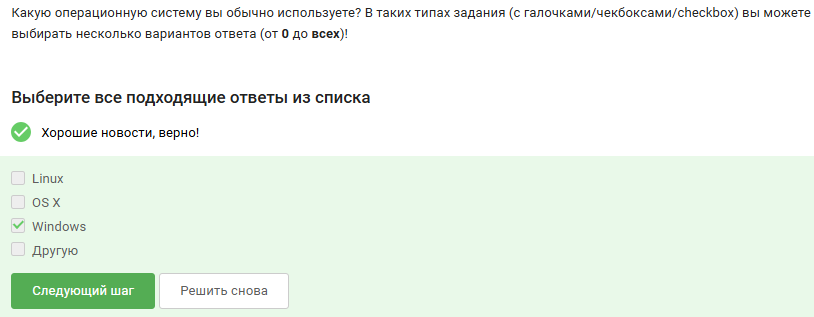{#fig:001 width=70%}

Виртуальная машина — это программа, которая эмулирует компьютер и позволяет запускать одну ОС внутри другой (например, VirtualBox). Остальные варианты не имеют отношения к виртуализации.

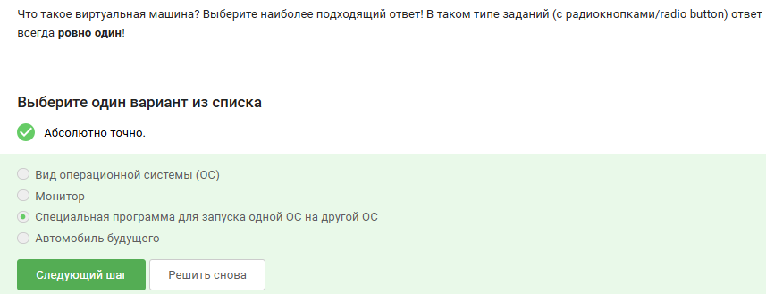{#fig:002 width=70%}

Шаги выполнения:
1. Открыть LibreOffice Writer
2. Напечатать строку: Hello, Linux!
3. Нажать Файл → Сохранить как → выбрать тип «Microsoft Word 2003 XML»
4. Указать имя Hello.xml и сохранить
5. Загрузить файл в форму на Stepik

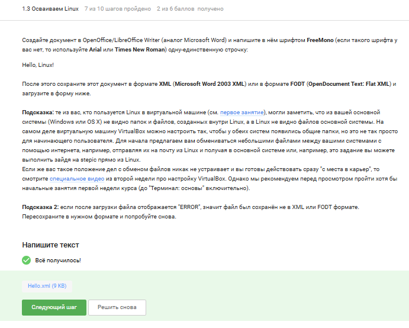{#fig:003 width=70%}

Почему выбран deb: Ubuntu основана на Debian, где установочные пакеты имеют расширение .deb. .exe — для Windows, .dmg — для macOS, .txt — текстовые файлы.

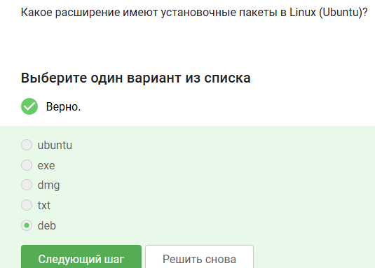{#fig:004 width=70%}

Шаги выполнения:
1. Установить VLC через Software Center (или sudo apt install vlc)
2. Запустить VLC
3. Открыть Help → About (или нажать Shift+F1)
4. Перейти на вкладку Authors
5. Найти первую фамилию в списке (без имени) — Denis-Courmont
6. Ввести её в форму

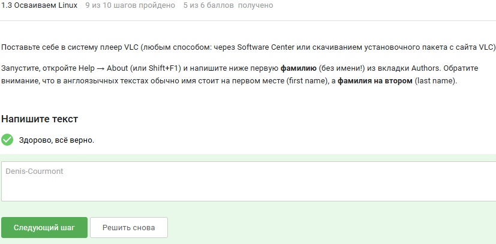{#fig:005 width=70%}

Почему выбраны эти варианты: Update Manager обновляет установленные программы, обновляет список доступных пакетов (ссылки в Software Center) и обновляет всю систему до новой версии. Установкой и удалением программ он не занимается

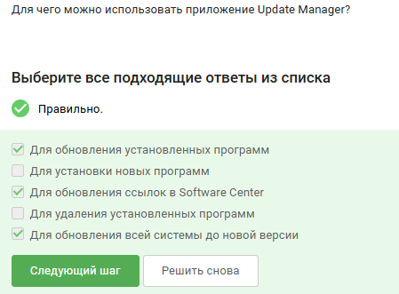{#fig:006 width=70%}

Почему выбраны консоль и терминал: В Linux термины «командная строка», «консоль» и «терминал» являются синонимами. «Термин» — это часть слова или самостоятельное понятие из лексики, «Ассоль» — персонаж из книги. 

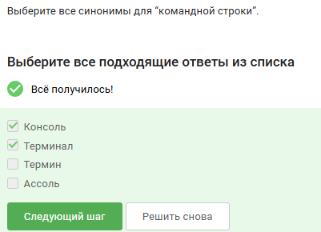{#fig:007 width=70%}

Почему выбран pwd: Команда pwd (print working directory) выводит путь к текущей директории. Она пишется только строчными буквами. PWD — переменная окружения, Pwd — ошибка.

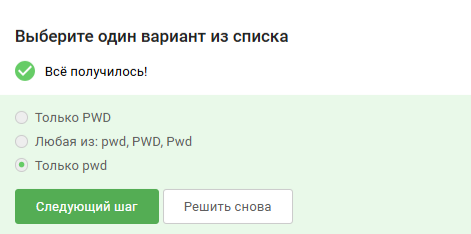{#fig:008 width=70%}

Почему выбраны эти варианты: Все отмеченные варианты содержат ключи -A (показать почти всё), -h (человеко-читаемые размеры) и -I (игнорировать шаблон) в правильной форме. Эти ключи требовались в задании.

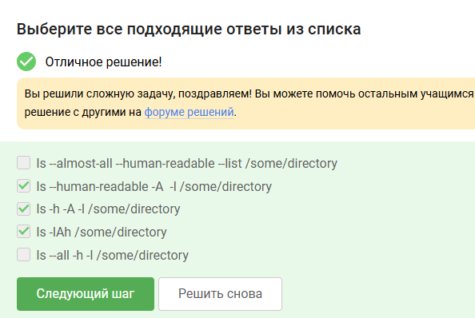{#fig:009 width=70%}

Почему выбран ls ~/Downloads: Символ ~ заменяет путь к домашней директории (/home/bi). Находясь в /home/bi/Documents, команда ls ~/Downloads покажет содержимое /home/bi/Downloads. Остальные варианты ведут в другие места или содержат ошибки.

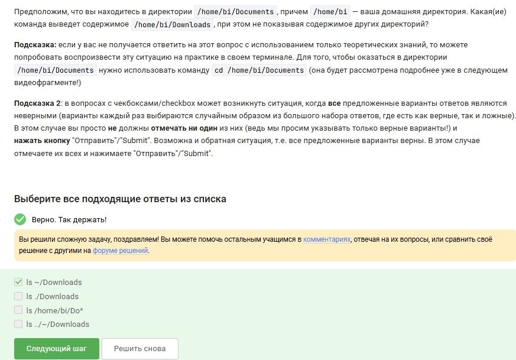{#fig:010 width=70%}

Почему выбран rm -r: rm -r удаляет директорию рекурсивно (вместе со всем содержимым). rm -f удаляет только файлы, mv перемещает, mkdir создаёт.

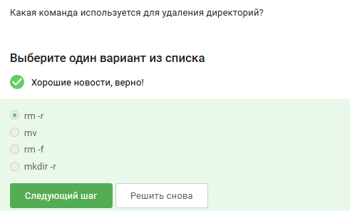{#fig:011 width=70%}

Почему выбран ответ: Firefox запускается как отдельный процесс. Команда exit закрывает текущую оболочку терминала. Firefox продолжает работать независимо.

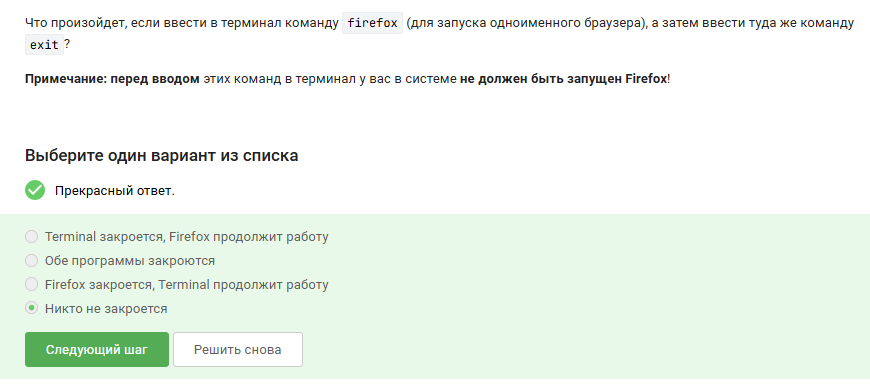{#fig:012 width=70%}

Почему выбран ответ: Амперсанд & запускает программу в фоне. Ручной эквивалент: запуск → Ctrl+Z (приостановка) → bg (перевод в фон).

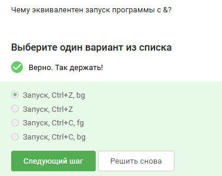{#fig:013 width=70%}

Шаги выполнения:
1. Скачать файл с программой
2. Сделать его исполняемым: chmod +x имя_файла
3. Запустить: ./имя_файла
4. Скопировать вывод программы
5. Вставить в форму

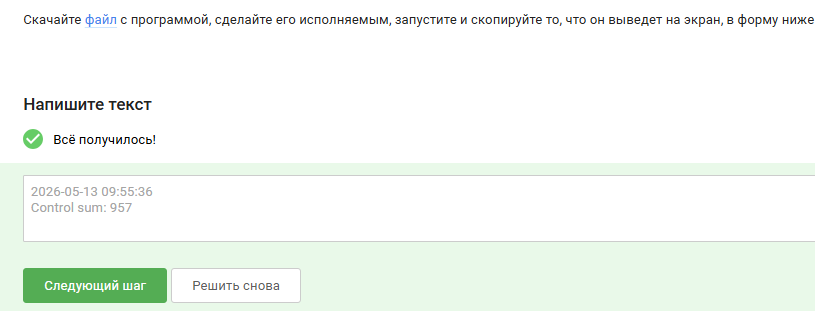{#fig:014 width=70%}

Почему выбран ответ: Поток ошибок stderr по умолчанию выводится на экран (терминал), так же как и stdout

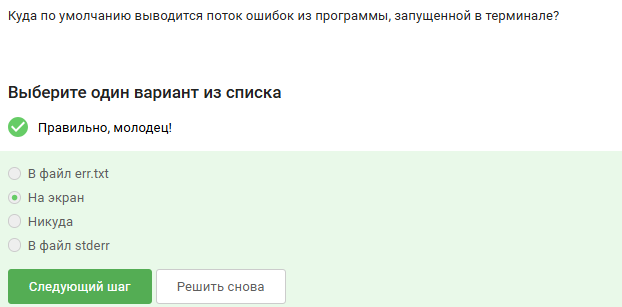{#fig:015 width=70%}

Почему выбраны 2> и 2>>: 2> перенаправляет поток ошибок в файл с перезаписью, 2>> — с добавлением в конец. Остальные варианты перенаправляют не туда или содержат ошибки синтаксиса.

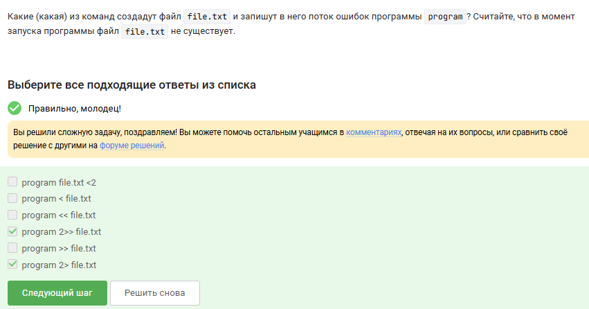{#fig:016 width=70%}

Почему выбран ответ: Конвейер | передаёт только stdout. stderr не проходит через pipe и выводится на экран.

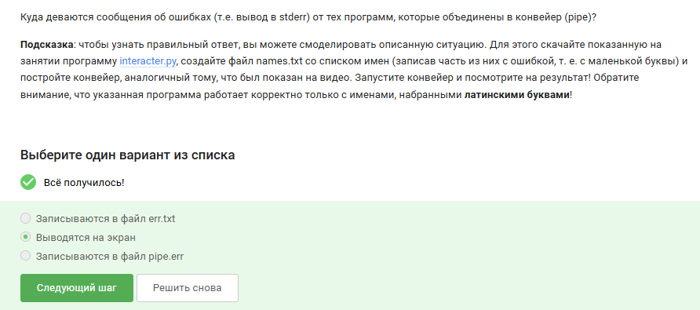{#fig:017 width=70%}

Почему выбран /home/alex/Pictures/1.jpg:  -P задаёт каталог, -O переименовывает файл. Итог: файл сохраняется как /home/alex/Pictures/1.jpg

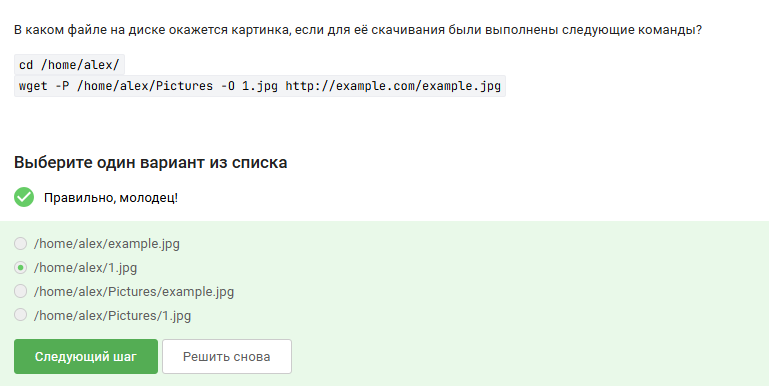{#fig:018 width=70%}

Почему выбран -q или --quiet: Опция -q (quiet) отключает вывод сообщений. -v (verbose) наоборот включает подробный вывод.

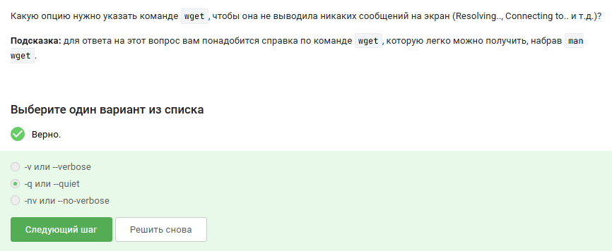{#fig:019 width=70%}

Почему выбран ответ: wget скачивает jpg-картинки и html-страницы, но затем html удаляются. Остаются только jpg.

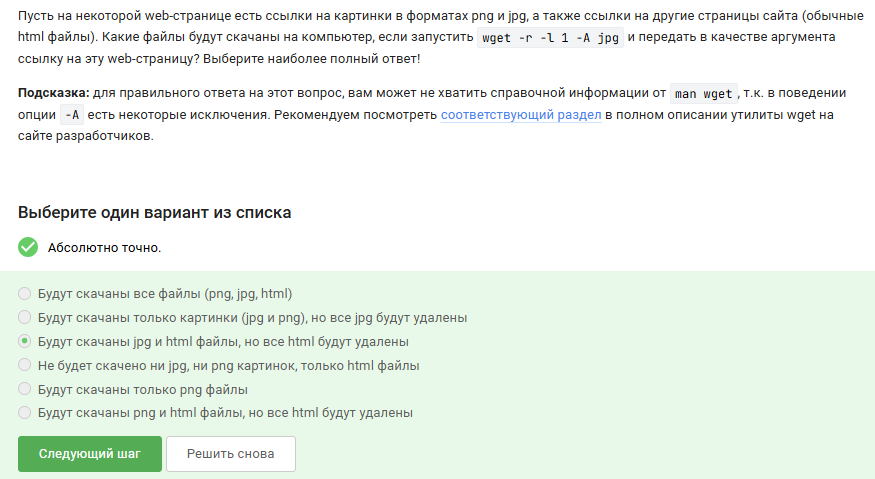{#fig:020 width=70%}

Почему выбран ответ: gzip после распаковки удаляет архив .gz. zip оставляет архив на месте.

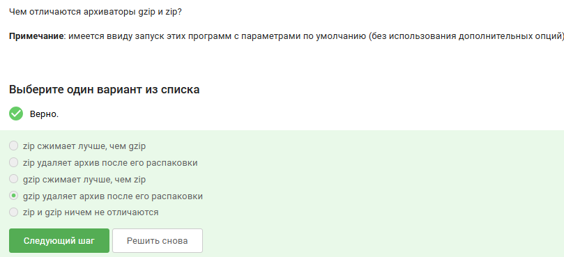{#fig:021 width=70%}

Почему выбраны zip и tar: zip и tar умеют упаковывать целые папки. gzip сжимает только один файл.

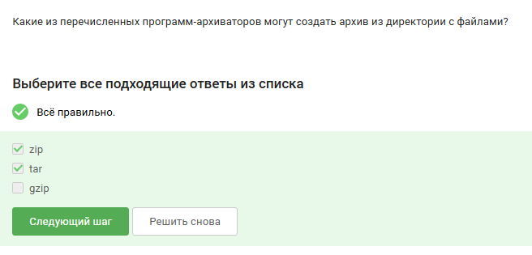{#fig:022 width=70%}

Почему выбран -cjf: -c — создать архив, -j — использовать bzip2, -f — указать файл. -czf — для gzip, -xjf — распаковка bzip2.

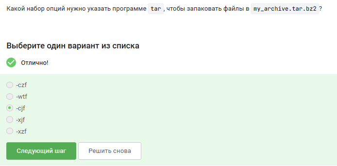{#fig:023 width=70%}

Почему выбраны эти маски: ? — может не сработать из-за особенностей; alexey.* — с маленькой буквы; *.jpg — расширение jpg, а не jpeg. 

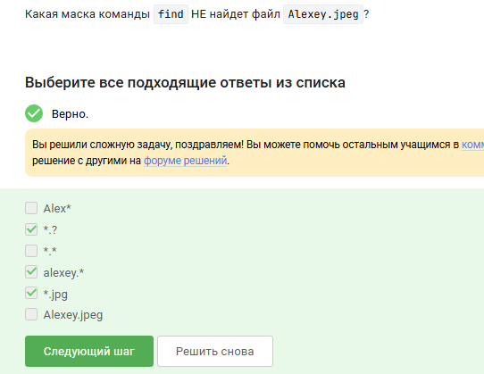{#fig:024 width=70%}

Почему выбраны эти строки: grep по умолчанию чувствителен к регистру. Он находит только строки с маленькой «world». Строки с «World», «word» или без точного вхождения не подходят. 

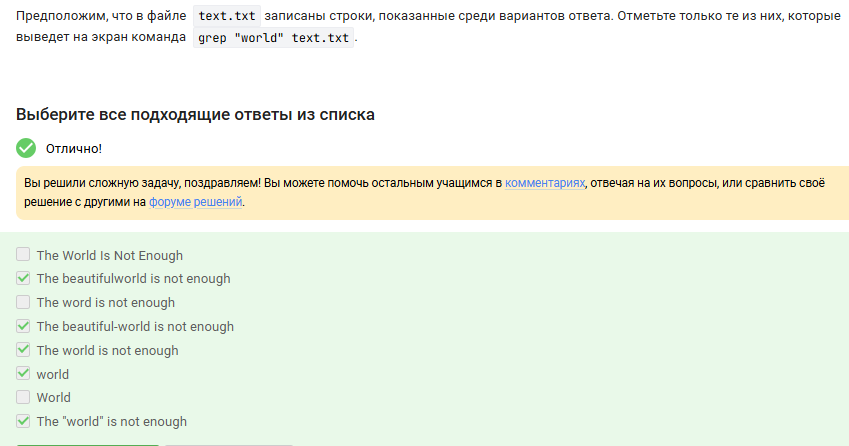{#fig:025 width=70%}

Шаги выполнения:
1. Скачать архив с произведениями Шекспира
2. Распаковать архив
3. Выполнить команду: grep -r love . > lines_with_love.txt
4. Загрузить полученный файл в форму

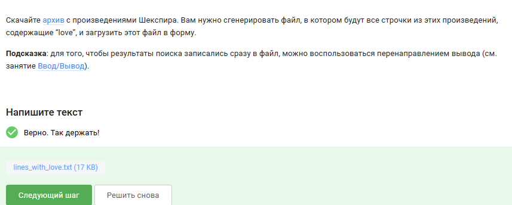{#fig:026 width=70%}

# Выводы

В результате выполнения задач первого модуля были успешно освоены фундаментальные принципы работы в командной оболочке Linux.
Полученные навыки работы с командами навигации, управления файлами и перенаправления потоков создали необходимую базу для дальнейшего изучения более сложных тем, таких как написание скриптов на bash, работа с удалёнными серверами и настройка окружения для разработки
. Практическое применение команд grep и find, а также умение строить эффективные конвейеры из нескольких команд, позволяют выполнять типовые задачи по обработке и поиску данных непосредственно в терминале без использования графических инструментов. Это значительно повышает эффективность и гибкость работы в операционной системе Linux.

# Список литературы

Тормозов, В. С. Основы работы в операционной системе Linux : учебное пособие / В. С. Тормозов, А. Л. Золкин. — Самара : Реавиз, 2023. — 66 с. — ISBN 978-5-907359-20-8.

