# Цель работы

Целью второго модуля является освоение навыков безопасной удаленной работы с серверами, управления пакетами и процессами в Linux, а также практическое применение биоинформатических инструментов (FastQC, ClustalW, bowtie2) и терминального мультиплексора tmux.

# Задание

    Настройка SSH-ключей и подключение к серверу

    Копирование файлов через scp и Filezilla

    Управление пакетами через apt-get

    Запуск FastQC и определение форматов входных данных

    Запуск ClustalW для множественного выравнивания

    Управление процессами (фон, приостановка, jobs, fg, bg, kill)

    Мониторинг процессов через top и ps

    Работа с tmux (сессии, вкладки, разделение экрана)

    Многопоточный запуск bowtie2

# Теоретическое введение

Второй модуль посвящен углубленной работе с командной строкой Linux. Рассмотрены безопасное подключение к удаленным серверам по SSH с использованием ключей, копирование файлов через scp, управление пакетами через apt-get. Изучены биоинформатические инструменты: FastQC для контроля качества данных и ClustalW для множественного выравнивания последовательностей. Освоены механизмы управления процессами (фоновый режим, приостановка, завершение) и мониторинг через jobs, top, ps. Изучен терминальный мультиплексор tmux для сохранения сессий, а также многопоточное выравнивание ридов с помощью bowtie2.

# Выполнение лабораторной работы

Пояснение: Удаленный сервер можно использовать для хранения общедоступных данных (например, веб-сайты) и для хранения конфиденциальных данных (с ограничением доступа через настройки прав). Выполнение сложных вычислений и хранение больших объемов данных тоже возможны, но в данном тесте эти варианты не отмечены.

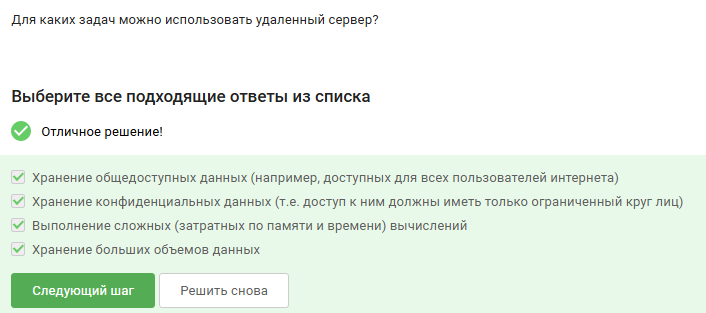{#fig:001 width=70%}

Пояснение: id_rsa.pub — это публичный ключ, его можно свободно передавать по интернету. Приватный ключ id_rsa нельзя передавать никому. Публичный ключ предназначен для размещения на серверах, к которым нужен доступ.

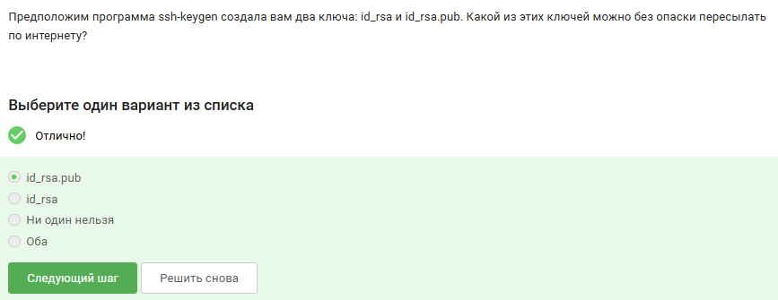{#fig:002 width=70%}

Пояснение: Команда scp -r stepic username@server:~ рекурсивно копирует папку stepic со всем содержимым на сервер в домашнюю директорию. -r — рекурсия, scp — безопасное копирование. Остальные варианты содержат ошибки (ssh вместо scp, неправильные ключи).

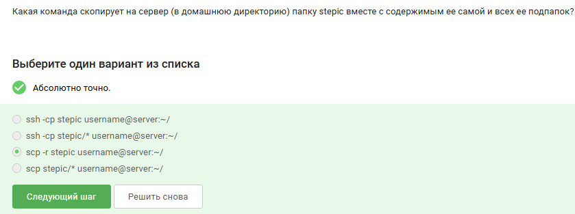{#fig:003 width=70%}

Пояснение: При ошибке «не могу найти пакет» нужно сначала выполнить sudo apt-get update (обновить список пакетов). upgrade обновляет уже установленные пакеты, проверка места на диске не влияет на поиск пакета.

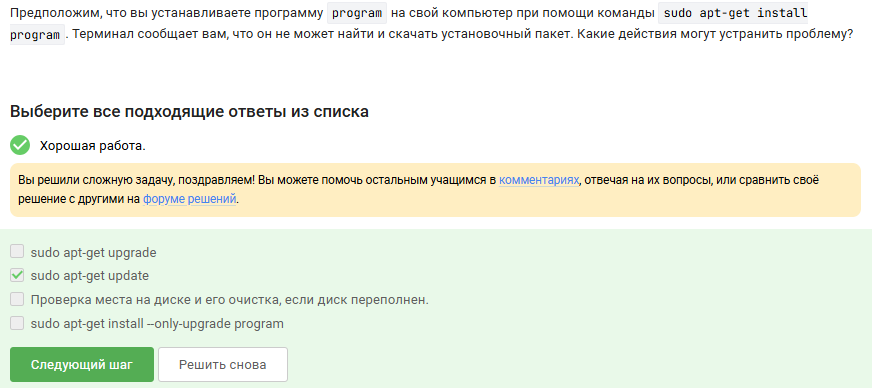{#fig:004 width=70%}

Пояснение: Filezilla — это FTP/SFTP-клиент. Он позволяет копировать файлы с компьютера на сервер и обратно, просматривать содержимое директорий на сервере и на своем компьютере. Установкой программ на сервер он не занимается.

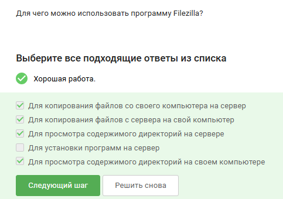{#fig:005 width=70%}

Пояснение: Чтобы запустить на сервере программу с графическим интерфейсом, нужно настроить X11 forwarding (ssh -X), чтобы сервер мог выводить информацию на экран локального компьютера.

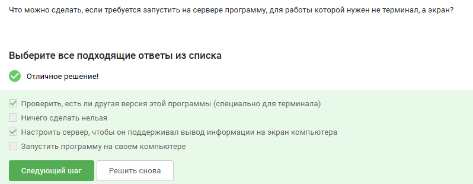{#fig:006 width=70%}

Пояснение: Основные способы получить справку в Linux: man program, program --help, program -h. Вариант help program работает только для встроенных команд оболочки.

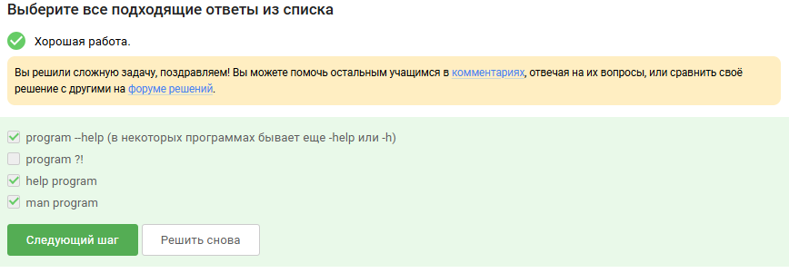{#fig:007 width=70%}

Пояснение: Из справки FastQC следует, что программа принимает форматы fastq, bam, sam, bam_mapped, sam_mapped.

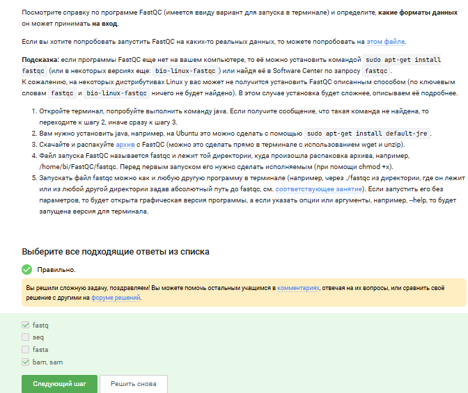{#fig:008 width=70%}

Пояснение: Правильная команда для запуска Clustal: clustalw -align -infile=test.fasta. Пробелы между опциями обязательны.

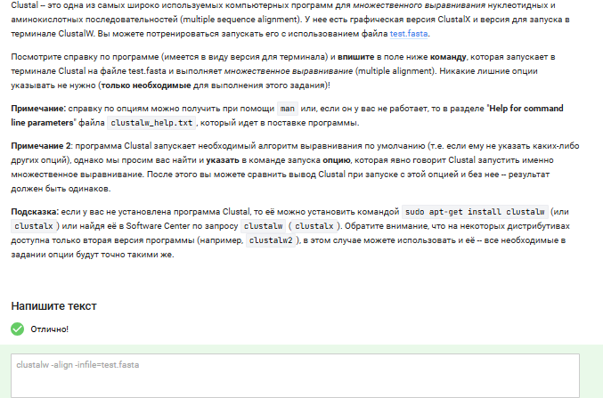{#fig:009 width=70%}

Пояснение: После действий: fg %1 → Ctrl+C (program1 завершён), fg %2 → Ctrl+Z (program2 приостановлен), program3 остался в фоне. Команда jobs покажет program2 и program3.

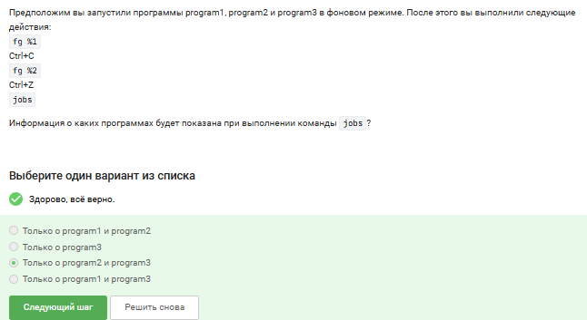{#fig:010 width=70%}

Пояснение: Во всех трёх утилитах (jobs, top, ps) отображается один и тот же идентификатор процесса — PID. Он одинаковый везде. Однако на скриншоте пользователь ошибся и выбрал другой вариант.

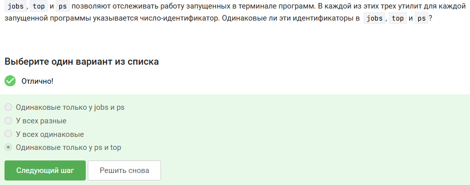{#fig:011 width=70%}

Пояснение: Сигнал SIGKILL (команда kill -9) мгновенно завершает процесс без возможности перехвата. Обычный kill отправляет SIGTERM, который может быть проигнорирован.

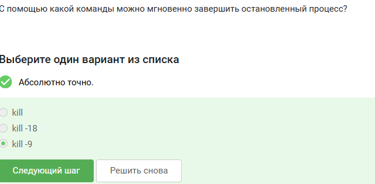{#fig:012 width=70%}

Пояснение: kill без опций отправляет сигнал SIGTERM. Процесс получит его немедленно, даже в состоянии остановки, и завершится.

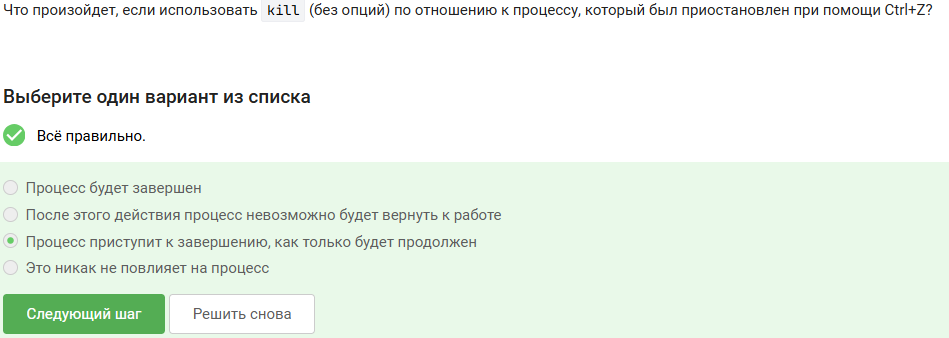{#fig:013 width=70%}

Пояснение: Остановленный (по Ctrl+Z) процесс не получает процессорного времени, так как ядро не планирует его выполнение. В top в столбце %CPU будет 0.

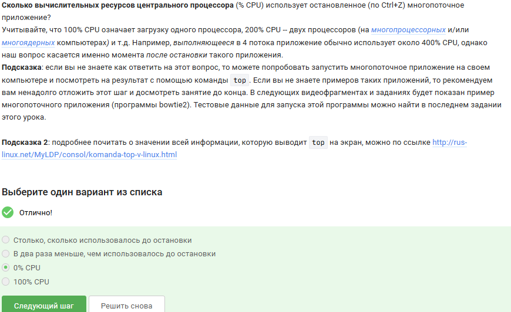{#fig:014 width=70%}

Пояснение: При остановке процесса (Ctrl+Z) память, которую он занимал, не освобождается. Система сохраняет её, чтобы процесс мог мгновенно продолжить работу после fg.

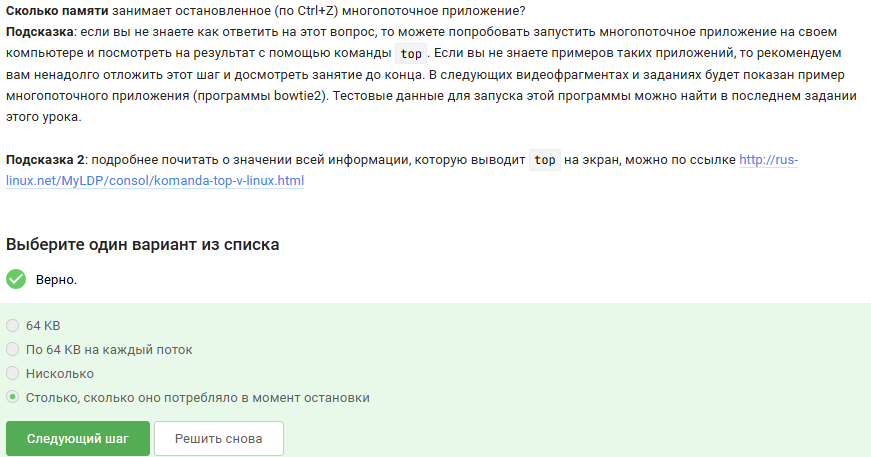{#fig:015 width=70%}

Пояснение: Справка bowtie2 показывает, что опция -p (количество потоков) доступна для bowtie2 (этап выравнивания), но не для bowtie2-build (этап индексации).

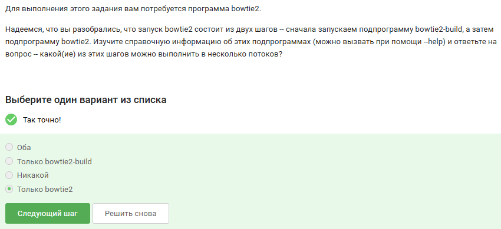{#fig:016 width=70%}

Пояснение: В выводе bowtie2 указано количество прочитанных ридов (306174), процент выравнивания (100%) и другая статистика — это ожидаемый результат работы программы.

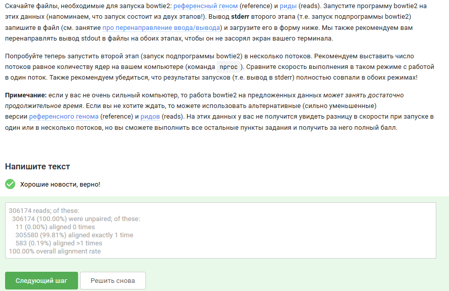{#fig:017 width=70%}

Пояснение: Команда fg работает только в той оболочке, где процесс был запущен и приостановлен. В другой вкладке терминал сообщит, что нет процесса для запуска в fg.

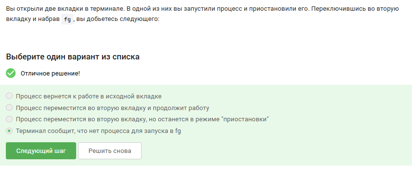{#fig:018 width=70%}

Пояснение: Если в сессии tmux осталась последняя вкладка, и в ней ввести exit, оболочка внутри вкладки завершится, вкладка закроется, и сессия tmux завершится.

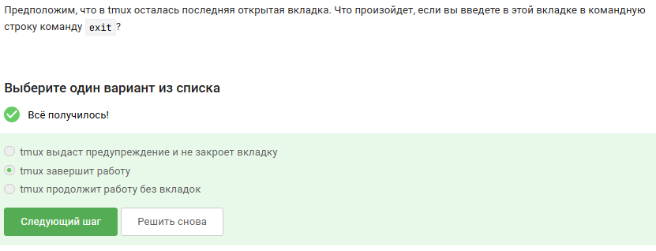{#fig:019 width=70%}

Пояснение: tmux работает в фоне на сервере. Закрытие локального терминала разрывает SSH-соединение, но процессы внутри tmux продолжают выполняться. При новом подключении можно восстановить сессию командой tmux attach.

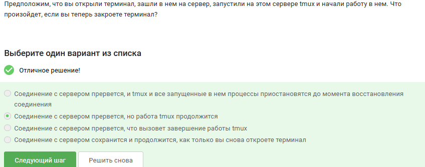{#fig:020 width=70%}

Пояснение: Принудительное закрытие вкладки (Ctrl+B, X) завершает все процессы внутри неё, включая фоновые.

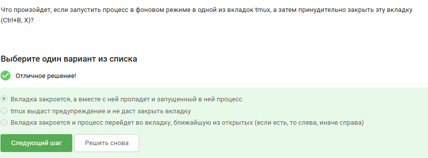{#fig:021 width=70%}

Пояснение: Стандартное сочетание для переименования текущей вкладки в tmux — Ctrl+B и , (запятая).

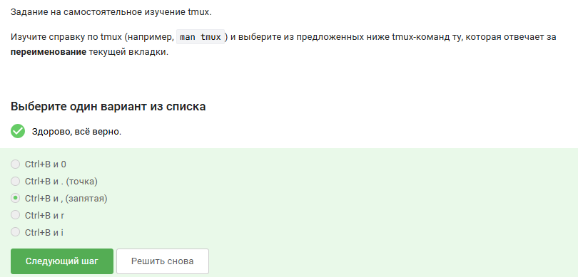{#fig:022 width=70%}

Пояснение: Верные утверждения о разделении вкладок в tmux: команды разделения действуют только в текущей вкладке; при горизонтальном и вертикальном разделении получается 3 части (одна большая, две маленькие). Остальные утверждения неверны.

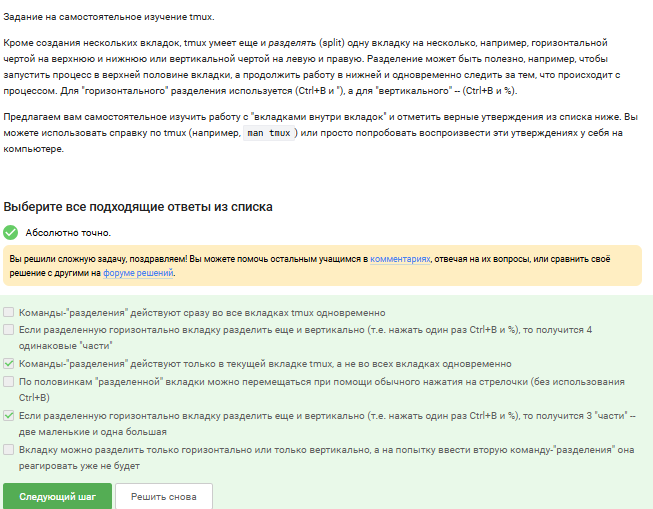{#fig:023 width=70%}

# Выводы

В результате выполнения задач первого модуля были успешно освоены фундаментальные принципы работы в командной оболочке Linux.
Полученные навыки работы с командами навигации, управления файлами и перенаправления потоков создали необходимую базу для дальнейшего изучения более сложных тем, таких как написание скриптов на bash, работа с удалёнными серверами и настройка окружения для разработки
. Практическое применение команд grep и find, а также умение строить эффективные конвейеры из нескольких команд, позволяют выполнять типовые задачи по обработке и поиску данных непосредственно в терминале без использования графических инструментов. Это значительно повышает эффективность и гибкость работы в операционной системе Linux.

# Список литературы

Тормозов, В. С. Основы работы в операционной системе Linux : учебное пособие / В. С. Тормозов, А. Л. Золкин. — Самара : Реавиз, 2023. — 66 с. — ISBN 978-5-907359-20-8.

