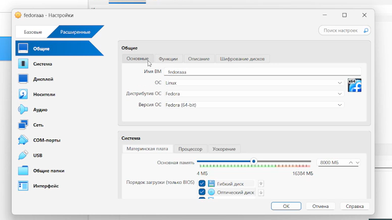
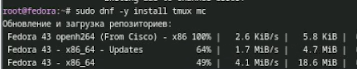
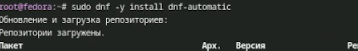
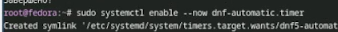
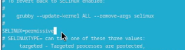
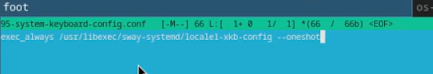
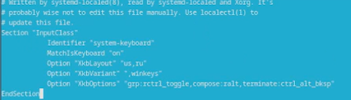

---
## Front matter
lang: ru-RU
title: Лабораторная работа №1
subtitle: Архитектура компьютеров
author:
  - Безлепкина Т.И.
institute:
  - Российский университет дружбы народов, Москва, Россия
date: 06 марта 2026

## i18n babel
babel-lang: russian
babel-otherlangs: english

## Fonts
mainfont: Liberation Serif
sansfont: Liberation Sans
monofont: Liberation Mono

## Formatting pdf
toc: false
toc-title: Содержание
slide_level: 0
aspectratio: 169
section-titles: true
theme: metropolis
header-includes:
  - \metroset{progressbar=frametitle,sectionpage=progressbar,numbering=fraction}
---

# Информация

## Докладчик

:::::::::::::: {.columns align=center}
::: {.column width="70%"}

  * Безлепкина Татьяна Игоревна
  * Студентка НКАбд-01-25
  * Таня
  * Российский университет дружбы народов
  * [1032253539@rudn.ru](mailto1032253539@rudn.ru)

:::
::: {.column width="30%"}

:::
::::::::::::::

# Цель работы

Целью данной работы является приобретение практических навыков установки операционной системы на виртуальную машину, настройки минимально необходимых для дальнейшей работы сервисов.

# Задание

Создание виртуальной машины.
Установка операционной системы.
Первоначальная настройка системы.
Установка ПО для создания отчётов.
Анализ загрузки системы (домашнее задание).

#Актуальность темы

Linux — основа современной IT-инфраструктуры.Fedora — передовой дистрибутив с актуальными технологиями.Виртуализация — эффективный способ изоляции и экономии ресурсов.Навыки установки и настройки Linux необходимы каждому специалисту

# Объект и предмет исследования.

Объект: процесс установки Fedora Linux на виртуальную машину.Предмет: методы установки, настройка сервисов, управление пакетами, конфигурирование окружения Sway

# Научная новизна. 

Систематизация практических приёмов установки Fedora Linux с окружением Sway для создания рабочего места технического специалиста.

# Практическая значимость работы. 

Быстрое развёртывание рабочей среды
Создание шаблонов для учебных целей
Автоматизация установки Linux
Подготовка специалистов по администрированию

# Теоретическое введение

Операционная система управляет ресурсами компьютера и взаимодействием с пользователем.
Виртуализация позволяет запускать несколько ОС на одном компьютере. Гипервизоры: VirtualBox (для обучения) и QEMU/KVM (высокая производительность).
Fedora — дистрибутив Linux с актуальным ПО. Используется версия Fedora Sway.
Основные понятия Linux: ядро, процесс, файловая система, терминал, командная оболочка Bash.

# Выполнение лабораторной работы

Создание виртуальной машины (рис. -@fig:001)

{#fig:001 width=70%}

---

Установка системы на диск (рис. -@fig:002)

{#fig:002 width=70%}

---

Программа для удобства работы в консоли (рис. -@fig:003) 

{#fig:003 width=70%}

---

Другой вариант консоли (рис. -@fig:004)

{#fig:004 width=70%}

---

Настройка автоматических обновлений (рис. -@fig:005)

{#fig:005 width=70%}

---

Запуск таймера (рис. -@fig:006)

{#fig:006 width=70%}

--- 

Изменение параметров SELinux (рис. -@fig:007)

{#fig:007 width=70%}

---

Подготовка директории для конфигурации Sway (рис. -@fig:008)

{#fig:008 width=70%}

---

Редактирование файла, который будет отвечать за настройки клавиатуры в Sway (рис. -@fig:009)

{#fig:009 width=70%}

---

Редактирование конфигурационного файла (рис. -@fig:010)

{#fig:010 width=70%}

---

Работа с языком разметки Markdown (рис. -@fig:011)

{#fig:011 width=70%}

---

Установка pandoc и pandoc-crossref вручную (рис. -@fig:012)

{#fig:012 width=70%}

---

Для генерации PDF-файлов из Markdown через Pandoc требуется система верстки LaTeX (рис. -@fig:013)

{#fig:013 width=70%}

---

Домашнее задание,выполняется сбор информации о системе с помощью команд dmesg для фиксации итоговой конфигурации (рис. -@fig:014)

{#fig:014 width=70%}

# Вывод

В ходе выполнения лабораторной работы были получены практические навыки установки операционной системы Fedora Linux. Освоены первичные этапы настройки системы, включая управление пакетами с помощью DNF, настройку автоматических обновлений, конфигурирование SELinux. Получен опыт настройки окружения рабочего стола Sway и синхронизации раскладки клавиатуры с системными параметрами. Установлено прикладное программное обеспечение (Pandoc, Texlive), необходимое для работы с технической документацией.

