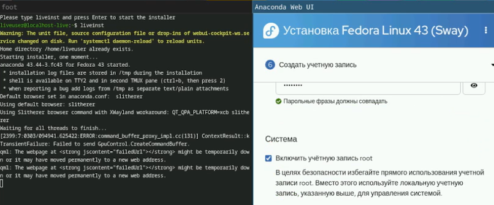
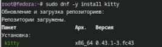
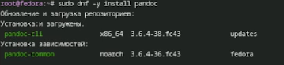
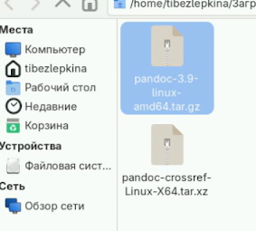
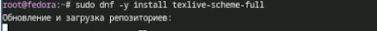
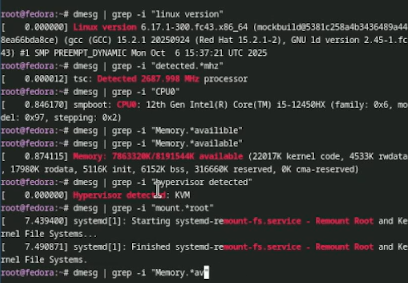

# Цель работы

Целью данной работы является приобретение практических навыков установки операционной системы на виртуальную машину, настройки минимально необходимых для дальнейшей работы сервисов.

# Задание

Создание виртуальной машины.
Установка операционной системы.
Первоначальная настройка системы.
Установка ПО для создания отчётов.
Анализ загрузки системы (домашнее задание).

# Теоретическое введение

Операционная система

Операционная система (ОС) — это комплекс взаимосвязанных программ, предназначенных для управления ресурсами компьютера и организации взаимодействия с пользователем. Основные функции ОС:

    Управление аппаратными устройствами (процессор, память, диски)

    Организация файловой системы

    Запуск и управление процессами

    Предоставление пользовательского интерфейса

Виртуализация

Виртуализация — технология, позволяющая создавать виртуальные версии аппаратных ресурсов (процессора, памяти, дисков) и запускать несколько изолированных ОС на одном физическом компьютере.
Гипервизоры

Программное обеспечение для виртуализации называется гипервизором. В работе используются два типа гипервизоров:

    VirtualBox — гипервизор 2-го типа (работает поверх существующей ОС). Подходит для обучения и тестирования.

    QEMU с KVM — гипервизор 1-го типа (работает непосредственно на оборудовании) в Linux, обеспечивающий высокую производительность за счёт аппаратной виртуализации.

Дистрибутив Fedora

Fedora — это свободный дистрибутив Linux, разрабатываемый сообществом при поддержке компании Red Hat. Характеризуется использованием самых свежих версий программного обеспечения. В работе используется версия Fedora Sway — редакция с оконным менеджером Sway (Wayland-композитор, совместимый с i3).
Базовые понятия Linux

    Ядро (kernel) — центральная часть ОС, управляющая оборудованием и системными вызовами.

    Процесс — экземпляр выполняющейся программы.

    Файловая система — способ организации и хранения данных на диске.

    Терминал — интерфейс для ввода команд.

    Командная оболочка (shell) — программа, интерпретирующая команды пользователя (в Fedora по умолчанию Bash).

# Выполнение лабораторной работы

Создание виртуальной машины (рис. -@fig:001)

{#fig:001 width=70%}

Установка системы на диск (рис. -@fig:002)

{#fig:002 width=70%}

Программа для удобства работы в консоли (рис. -@fig:003) 

{#fig:003 width=70%}

Другой вариант консоли (рис. -@fig:004)

{#fig:004 width=70%}

Настройка автоматических обновлений (рис. -@fig:005)

{#fig:005 width=70%}

Запуск таймера (рис. -@fig:006)

{#fig:006 width=70%}

Изменение параметров SELinux (рис. -@fig:007)

{#fig:007 width=70%}

Подготовка директории для конфигурации Sway (рис. -@fig:008)

{#fig:008 width=70%}

Редактирование файла, который будет отвечать за настройки клавиатуры в Sway (рис. -@fig:009)

{#fig:009 width=70%}

Редактирование конфигурационного файла (рис. -@fig:010)

{#fig:010 width=70%}

Работа с языком разметки Markdown (рис. -@fig:011)

{#fig:011 width=70%}

Установка pandoc и pandoc-crossref вручную (рис. -@fig:012)

{#fig:012 width=70%}

Для генерации PDF-файлов из Markdown через Pandoc требуется система верстки LaTeX (рис. -@fig:013)

{#fig:013 width=70%}

Домашнее задание,выполняется сбор информации о системе с помощью команд dmesg для фиксации итоговой конфигурации (рис. -@fig:014)

{#fig:014 width=70%}

# Выводы

В ходе выполнения лабораторной работы были получены практические навыки установки операционной системы Fedora Linux. Освоены первичные этапы настройки системы, включая управление пакетами с помощью DNF, настройку автоматических обновлений, конфигурирование SELinux. Получен опыт настройки окружения рабочего стола Sway и синхронизации раскладки клавиатуры с системными параметрами. Установлено прикладное программное обеспечение (Pandoc, Texlive), необходимое для работы с технической документацией. В результате проделанной работы система Fedora Linux полностью подготовл

#Контрольные вопросы

1.Учетная запись пользователя содержит следующую информацию: имя пользователя (логин), UID (идентификатор пользователя), GID (идентификатор основной группы), домашний каталог, используемую командную оболочку (shell), а также пароль в зашифрованном виде, хранящийся отдельно в файле /etc/shadow. Вся основная информация хранится в файле /etc/passwd.

2.Команды терминала:
   - Для получения справки по команде: man ls или ls --help
   - Для перемещения по файловой системе: cd /home/user/Documents
   - Для просмотра содержимого каталога: ls -la /home/user
   - Для определения объёма каталога: du -sh /home/user
   - Для создания каталога: mkdir newdir
   - Для удаления каталога: rm -r newdir
   - Для создания файла: touch newfile.txt
   - Для удаления файла: rm newfile.txt
   - Для задания определённых прав на файл/каталог: chmod 755 script.sh
   - Для просмотра истории команд: history

3.Файловая система — это способ организации и хранения данных на диске или другом носителе. Она определяет структуру каталогов и файлов, а также правила доступа к ним. Примеры:
   - ext4 — журналируемая файловая система, используемая в Linux по умолчанию, поддерживает файлы до 16 ТБ и тома до 1 ЭБ
   - NTFS — файловая система Windows с поддержкой больших файлов, прав доступа, шифрования и журналирования
   - FAT32 — старая файловая система с ограничением на размер файла 4 ГБ и тома до 2 ТБ, широко поддерживается разными устройствами
   - XFS — высокопроизводительная журналируемая файловая система, оптимизированная для больших файлов и параллельных операций ввода-вывода

4.Чтобы посмотреть, какие файловые системы подмонтированы в ОС, используются команды mount или df. Примеры: mount или df -h

5.Чтобы удалить зависший процесс, нужно найти его PID с помощью команд ps или top, а затем использовать команду kill. Если процесс не завершается обычным сигналом, используется kill -9. Примеры:
   - ps aux | grep processname
   - kill 1234 (где 1234 — PID процесса)
   - kill -9 1234 (принудительное завершение)

# Список литературы

::: {#refs}
:::
