---
## Front matter
lang: ru-RU
title: Лабораторная работа №2
subtitle: Архитектура компьютеров
author:
  - Безлепкина Т.И.
institute:
  - Российский университет дружбы народов, Москва, Россия
date: 06 марта 2026

## i18n babel
babel-lang: russian
babel-otherlangs: english

## Fonts
mainfont: Liberation Serif
sansfont: Liberation Sans
monofont: Liberation Mono

## Formatting pdf
toc: false
toc-title: Содержание
slide_level: 0
aspectratio: 169
section-titles: true
theme: metropolis
header-includes:
  - \metroset{progressbar=frametitle,sectionpage=progressbar,numbering=fraction}
---

# Информация

## Докладчик

:::::::::::::: {.columns align=center}
::: {.column width="70%"}

  * Безлепкина Татьяна Игоревна
  * Студентка НКАбд-01-25
  * Таня
  * Российский университет дружбы народов
  * [1032253539@rudn.ru](mailto1032253539@rudn.ru)

:::
::: {.column width="30%"}

:::
::::::::::::::

# Цель работы

Изучить идеологию и применение средств контроля версий.
Освоить умения по работе с git.

# Задание

Создать базовую конфигурацию для работы с git.
Создать ключ SSH.
Создать ключ PGP.
Настроить подписи git.
Зарегистрироваться на Github.
Создать локальный каталог для выполнения заданий по предмету.

# Актуальность темы

Git — наиболее популярная распределённая система контроля версий, используемая в большинстве современных IT-проектов. Навыки работы с Git необходимы каждому разработчику для эффективной командной работы, отслеживания изменений и управления версиями кода.

# Объект и предмет исследования.

Объект: распределённые системы контроля версий.
Предмет: процесс работы с Git: создание репозиториев, управление коммитами, ветвление и слияние, работа с удалёнными репозиториями

# Научная новизна. 

Систематизация основных приёмов работы с Git для эффективного управления версиями в учебных и научных проектах, включая работу с ветками, разрешение конфликтов и организацию совместной разработки.
 
# Практическая значимость работы. 

Освоение базовых команд Git для повседневной работы.
Возможность отслеживания истории изменений проекта.
Организация командной работы над кодом и документацией.
Подготовка к профессиональной разработке в IT-индустрии.
Интеграция с платформами GitHub/GitLab для хранения и совместного доступа к проектам.

# Теоретическое введение

Системы контроля версий (VCS) применяются при коллективной работе над проектами, позволяя фиксировать изменения, совмещать правки разных участников и возвращаться к более ранним версиям. В классических централизованных системах (CVS, Subversion) используется единый репозиторий на сервере, где хранятся все версии файлов с дельта-компрессией. Распределённые системы (Git, Mercurial) не требуют обязательного центрального репозитория. VCS также обеспечивают отслеживание конфликтов, блокировку файлов и ведение журнала изменений с информацией об авторах.

# Выполнение лабораторной работы

Установка git 
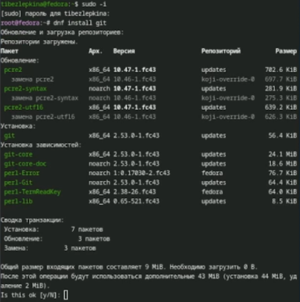
---

Установка gh 
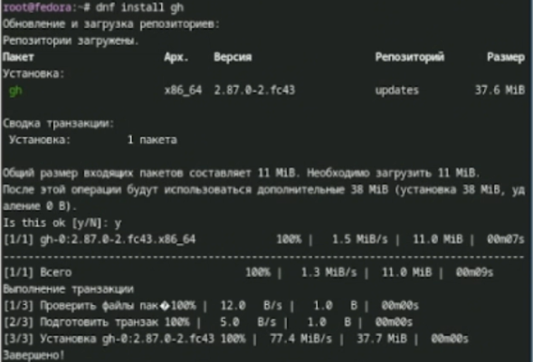
---
Базовая настройка git,зададим имя и email владельца репозитория

---

Настроим utf-8 в выводе сообщений git,зададим имя ветки,а также параметры 

---

Создадим ssh ключ 
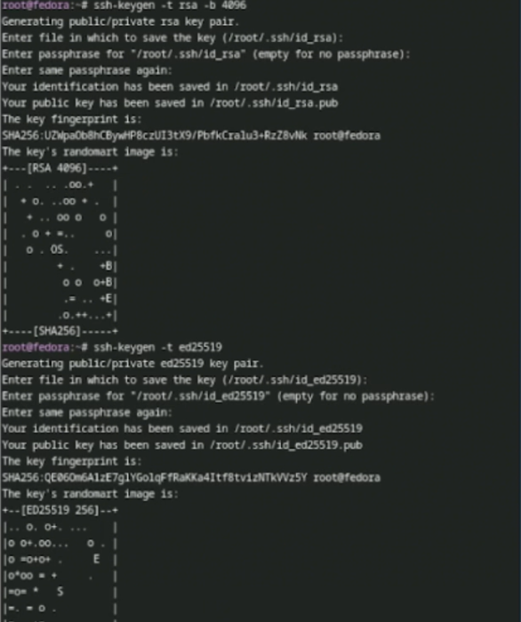
---

Добавим в github 
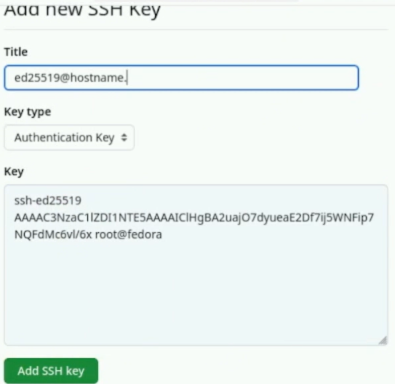
---

Cоздадим pgp ключ 
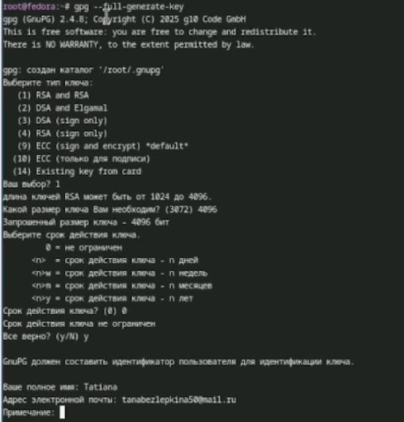
---

Копируем отпечаток приватного ключа 
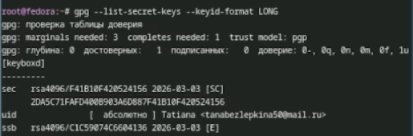
---

Экспортируем ключ по его отпечатку 
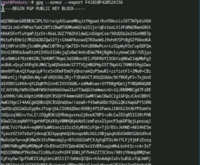
---

Добавим ключ pgp в github
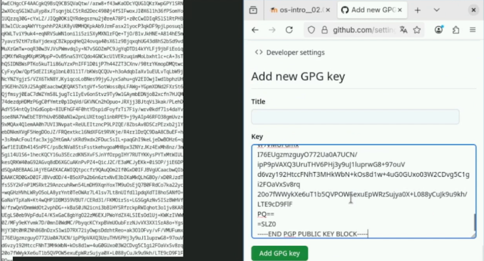
---

Настройка автоматических подписей коммитов git 

---

Авторизация в gh 
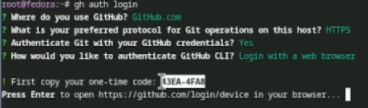
---

Продолжение работы с gh 
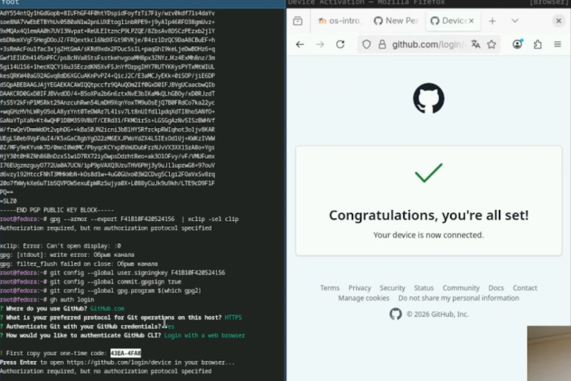
---
Создание репозитория курса на основе шаблона 
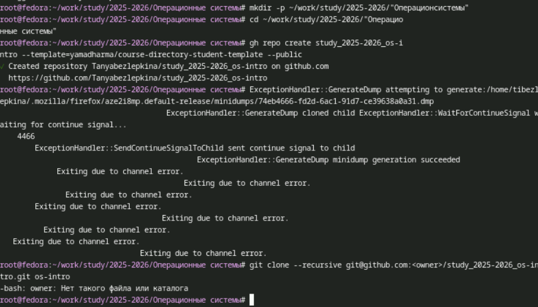
---

Продолжение загрузки шаблона 
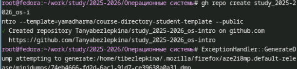
---

Настройка каталога курса 

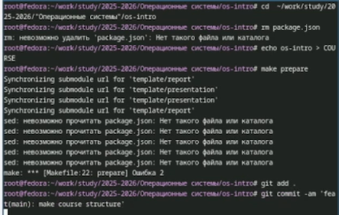
---

Отправка файлов на сервер 
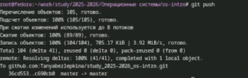

# Вывод

В ходе выполнения работы были изучены основные принципы работы систем контроля версий и получены практические навыки использования Git. Освоены базовые команды для создания репозиториев, фиксации изменений, работы с ветками и удалёнными репозиториями. Полученные знания позволяют эффективно организовать совместную работу над проектами, отслеживать историю изменений и управлять версиями кода, что является необходимым навыком для современного разработчика.

