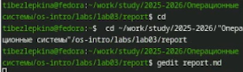
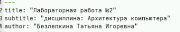
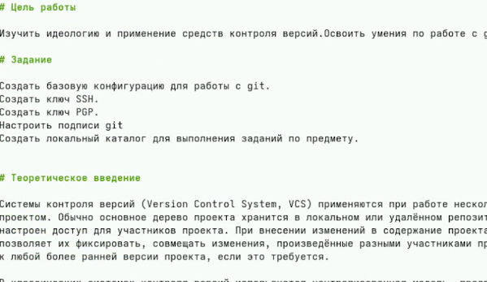
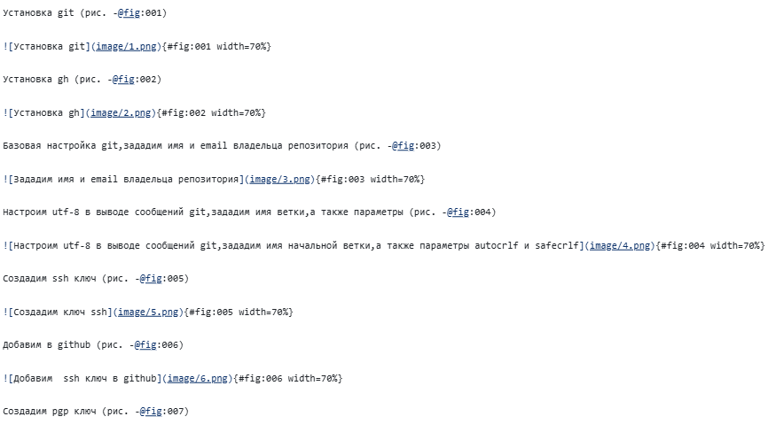

---
## Front matter
lang: ru-RU
title: Лабораторная работа №3
subtitle: Архитектура компьютеров
author:
  - Безлепкина Т.И.
institute:
  - Российский университет дружбы народов, Москва, Россия
date: 06 марта 2026

## i18n babel
babel-lang: russian
babel-otherlangs: english

## Fonts
mainfont: Liberation Serif
sansfont: Liberation Sans
monofont: Liberation Mono

## Formatting pdf
toc: false
toc-title: Содержание
slide_level: 0
aspectratio: 169
section-titles: true
theme: metropolis
header-includes:
  - \metroset{progressbar=frametitle,sectionpage=progressbar,numbering=fraction}
---

# Информация

## Докладчик

:::::::::::::: {.columns align=center}
::: {.column width="70%"}

  * Безлепкина Татьяна Игоревна
  * Студентка НКАбд-01-25
  * Таня
  * Российский университет дружбы народов
  * [1032253539@rudn.ru](mailto1032253539@rudn.ru)

:::
::: {.column width="30%"}

:::
::::::::::::::

# Цель работы

Мы научились оформлять отчёты с помощью легковесного языка разметки Markdown.

# Задание

Сделайте отчёт по предыдущей лабораторной работе в формате Markdown.
В качестве отчёта просьба предоставить отчёты в 3 форматах: pdf, docx и md (в архиве, поскольку он должен содержать скриншоты, Makefile и т.д.)

# Актуальность темы

Markdown — один из наиболее популярных языков разметки для создания технической документации, отчётов и презентаций. Его простота и удобство позволяют быстро форматировать текст, а возможность конвертации в различные форматы (PDF, DOCX, HTML) делает его незаменимым инструментом для студентов и исследователей при подготовке лабораторных работ и научных публикаций.

# Объект и предмет исследования.

Объект: язык разметки Markdown и инструменты его обработки.
Предмет: процесс создания структурированных документов с помощью Markdown и их конвертация в целевые форматы с использованием Pandoc

# Научная новизна. 
Систематизация приёмов работы с Markdown и Pandoc для эффективной подготовки учебной и научной документации, включая автоматизацию процесса конвертации с помощью Makefile и интеграцию с системами контроля версий.

 
# Практическая значимость работы. 
Освоение базового синтаксиса Markdown для быстрого форматирования текстов

Возможность создания документов, не зависящих от конкретного текстового процессора.
Автоматизация конвертации в различные форматы (PDF, DOCX, HTML) с помощью Pandoc.
Упрощение процесса подготовки отчётов по лабораторным работам.
Интеграция с Git для версионирования документации.

# Теоретическое введение

Markdown — язык разметки для форматирования текста. Заголовки обозначаются #, полужирный текст — **, курсив — *. Списки создаются звёздочками или цифрами, ссылки — текст, код — обратными кавычками. Для конвертации используется Pandoc: pandoc файл.md -o файл.pdf.

# Выполнение лабораторной работы
В рабочей директории курса через тектовый редактор файла открываю шаблон 

{#fig:004 width=70%}
---

Указываю основную информацию о лабораторной работе 

{#fig:001 width=70%}
---

Формирую цель работы,задание и заполняю теоритическое введение 

{#fig:002 width=70%}
---
Описываю процесс выполнения лабораторной работы 

{#fig:003 width=70%}

# Вывод

Мы научились оформлять отчёты с помощью легковесного языка разметки Markdown.

