---
## Front matter
lang: ru-RU
title: Лабораторная работа №5
subtitle: Архитектура компьютеров
author:
  - Безлепкина Т.И.
institute:
  - Российский университет дружбы народов, Москва, Россия
date: 06 марта 2026

## i18n babel
babel-lang: russian
babel-otherlangs: english

## Fonts
mainfont: Liberation Serif
sansfont: Liberation Sans
monofont: Liberation Mono

## Formatting pdf
toc: false
toc-title: Содержание
slide_level: 0
aspectratio: 169
section-titles: true
theme: metropolis
header-includes:
  - \metroset{progressbar=frametitle,sectionpage=progressbar,numbering=fraction}
---

# Информация

## Докладчик

:::::::::::::: {.columns align=center}
::: {.column width="70%"}

  * Безлепкина Татьяна Игоревна
  * Студентка НКАбд-01-25
  * Таня
  * Российский университет дружбы народов
  * [1032253539@rudn.ru](mailto1032253539@rudn.ru)

:::
::: {.column width="30%"}

.jpg)

:::
::::::::::::::

# Цель работы

Получение практических навыков работы с менеджером паролей pass и системой управления конфигурационными файлами chezmoi, а также их интеграция с Git и браузером для безопасного хранения и синхронизации данных.

# Задание

- Установить и настроить pass с GPG-ключом, подключить Git-репозиторий
- Добавить и просмотреть пароль, установить браузерное расширение
- Установить chezmoi, создать репозиторий dotfiles, инициализировать и проверить изменения

# Актуальность темы

В условиях роста числа онлайн-сервисов хранить пароли в голове или на бумаге небезопасно и неудобно. Менеджеры паролей стали необходимостью для защиты данных и экономии времени.

# Объект и предмет исследования.

- Объект: Процесс безопасного хранения учетных данных и управления конфигурациями в Linux.
- Предмет: Менеджер паролей pass и система управления dotfiles chezmoi.

# Научная новизна. 

Комплексный подход, объединяющий GPG-шифрование, версионирование паролей через Git и автоматическое развертывание конфигураций рабочей среды ("конфигурация как код").

# Практическая значимость работы. 

Возможность быстро развернуть защищенное и персонализированное рабочее окружение на любом компьютере одной командой, автоматически синхронизируя пароли и настройки.

# Теоретическое введение

- Pass — менеджер паролей, использующий GPG-шифрование и Git для синхронизации. Интеграция с браузером осуществляется через browserpass.
- Chezmoi — инструмент для управления конфигурационными файлами (dotfiles) через Git, позволяющий разворачивать настройки на нескольких машинах.

# Выполнение лабораторной работы

Менеджер паролей pass и расширение pass-otp устанавливаются стандартным способом для Fedora
(рис. -@fig:001)

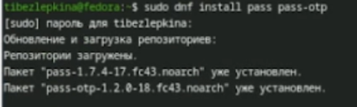{#fig:001 width=70%}

---

Ключи GPG (рис. -@fig:002)

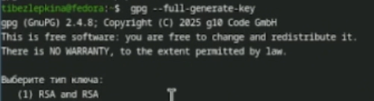{#fig:002 width=70%}

---

После установки необходимо инициализировать хранилище паролей и привязать его к GPG-ключу (рис. -@fig:003)

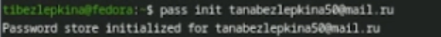{#fig:003 width=70%}

---

Для отслеживания изменений и синхронизации паролей создаем локальный Git-репозиторий в хранилище (рис. -@fig:004)

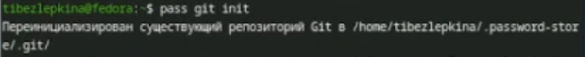{#fig:004 width=70%}

---

Привязываем локальный Git-репозиторий к репозиторию на GitHub для синхронизации паролей (рис. -@fig:005)

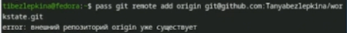{#fig:005 width=70%}

---

Отправляем локальные изменения в удаленный репозиторий и загружаем обновления (рис. -@fig:006)

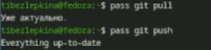{#fig:006 width=70%}

---

Подключение репозитория (рис. -@fig:007)

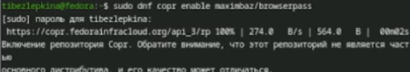{#fig:007 width=70%}

---

Установка browserpass (рис. -@fig:008)

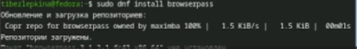{#fig:008 width=70%}

---

Добавление пароля (рис. -@fig:009)

{#fig:009 width=70%}

---

Просмотр пароля (рис. -@fig:010)

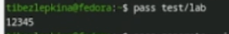{#fig:010 width=70%}

---

Генерация пароля (рис. -@fig:011)

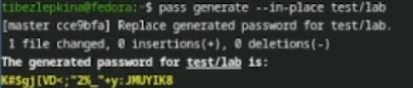{#fig:011 width=70%}

---

Установка дополнительного ПО (рис. -@fig:012)

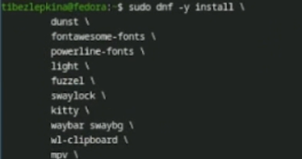{#fig:012 width=70%}

---

Подключение репозитория шрифтов (рис. -@fig:013)

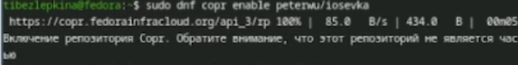{#fig:013 width=70%}

---

Поиск шрифтов (рис. -@fig:014)

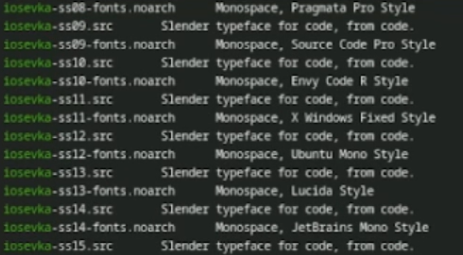{#fig:014 width=70%}

---

Установка шрифтов (рис. -@fig:015)

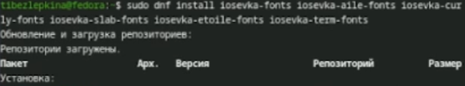{#fig:015 width=70%}

---

Установка chezmoi (рис. -@fig:016)

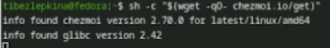{#fig:016 width=70%}

---

Создание репозитория dotfiles (рис. -@fig:017)

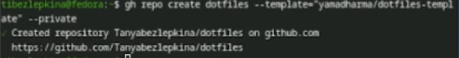{#fig:017 width=70%}

---

Инициализация chezmoi (рис. -@fig:018)

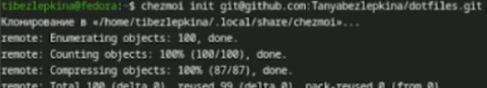{#fig:018 width=70%}

---

Проверка изменений (рис. -@fig:019)

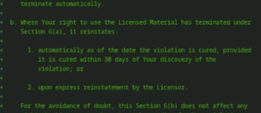{#fig:019 width=70%}

---

Демонстрация команд для работы на нескольких машинах(chezmoi init — инициализация репозитория,
chezmoi diff — проверка изменений,
chezmoi apply -v — применение конфигурации) (рис. -@fig:020)

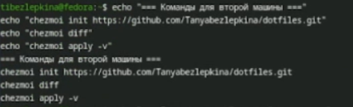{#fig:020 width=70%}

---

Быстрая настройка новой машины (рис. -@fig:021)

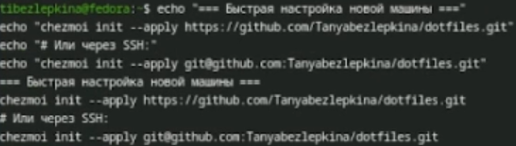{#fig:021 width=70%}

---

Ежедневные операции с chezmoi (рис. -@fig:022)

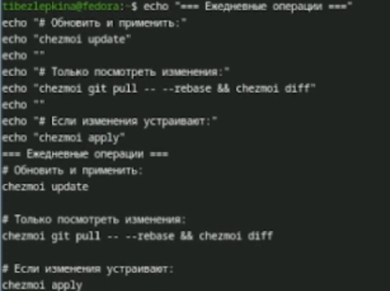{#fig:022 width=70%}

---

Настройка автоматической синхронизации (рис. -@fig:023)

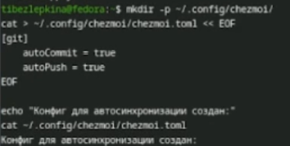{#fig:023 width=70%}

# Вывод

В ходе работы освоены инструменты безопасного хранения паролей (pass) и управления конфигурациями (chezmoi). Получены навыки работы с GPG-ключами, синхронизации через Git/GitHub, интеграции с браузером и развертывания dotfiles на нескольких машинах.

