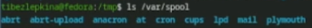
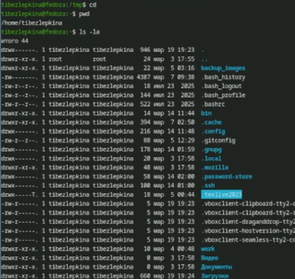
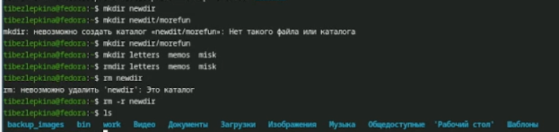
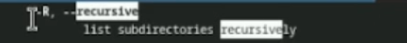
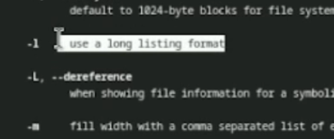
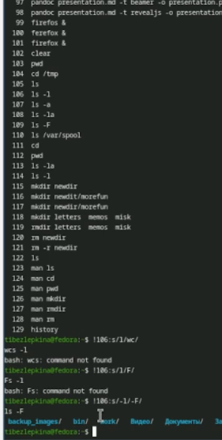

---
## Front matter
lang: ru-RU
title: Лабораторная работа №6
subtitle: Архитектура компьютеров
author:
  - Безлепкина Т.И.
institute:
  - Российский университет дружбы народов, Москва, Россия
date: 06 марта 2026

## i18n babel
babel-lang: russian
babel-otherlangs: english

## Fonts
mainfont: Liberation Serif
sansfont: Liberation Sans
monofont: Liberation Mono

## Formatting pdf
toc: false
toc-title: Содержание
slide_level: 0
aspectratio: 169
section-titles: true
theme: metropolis
header-includes:
  - \metroset{progressbar=frametitle,sectionpage=progressbar,numbering=fraction}
---

# Информация

## Докладчик

:::::::::::::: {.columns align=center}
::: {.column width="70%"}

  * Безлепкина Татьяна Игоревна
  * Студентка НКАбд-01-25
  * Таня
  * Российский университет дружбы народов
  * [1032253539@rudn.ru](mailto1032253539@rudn.ru)

:::
::: {.column width="30%"}

:::
::::::::::::::

# Цель работы

Целью данной лабораторной работы является освоение основных команд для навигации по файловой системе Linux, управления каталогами (создание, удаление, просмотр), а также получение навыков работы со справочной системой команд (man) и буфером команд (history)

# Задание

- Определить полное имя домашнего каталога.
- Выполнить навигацию по каталогам `/tmp` и `/var/spool`, проанализировать вывод команды `ls` с различными опциями.
- Практически освоить создание и удаление каталогов с помощью команд `mkdir` и `rmdir`/`rm`.
- Изучить справочную информацию команд `ls`, `cd`, `pwd`, `mkdir`, `rmdir`, `rm` с помощью `man`.
- Научиться модифицировать и повторно выполнять команды из буфера истории (`history`).

# Актуальность темы

Навыки работы в командной строке Linux являются фундаментальными для специалистов в области IT, поскольку позволяют эффективно управлять файловой системой, автоматизировать задачи и администрировать серверы, где графический интерфейс часто отсутствует.

# Объект и предмет исследования.

Объект исследования: файловая система операционной системы Linux.

Предмет исследования: команды навигации и управления каталогами (cd, pwd, ls, mkdir, rm, rmdir), справочная система man и механизм работы с историей команд history.

# Научная новизна. 

Освоение базовых принципов взаимодействия с файловой системой Linux через командную строку формирует основу для дальнейшего изучения более сложных аспектов администрирования, скриптовой автоматизации и программирования в Unix-подобных средах.

# Практическая значимость работы. 

Полученные навыки позволяют уверенно ориентироваться в файловой структуре Linux, эффективно создавать и удалять каталоги, быстро находить справочную информацию по командам, а также ускорять работу за счет использования буфера истории команд.

# Теоретическое введение

В операционной системе Linux навигация и управление файлами являются базовыми навыками работы в командной строке. Все объекты (файлы, каталоги, устройства) организованы в единую иерархическую структуру — файловое дерево, корнем которого является каталог `/`.

- **Абсолютный путь** — это полный путь от корневого каталога (`/`), например `/home/tanya/newdir`.
- **Относительный путь** — путь относительно текущего рабочего каталога, например `newdir/morefun`.

Для работы с каталогами используются следующие основные команды:
- `pwd` (print working directory) — показывает полный путь к текущему каталогу.
- `cd` (change directory) — осуществляет переход в другой каталог.
- `ls` (list) — выводит список содержимого каталога. Имеет множество опций для форматирования вывода.
- `mkdir` (make directory) — создает новые каталоги.
- `rmdir` (remove directory) — удаляет пустые каталоги.
- `rm` (remove) — удаляет файлы или каталоги (с опцией `-r`).

Для получения подробной справки о любой команде используется встроенная справочная система `man` (manual), например `man ls`.

# Выполнение лабораторной работы

Была определена текущая директория (/home/tibezlepkina) и выполнен переход в каталог /tmp для дальнейшей работы с временными файлами (рис. -@fig:001)

{#fig:001 width=70%}

---

Работа с ls и различными опциями.ls - Только имена видимых файлов и каталогов, ls -a - Все файлы, включая скрытые, ls -l - Подробная информация: права доступа, количество ссылок, владелец, группа, размер, дата и время последнего изменения, имя файла  (рис. -@fig:002)

{#fig:002 width=70%}

---

Была выполнена команда ls /var/spool для просмотра содержимого системного каталога, в котором хранятся очереди заданий различных служб (рис. -@fig:003)

{#fig:003 width=70%}

---

Анализ вывода команды ls -la показывает, что владельцем всех файлов и подкаталогов является пользователь tibezlepkina, а группой-владельцем — группа tibezlepkina (рис. -@fig:004)

{#fig:004 width=70%}

---

Были выполнены операции по созданию и удалению каталогов с использованием команд mkdir и rm. В процессе работы были проанализированы типичные ошибки, возникающие при некорректном использовании данных команд, а также способы их устранения. (рис. -@fig:005)

{#fig:005 width=70%}

---

Для рекурсивного просмотра содержимого каталога и всех его подкаталогов используется опция -R (рис. -@fig:006)

{#fig:006 width=70%}

---

С помощью команды man ls был определён набор опций команды ls, позволяющий отсортировать выводимый список содержимого каталога по времени последнего изменения с развёрнутым описанием файлов (рис. -@fig:007)

{#fig:007 width=70%}

---

mkdir: -p — создает промежуточные каталоги; -v — показывает сообщения о создании.rmdir: -p — удаляет вложенные пустые каталоги;rm: -r — рекурсивное удаление (каталогов); -f — принудительное удаление; -i — запрос подтверждения; -v — вывод информации об удалении.cd: без опций — переход в домашний каталог; - — переход в предыдущий каталог.pwd: -L — логический путь (с ссылками); -P — физический путь (без ссылок) (рис. -@fig:008)

{#fig:008 width=70%}

---

Была изучена работа с историей команд в терминале с использованием механизма подстановки (substitution) для повторного выполнения и модификации ранее введенных команд. (рис. -@fig:009)

{#fig:009 width=70%}

# Выводы

- Определила полное имя своего домашнего каталога (/home/tatiana).
- Научилась навигировать по файловой системе Linux с помощью команд cd и pwd.
- Изучила различные опции команды ls (-l, -a, -R, -t) и научилась интерпретировать их вывод.
- Освоила создание и удаление каталогов с помощью mkdir, rmdir и rm -r.
- Приобрела навыки работы со справочной системой man для получения информации о командах.
- Научилась использовать буфер команд history для модификации и повторного выполнения ранее введенных команд.
- Полученные навыки являются фундаментом для дальнейшей эффективной работы в командной строке операционной системы Linux.

# Список литературы

::: {#refs}
:::

