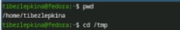
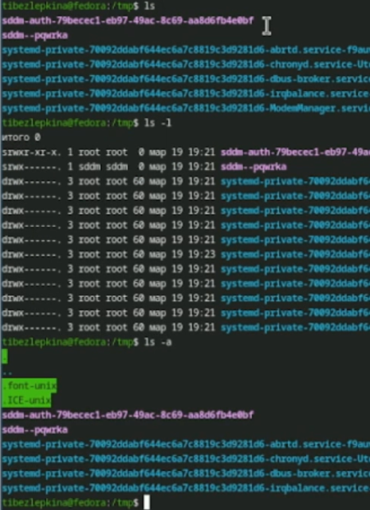
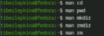

# Цель работы

Целью данной лабораторной работы является освоение основных команд для навигации по файловой системе Linux, управления каталогами (создание, удаление, просмотр), а также получение навыков работы со справочной системой команд (man) и буфером команд (history)

# Задание

- Определить полное имя домашнего каталога.
- Выполнить навигацию по каталогам `/tmp` и `/var/spool`, проанализировать вывод команды `ls` с различными опциями.
- Практически освоить создание и удаление каталогов с помощью команд `mkdir` и `rmdir`/`rm`.
- Изучить справочную информацию команд `ls`, `cd`, `pwd`, `mkdir`, `rmdir`, `rm` с помощью `man`.
- Научиться модифицировать и повторно выполнять команды из буфера истории (`history`).


# Теоретическое введение

В операционной системе Linux навигация и управление файлами являются базовыми навыками работы в командной строке. Все объекты (файлы, каталоги, устройства) организованы в единую иерархическую структуру — файловое дерево, корнем которого является каталог `/`.

- **Абсолютный путь** — это полный путь от корневого каталога (`/`), например `/home/tanya/newdir`.
- **Относительный путь** — путь относительно текущего рабочего каталога, например `newdir/morefun`.

Для работы с каталогами используются следующие основные команды:
- `pwd` (print working directory) — показывает полный путь к текущему каталогу.
- `cd` (change directory) — осуществляет переход в другой каталог.
- `ls` (list) — выводит список содержимого каталога. Имеет множество опций для форматирования вывода.
- `mkdir` (make directory) — создает новые каталоги.
- `rmdir` (remove directory) — удаляет пустые каталоги.
- `rm` (remove) — удаляет файлы или каталоги (с опцией `-r`).

Для получения подробной справки о любой команде используется встроенная справочная система `man` (manual), например `man ls`.

# Выполнение лабораторной работы


Была определена текущая директория (/home/tibezlepkina) и выполнен переход в каталог /tmp для дальнейшей работы с временными файлами (рис. -@fig:001)

{#fig:001 width=70%}

Работа с ls и различными опциями.ls - Только имена видимых файлов и каталогов, ls -a - Все файлы, включая скрытые, ls -l - Подробная информация: права доступа, количество ссылок, владелец, группа, размер, дата и время последнего изменения, имя файла  (рис. -@fig:002)

{#fig:002 width=70%}

Была выполнена команда ls /var/spool для просмотра содержимого системного каталога, в котором хранятся очереди заданий различных служб (рис. -@fig:003)

{#fig:003 width=70%}

Анализ вывода команды ls -la показывает, что владельцем всех файлов и подкаталогов является пользователь tibezlepkina, а группой-владельцем — группа tibezlepkina (рис. -@fig:004)

{#fig:004 width=70%}

Были выполнены операции по созданию и удалению каталогов с использованием команд mkdir и rm. В процессе работы были проанализированы типичные ошибки, возникающие при некорректном использовании данных команд, а также способы их устранения. (рис. -@fig:005)

{#fig:005 width=70%}

Для рекурсивного просмотра содержимого каталога и всех его подкаталогов используется опция -R (рис. -@fig:006)

{#fig:006 width=70%}

С помощью команды man ls был определён набор опций команды ls, позволяющий отсортировать выводимый список содержимого каталога по времени последнего изменения с развёрнутым описанием файлов (рис. -@fig:007)

{#fig:007 width=70%}

mkdir: -p — создает промежуточные каталоги; -v — показывает сообщения о создании.rmdir: -p — удаляет вложенные пустые каталоги;rm: -r — рекурсивное удаление (каталогов); -f — принудительное удаление; -i — запрос подтверждения; -v — вывод информации об удалении.cd: без опций — переход в домашний каталог; - — переход в предыдущий каталог.pwd: -L — логический путь (с ссылками); -P — физический путь (без ссылок) (рис. -@fig:008)

{#fig:008 width=70%}

Была изучена работа с историей команд в терминале с использованием механизма подстановки (substitution) для повторного выполнения и модификации ранее введенных команд. (рис. -@fig:009)

{#fig:009 width=70%}

# Выводы

- Определила полное имя своего домашнего каталога (/home/tatiana).
- Научилась навигировать по файловой системе Linux с помощью команд cd и pwd.
- Изучила различные опции команды ls (-l, -a, -R, -t) и научилась интерпретировать их вывод.
- Освоила создание и удаление каталогов с помощью mkdir, rmdir и rm -r.
- Приобрела навыки работы со справочной системой man для получения информации о командах.
- Научилась использовать буфер команд history для модификации и повторного выполнения ранее введенных команд.
- Полученные навыки являются фундаментом для дальнейшей эффективной работы в командной строке операционной системы Linux.

# Контрольные вопросы

## Ответы на контрольные вопросы

**1. Что такое командная строка?**

Командная строка (терминал, консоль) — это интерфейс взаимодействия пользователя с операционной системой путем ввода текстовых команд. Она позволяет выполнять операции с файлами, запускать программы и управлять системой без использования графического интерфейса.

**2. При помощи какой команды можно определить абсолютный путь текущего каталога? Приведите пример.**

Для определения абсолютного пути текущего каталога используется команда `pwd` (print working directory).

Пример:
```bash
$ pwd
/home/tatiana/labrab
```

**3. При помощи какой команды и каких опций можно определить только тип файлов и их имена в текущем каталоге? Приведите примеры.**

Для определения типа файлов и их имен используется команда `ls -F`. Эта опция добавляет специальный символ к имени файла, указывающий на его тип:
- `/` — каталог
- `*` — исполняемый файл
- `@` — символическая ссылка
- `|` — именованный канал
- `=` — сокет

Пример:
```bash
$ ls -F
Documents/  script.sh*  link@  file.txt
```

**4. Каким образом отобразить информацию о скрытых файлах? Приведите примеры.**

Скрытые файлы (имена которых начинаются с точки) отображаются с помощью опции `-a` (all):

```bash
$ ls -a
.  ..  .bashrc  .config  Documents  file.txt
```

Для более подробного просмотра скрытых файлов используется комбинация `ls -la`.

**5. При помощи каких команд можно удалить файл и каталог? Можно ли это сделать одной и той же командой? Приведите примеры.**

- Для удаления файла используется команда `rm файл`
- Для удаления пустого каталога используется команда `rmdir каталог`
- Для удаления каталога с содержимым используется команда `rm -r каталог`

Да, можно использовать одну команду `rm -r` для удаления и файлов, и каталогов (рекурсивно).

Примеры:
```bash
rm file.txt                 # удаление файла
rmdir empty_dir             # удаление пустого каталога
rm -r project/              # удаление каталога project со всем содержимым
rm -rf dir/                 # принудительное удаление без подтверждения
```

**6. Каким образом можно вывести информацию о последних выполненных пользователем командах?**

Для вывода списка последних выполненных команд используется команда `history`:

```bash
$ history
100  ls -la
101  cd /tmp
102  mkdir test
103  history
```

**7. Как воспользоваться историей команд для их модифицированного выполнения? Приведите примеры.**

Существует несколько способов работы с историей команд:

- `!!` — выполнить последнюю команду
- `!100` — выполнить команду под номером 100
- `!ls` — выполнить последнюю команду, начинающуюся с ls
- `!102:s/old/new/` — выполнить команду 102, заменив `old` на `new`

Примеры:
```bash
$ !!                      # выполнит последнюю команду
$ !100                    # выполнит команду с номером 100
$ !102:s/misk/docs/       # выполнит команду 102, заменив misk на docs
```

**8. Приведите примеры запуска нескольких команд в одной строке.**

Для запуска нескольких команд в одной строке используется точка с запятой `;`:

```bash
cd /tmp; ls -la; pwd
```

Также можно использовать условное выполнение:
- `&&` — вторая команда выполнится только при успешном выполнении первой
- `||` — вторая команда выполнится только при ошибке выполнения первой

Примеры:
```bash
mkdir test && cd test          # создать папку и сразу войти в нее
gcc program.c || echo "Ошибка компиляции"
```

**9. Дайте определение и приведите примеры символов экранирования.**

Экранирование — это способ отмены специального значения символов. Для экранирования используется обратный слеш `\` или кавычки.

Примеры:
```bash
echo \$HOME                   # выведет $HOME, а не значение переменной
touch "file name.txt"         # создаст файл с пробелом в имени
touch file\ name.txt          # то же самое с экранированием пробела
```

**10. Охарактеризуйте вывод информации на экран после выполнения команды ls с опцией l.**

Опция `-l` (long format) выводит подробную информацию о файлах в виде таблицы:

```
-rw-r--r-- 1 tatiana tatiana 1234 Apr 15 10:30 file.txt
```

Поля слева направо означают:
1. **Тип файла и права доступа** (первый символ: `-` обычный файл, `d` каталог, `l` символическая ссылка)
2. **Количество жестких ссылок**
3. **Имя владельца**
4. **Имя группы-владельца**
5. **Размер файла в байтах**
6. **Дата и время последнего изменения**
7. **Имя файла**

**11. Что такое относительный путь к файлу? Приведите примеры использования относительного и абсолютного пути при выполнении какой-либо команды.**

**Относительный путь** — это путь к файлу или каталогу относительно текущего рабочего каталога. Он не начинается с символа `/`.

**Абсолютный путь** — это полный путь от корневого каталога `/`.

Примеры (при текущем каталоге `/home/tatiana`):
```bash
# Использование абсолютного пути
ls /home/tatiana/Documents/file.txt

# Использование относительного пути
ls Documents/file.txt
cd ..                     # переход на уровень выше (относительный путь)
cd /home                  # переход по абсолютному пути
```

**12. Как получить информацию об интересующей вас команде?**

Для получения справочной информации о команде используется команда `man` (manual):

```bash
man ls
man mkdir
man bash
```

Альтернативные способы: `info команда`, `команда --help`, `help команда` (для встроенных команд bash).

**13. Какая клавиша или комбинация клавиш служит для автоматического дополнения вводимых команд?**

Для автоматического дополнения вводимых команд используется клавиша **Tab** (табуляция).

Примеры использования:
- При вводе `cd Docu` и нажатии Tab команда дополнится до `cd Documents/`
- При двойном нажатии Tab после `pandoc` отобразится список всех команд, начинающихся с `pandoc`

---

# Список литературы

::: {#refs}
:::
