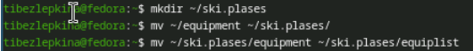
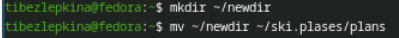
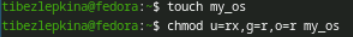
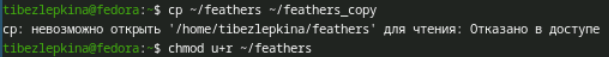
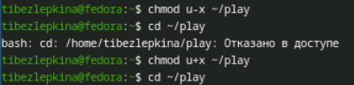
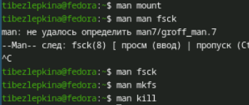

---
## Front matter
lang: ru-RU
title: Лабораторная работа №7
subtitle: Архитектура компьютеров
author:
  - Безлепкина Т.И.
institute:
  - Российский университет дружбы народов, Москва, Россия
date: 06 марта 2026

## i18n babel
babel-lang: russian
babel-otherlangs: english

## Fonts
mainfont: Liberation Serif
sansfont: Liberation Sans
monofont: Liberation Mono

## Formatting pdf
toc: false
toc-title: Содержание
slide_level: 0
aspectratio: 169
section-titles: true
theme: metropolis
header-includes:
  - \metroset{progressbar=frametitle,sectionpage=progressbar,numbering=fraction}
---

# Информация

## Докладчик

:::::::::::::: {.columns align=center}
::: {.column width="70%"}

  * Безлепкина Татьяна Игоревна
  * Студентка НКАбд-01-25
  * Таня
  * Российский университет дружбы народов
  * [1032253539@rudn.ru](mailto1032253539@rudn.ru)

:::
::: {.column width="30%"}

.jpg)

:::
::::::::::::::

# Цель работы

Ознакомление с файловой системой Linux, её структурой, именами и содержанием
каталогов. Приобретение практических навыков по применению команд для работы
с файлами и каталогами, по управлению процессами (и работами), по проверке исполь-
зования диска и обслуживанию файловой системы.

# Задание

1. Изучить команды для работы с файлами и каталогами (touch, cat, less, head, tail, cp, mv).
2. Освоить управление правами доступа с помощью chmod.
3. Научиться анализировать файловую систему с использованием команд mount, df, fsck.
4. Выполнить задания по изменению прав доступа для указанных файлов и каталогов.
5. Ответить на контрольные вопросы по теме.

# Актуальность темы

Файловая система является основой любой операционной системы. Понимание принципов её работы, умение управлять файлами и каталогами, а также правильно настраивать права доступа необходимо для эффективной работы в среде Linux

# Объект и предмет исследования.

**Объект исследования:** файловая система операционной системы Linux.

**Предмет исследования:** структура файловой системы, команды для работы с файлами и каталогами, механизмы управления правами доступа.

# Научная новизна. 

Работа носит учебно-практический характер и направлена на закрепление базовых навыков работы с файловой системой Linux. Новизна заключается в систематизации знаний о командах и инструментах анализа файловой системы

# Практическая значимость работы. 

Полученные навыки позволяют эффективно управлять файлами и каталогами, настраивать права доступа, контролировать использование дискового пространства и обслуживать файловую систему, что необходимо для повседневной работы системного администратора и разработчика.

# Теоретическое введение

В Linux файловая система имеет иерархическую структуру и состоит из файлов и каталогов. Основные типы файловых систем: ext2, ext3, ext4, ReiserFS, XFS, FAT, NTFS. Для работы с файлами используются команды: touch (создание), cat, less, head, tail (просмотр), cp (копирование), mv (перемещение/переименование). Каждый файл и каталог имеет права доступа (чтение, запись, выполнение) для владельца, группы и остальных пользователей. Права можно изменять командой chmod. Для анализа файловой системы применяются команды mount, df, fsck.

# Выполнение лабораторной работы

Необходимо скопировать системный файл io.h из каталога /usr/include/sys/ в домашний каталог пользователя в папку equipment (рис. -@fig:001)

{#fig:001 width=70%}

---

Создаётся каталог для хранения файлов, связанных с лыжным снаряжением. Затем файл equipment перемещается в этот каталог и переименовывается в equiplist  (рис. -@fig:002)

{#fig:002 width=70%}

---

Создаётся пустой файл abc1, который затем копируется в каталог ski.plases под именем equiplist2 (рис. -@fig:003)

{#fig:003 width=70%}

---

Внутри каталога ski.plases создаётся подкаталог equipment, в который перемещаются ранее созданные файлы equiplist и equiplist2 (рис. -@fig:004)

{#fig:004 width=70%}

---

Создаётся временный каталог newdir, который затем переименовывается в plans и перемещается внутрь ski.plases (рис. -@fig:005)

{#fig:005 width=70%}

---

Создаётся каталог australia, для которого устанавливаются права доступа: владелец имеет полные права (rwx), группа и остальные — только чтение (r) (рис. -@fig:006)

{#fig:006 width=70%}

---

Создаётся каталог play, для которого задаются права: владелец имеет полные права (rwx), группа и остальные — только право на выполнение (x) (рис. -@fig:007)

{#fig:007 width=70%}

---

Создаётся файл my_os, для которого устанавливаются права: владелец может читать и выполнять (rx), группа и остальные — только читать (r) (рис. -@fig:008)

{#fig:008 width=70%}

---

Создаётся файл feathers, для которого задаются права: владелец и группа имеют права на чтение и запись (rw), остальные — только чтение (r) (рис. -@fig:009)

{#fig:009 width=70%}

---

Для ознакомления с системными пользователями выполняется просмотр файла /etc/passwd, содержащего учётные записи (рис. -@fig:010)

{#fig:010 width=70%}

---

Создаётся копия файла feathers с именем file.old, которая затем перемещается в каталог play (рис. -@fig:011)

{#fig:011 width=70%}

---

Каталог play копируется рекурсивно в новый каталог fun, который затем перемещается внутрь play под именем games (рис. -@fig:012)

{#fig:012 width=70%}

---

У владельца файла feathers удаляется право на чтение, после чего попытка просмотра файла завершается ошибкой отказа в доступе (рис. -@fig:013)

{#fig:013 width=70%}

---

Из-за отсутствия права на чтение попытка скопировать файл feathers завершается ошибкой. Затем владельцу возвращается право на чтение (рис. -@fig:014)

{#fig:014 width=70%}

---

У каталога play удаляется право на выполнение для владельца, что делает невозможным переход в этот каталог. После восстановления права доступ возвращается. (рис. -@fig:015)

{#fig:015 width=70%}

---

Для изучения команд работы с файловыми системами и процессами используются справочные страницы (man) для команд mount, fsck, mkfs, kill (рис. -@fig:016)

{#fig:016 width=70%}

## Краткая характеристика команд (по man)

**mount** — монтирование файловых систем

Пример: `mount -t ext4 /dev/sda1 /mnt/data` — монтирует раздел `/dev/sda1` с файловой системой ext4 в каталог `/mnt/data`

Ключи: `-t` — тип ФС, `-o` — параметры монтирования (ro/rw, noexec и др.), `-a` — монтировать все ФС из `/etc/fstab`

**fsck** — проверка и восстановление ФС

Пример: `sudo fsck -y /dev/sda1` — проверяет раздел и автоматически исправляет ошибки без запроса подтверждения

Ключи: `-y` — автоматически давать "да" на все вопросы, `-n` — только просмотр без исправлений, `-A` — проверить все ФС из `/etc/fstab`, `-f` — принудительная проверка

**mkfs** — создание файловой системы

Пример: `mkfs -t ext4 /dev/sdb1` — создаёт ФС ext4 на разделе `/dev/sdb1`

Примечание: `mkfs` является фронтендом; предпочтительнее использовать специализированные команды: `mkfs.ext4`, `mkfs.xfs`, `mkfs.vfat`

**kill** — завершение процессов

Пример: `kill -9 1234` — принудительно завершает процесс с PID 1234 сигналом SIGKILL

Ключи: `-l` — список сигналов, `-s` — указать сигнал по имени/номеру

Основные сигналы: SIGTERM (15) — мягкое завершение (по умолчанию), SIGKILL (9) — принудительное, SIGHUP (1) — перезапуск

# Выводы

В ходе выполнения лабораторной работы были изучены основные команды управления файлами и каталогами в Linux: `touch`, `cat`, `less`, `head`, `tail`, `cp`, `mv`. Приобретены навыки изменения прав доступа с помощью команды `chmod` как символьным, так и числовым способом. Освоены инструменты анализа файловой системы (`mount`, `df`, `fsck`), а также команды для работы с процессами (`kill`). Полученные знания позволяют эффективно работать с файловой структурой, управлять доступом к данным и контролировать состояние дискового пространства в операционной системе Linux.

# Список литературы

1. Network World. *Linux filesystems: Ext4, Btrfs, XFS, ZFS and more*. <https://www.networkworld.com/article/3631604/linux-filesystems-ext4-btrfs-xfs-zfs-and-more.html>
2. Debian Wiki. *FilesystemHierarchyStandard*. <https://wiki.debian.org/FilesystemHierarchyStandard>

