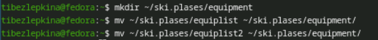
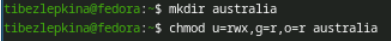
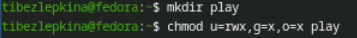
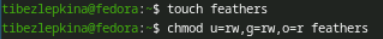
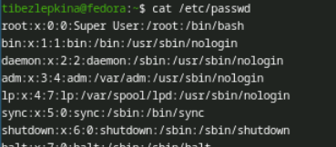
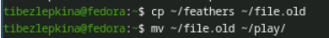
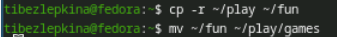
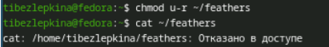

# Цель работы

Ознакомление с файловой системой Linux, её структурой, именами и содержанием
каталогов. Приобретение практических навыков по применению команд для работы
с файлами и каталогами, по управлению процессами (и работами), по проверке исполь-
зования диска и обслуживанию файловой системы.

# Задание

1. Изучить команды для работы с файлами и каталогами (touch, cat, less, head, tail, cp, mv).
2. Освоить управление правами доступа с помощью chmod.
3. Научиться анализировать файловую систему с использованием команд mount, df, fsck.
4. Выполнить задания по изменению прав доступа для указанных файлов и каталогов.
5. Ответить на контрольные вопросы по теме.

# Теоретическое введение

В Linux файловая система имеет иерархическую структуру и состоит из файлов и каталогов. Основные типы файловых систем: ext2, ext3, ext4, ReiserFS, XFS, FAT, NTFS. Для работы с файлами используются команды: touch (создание), cat, less, head, tail (просмотр), cp (копирование), mv (перемещение/переименование). Каждый файл и каталог имеет права доступа (чтение, запись, выполнение) для владельца, группы и остальных пользователей. Права можно изменять командой chmod. Для анализа файловой системы применяются команды mount, df, fsck.

# Выполнение лабораторной работы

Необходимо скопировать системный файл io.h из каталога /usr/include/sys/ в домашний каталог пользователя в папку equipment (рис. -@fig:001)

{#fig:001 width=70%}

Создаётся каталог для хранения файлов, связанных с лыжным снаряжением. Затем файл equipment перемещается в этот каталог и переименовывается в equiplist  (рис. -@fig:002)

{#fig:002 width=70%}

Создаётся пустой файл abc1, который затем копируется в каталог ski.plases под именем equiplist2 (рис. -@fig:003)

{#fig:003 width=70%}

Внутри каталога ski.plases создаётся подкаталог equipment, в который перемещаются ранее созданные файлы equiplist и equiplist2 (рис. -@fig:004)

{#fig:004 width=70%}

Создаётся временный каталог newdir, который затем переименовывается в plans и перемещается внутрь ski.plases (рис. -@fig:005)

{#fig:005 width=70%}

Создаётся каталог australia, для которого устанавливаются права доступа: владелец имеет полные права (rwx), группа и остальные — только чтение (r) (рис. -@fig:006)

{#fig:006 width=70%}

Создаётся каталог play, для которого задаются права: владелец имеет полные права (rwx), группа и остальные — только право на выполнение (x) (рис. -@fig:007)

{#fig:007 width=70%}

Создаётся файл my_os, для которого устанавливаются права: владелец может читать и выполнять (rx), группа и остальные — только читать (r) (рис. -@fig:008)

{#fig:008 width=70%}

Создаётся файл feathers, для которого задаются права: владелец и группа имеют права на чтение и запись (rw), остальные — только чтение (r) (рис. -@fig:009)

{#fig:009 width=70%}

Для ознакомления с системными пользователями выполняется просмотр файла /etc/passwd, содержащего учётные записи (рис. -@fig:010)

{#fig:010 width=70%}

Создаётся копия файла feathers с именем file.old, которая затем перемещается в каталог play (рис. -@fig:011)

{#fig:011 width=70%}

Каталог play копируется рекурсивно в новый каталог fun, который затем перемещается внутрь play под именем games (рис. -@fig:012)

{#fig:012 width=70%}

У владельца файла feathers удаляется право на чтение, после чего попытка просмотра файла завершается ошибкой отказа в доступе (рис. -@fig:013)

{#fig:013 width=70%}

Из-за отсутствия права на чтение попытка скопировать файл feathers завершается ошибкой. Затем владельцу возвращается право на чтение (рис. -@fig:014)

{#fig:014 width=70%}

У каталога play удаляется право на выполнение для владельца, что делает невозможным переход в этот каталог. После восстановления права доступ возвращается. (рис. -@fig:015)

{#fig:015 width=70%}

Для изучения команд работы с файловыми системами и процессами используются справочные страницы (man) для команд mount, fsck, mkfs, kill (рис. -@fig:016)

{#fig:016 width=70%}

## Краткая характеристика команд (по man)

**mount** — монтирование файловых систем

Пример: `mount -t ext4 /dev/sda1 /mnt/data` — монтирует раздел `/dev/sda1` с файловой системой ext4 в каталог `/mnt/data`

Ключи: `-t` — тип ФС, `-o` — параметры монтирования (ro/rw, noexec и др.), `-a` — монтировать все ФС из `/etc/fstab`

**fsck** — проверка и восстановление ФС

Пример: `sudo fsck -y /dev/sda1` — проверяет раздел и автоматически исправляет ошибки без запроса подтверждения

Ключи: `-y` — автоматически давать "да" на все вопросы, `-n` — только просмотр без исправлений, `-A` — проверить все ФС из `/etc/fstab`, `-f` — принудительная проверка

**mkfs** — создание файловой системы

Пример: `mkfs -t ext4 /dev/sdb1` — создаёт ФС ext4 на разделе `/dev/sdb1`

Примечание: `mkfs` является фронтендом; предпочтительнее использовать специализированные команды: `mkfs.ext4`, `mkfs.xfs`, `mkfs.vfat`

**kill** — завершение процессов

Пример: `kill -9 1234` — принудительно завершает процесс с PID 1234 сигналом SIGKILL

Ключи: `-l` — список сигналов, `-s` — указать сигнал по имени/номеру

Основные сигналы: SIGTERM (15) — мягкое завершение (по умолчанию), SIGKILL (9) — принудительное, SIGHUP (1) — перезапуск

# Выводы

В ходе выполнения лабораторной работы были изучены основные команды управления файлами и каталогами в Linux: `touch`, `cat`, `less`, `head`, `tail`, `cp`, `mv`. Приобретены навыки изменения прав доступа с помощью команды `chmod` как символьным, так и числовым способом. Освоены инструменты анализа файловой системы (`mount`, `df`, `fsck`), а также команды для работы с процессами (`kill`). Полученные знания позволяют эффективно работать с файловой структурой, управлять доступом к данным и контролировать состояние дискового пространства в операционной системе Linux.

# Контрольные вопросы

**1. Дайте характеристику каждой файловой системе, существующей на жёстком диске.**

ext4 — стандартная файловая система Linux, журналируемая, поддерживает большие объёмы. XFS — высокопроизводительная система для работы с крупными файлами. swap — раздел подкачки, используется как виртуальная память.

**2. Приведите общую структуру файловой системы и дайте характеристику каждой директории первого уровня.**

/bin — основные команды. /boot — загрузчик и ядро. /dev — файлы устройств. /etc — конфигурации. /home — домашние папки пользователей. /proc — информация о процессах. /root — домашний каталог root. /tmp — временные файлы. /usr — пользовательские программы. /var — логи и переменные данные.

**3. Какая операция должна быть выполнена, чтобы содержимое файловой системы стало доступно?**

Операция монтирования (команда mount). Файловая система подключается к точке монтирования в общем дереве каталогов.

**4. Назовите основные причины нарушения целостности файловой системы. Как устранить повреждения файловой системы?**

Причины: сбой питания, некорректное завершение работы, ошибки диска. Устранение: команда fsck для проверки и восстановления (запускается на размонтированной системе).

**5. Как создаётся файловая система?**

Командой mkfs: mkfs -t ext4 /dev/sda1

**6. Дайте характеристику командам для просмотра текстовых файлов.**

cat — выводит содержимое всего файла целиком. less — постраничный просмотр с возможностью навигации и поиска. head — выводит первые строки файла (по умолчанию 10). tail — выводит последние строки файла (по умолчанию 10).

**7. Приведите основные возможности команды cp в Linux.**

cp файл1 файл2 — копирование файла. cp файлы каталог/ — копирование нескольких файлов в каталог. cp -r каталог1 каталог2 — рекурсивное копирование каталога. cp -i — запрос подтверждения перед перезаписью. cp -f — принудительное копирование. cp -a — копирование с сохранением атрибутов.

**8. Приведите основные возможности команды mv в Linux.**

mv старый новый — переименование файла или каталога. mv файл каталог/ — перемещение файла в каталог. mv каталог1 каталог2/ — перемещение каталога. mv -i — запрос подтверждения перед перезаписью. mv -f — принудительное перемещение без запроса. mv -v — подробный вывод.

**9. Что такое права доступа? Как они могут быть изменены?**

Права доступа — это разрешения на чтение (r), запись (w) и выполнение (x) для трёх категорий пользователей: владельца (u), группы (g) и остальных (o). Изменяются права командой chmod: символьный способ chmod u+x файл; числовой способ chmod 755 файл (где r=4, w=2, x=1).

# Список литературы

1. Network World. *Linux filesystems: Ext4, Btrfs, XFS, ZFS and more*. <https://www.networkworld.com/article/3631604/linux-filesystems-ext4-btrfs-xfs-zfs-and-more.html>
2. Debian Wiki. *FilesystemHierarchyStandard*. <https://wiki.debian.org/FilesystemHierarchyStandard>
