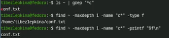
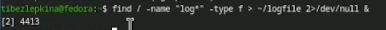
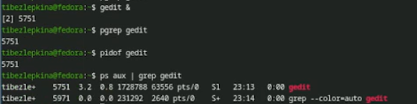

---
## Front matter
lang: ru-RU
title: Лабораторная работа №6
subtitle: Архитектура компьютеров
author:
  - Безлепкина Т.И.
institute:
  - Российский университет дружбы народов, Москва, Россия
date: 06 марта 2026

## i18n babel
babel-lang: russian
babel-otherlangs: english

## Fonts
mainfont: Liberation Serif
sansfont: Liberation Sans
monofont: Liberation Mono

## Formatting pdf
toc: false
toc-title: Содержание
slide_level: 2
aspectratio: 169
section-titles: true
theme: default
---

# Информация

## Докладчик

:::::::::::::: {.columns align=center}
::: {.column width="70%"}

  * Безлепкина Татьяна Игоревна
  * Студентка НКАбд-01-25
  * Таня
  * Российский университет дружбы народов
  * [1032253539@rudn.ru](mailto1032253539@rudn.ru)

:::
::: {.column width="30%"}

:::
::::::::::::::

# Цель работы

Ознакомление с инструментами поиска файлов и фильтрации текстовых данных.
Приобретение практических навыков: по управлению процессами (и заданиями), по
проверке использования диска и обслуживанию файловых систем.

# Задание

1. Записать `/etc` и `~` в `file.txt`.
2. Выбрать `.conf` строки в `conf.txt`.
3. Найти файлы на `c` в `~`.
4. Вывести файлы `/etc` на `h`.
5. Запустить фон поиск `log*` в `~/logfile`.
6. Удалить `~/logfile`.
7. Запустить `gedit` в фоне.
8. Найти PID `gedit` через `ps | grep`.
9. Изучить `man kill` и завершить `gedit`.
10. Выполнить `df -h` и `du -sh ~`.
11. Вывести все директории `~` через `find ~ -type d`.

# Актуальность темы

Работа с файлами, процессами и дисками — основа повседневной деятельности любого системного администратора и разработчика в Linux. Умение быстро искать файлы, фильтровать данные и управлять процессами значительно ускоряет решение практических задач.

# Объект и предмет исследования.

Объект — операционная система Linux (командная оболочка Bash).
Предмет — инструменты командной строки: find, grep, конвейеры, перенаправление потоков, ps, kill, df, du.

# Научная новизна. 

Для студента новизна заключается в освоении и закреплении практических приёмов работы с командной строкой Linux, которые ранее не применялись в комплексе.

# Практическая значимость работы. 

Полученные навыки позволяют автоматизировать поиск файлов, анализировать содержимое дисков, управлять процессами и эффективно работать в терминале — всё это необходимо в реальной профессиональной деятельности.

# Теоретическое введение

В ОС Linux существуют стандартные потоки: stdin (ввод), stdout (вывод), stderr (ошибки). Они перенаправляются через `>`, `>>`, `2>`, `&>`. Конвейер `|` передаёт вывод одной команды на ввод другой. Команда `find` ищет файлы, `grep` фильтрует текст. Процессы запускаются в фон через `&`, управляются `jobs` и `kill`. `df` показывает место на дисках, `du` — размер каталогов.

# Выполнение лабораторной работы

Необходимо записать список файлов из каталога /etc в файл file.txt, а затем добавить туда список файлов из домашнего каталога. (рис. -@fig:001)

{#fig:001 width=70%}

---

Выберим из file.txt названия .conf-файлов и поместите их в conf.txt  (рис. -@fig:002)

{#fig:002 width=70%}

---

Продемонстрированы три способа: через ls | grep(фильтр через grep), через find -type f(поиск с полным путём) и через find -printf(вывод только имён) (рис. -@fig:003)

{#fig:003 width=70%}

---

Вывод (постранично) файлов из /etc, начинающихся на h. (рис. -@fig:004)

{#fig:004 width=70%}

---

Запуск в фоновом режиме процесса, который ищет файлы log* и пишет результат в ~/logfile (рис. -@fig:005)

{#fig:005 width=70%}

---

Команда rm ~/logfile удаляет файл, созданный на предыдущем шаге. Файл удалён без подтверждения (стандартное поведение rm) (рис. -@fig:006)

{#fig:006 width=70%}

---

Запуск gedit & (рис. -@fig:007)

{#fig:007 width=70%}

---

Определение индефикатора процесса,завершение процесса gedit (рис. -@fig:008)

{#fig:008 width=70%}

---

Изучение и выполнение команд df и du (рис. -@fig:009)

{#fig:009 width=70%}

---

Команда выводит все директории (включая поддиректории) внутри домашнего каталога (рис. -@fig:010)

{#fig:010 width=70%}

# Выводы

В ходе лабораторной работы освоены перенаправление ввода-вывода, конвейеры, поиск файлов (find), фильтрация текста (grep), управление фоновыми задачами и процессами (jobs, ps, kill), а также проверка использования диска (df, du). Все задания выполнены, цель работы достигнута.

# Список литературы

