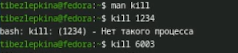
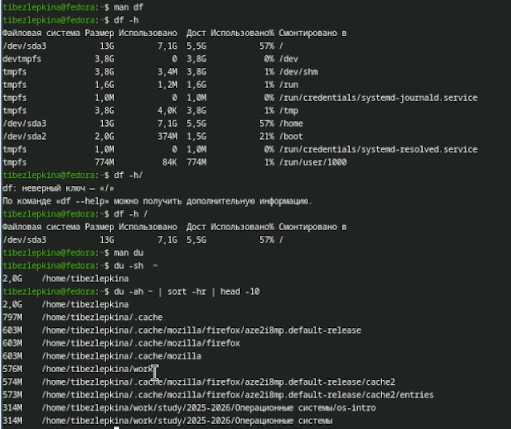

# Цель работы

Ознакомление с инструментами поиска файлов и фильтрации текстовых данных.
Приобретение практических навыков: по управлению процессами (и заданиями), по
проверке использования диска и обслуживанию файловых систем.

# Задание

1. Записать `/etc` и `~` в `file.txt`.
2. Выбрать `.conf` строки в `conf.txt`.
3. Найти файлы на `c` в `~`.
4. Вывести файлы `/etc` на `h`.
5. Запустить фон поиск `log*` в `~/logfile`.
6. Удалить `~/logfile`.
7. Запустить `gedit` в фоне.
8. Найти PID `gedit` через `ps | grep`.
9. Изучить `man kill` и завершить `gedit`.
10. Выполнить `df -h` и `du -sh ~`.
11. Вывести все директории `~` через `find ~ -type d`.

# Теоретическое введение

В ОС Linux существуют стандартные потоки: stdin (ввод), stdout (вывод), stderr (ошибки). Они перенаправляются через `>`, `>>`, `2>`, `&>`. Конвейер `|` передаёт вывод одной команды на ввод другой. Команда `find` ищет файлы, `grep` фильтрует текст. Процессы запускаются в фон через `&`, управляются `jobs` и `kill`. `df` показывает место на дисках, `du` — размер каталогов.

# Выполнение лабораторной работы

Необходимо записать список файлов из каталога /etc в файл file.txt, а затем добавить туда список файлов из домашнего каталога. (рис. -@fig:001)

{#fig:001 width=70%}

Выберим из file.txt названия .conf-файлов и поместите их в conf.txt  (рис. -@fig:002)

{#fig:002 width=70%}

Продемонстрированы три способа: через ls | grep(фильтр через grep), через find -type f(поиск с полным путём) и через find -printf(вывод только имён) (рис. -@fig:003)

{#fig:003 width=70%}

Вывод (постранично) файлов из /etc, начинающихся на h. (рис. -@fig:004)

{#fig:004 width=70%}

Запуск в фоновом режиме процесса, который ищет файлы log* и пишет результат в ~/logfile (рис. -@fig:005)

{#fig:005 width=70%}

Команда rm ~/logfile удаляет файл, созданный на предыдущем шаге. Файл удалён без подтверждения (стандартное поведение rm) (рис. -@fig:006)

{#fig:006 width=70%}

Запуск gedit & (рис. -@fig:007)

{#fig:007 width=70%}

Определение индефикатора процесса,завершение процесса gedit (рис. -@fig:008)

{#fig:008 width=70%}

Изучение и выполнение команд df и du (рис. -@fig:009)

{#fig:009 width=70%}

Команда выводит все директории (включая поддиректории) внутри домашнего каталога (рис. -@fig:010)

{#fig:010 width=70%}

# Выводы

В ходе лабораторной работы освоены перенаправление ввода-вывода, конвейеры, поиск файлов (find), фильтрация текста (grep), управление фоновыми задачами и процессами (jobs, ps, kill), а также проверка использования диска (df, du). Все задания выполнены, цель работы достигнута.

# Контрольные вопросы

1. Какие потоки ввода-вывода вы знаете?
В Linux существует три стандартных потока: stdin (стандартный ввод, дескриптор 0), stdout (стандартный вывод, дескриптор 1) и stderr (стандартный вывод ошибок, дескриптор 2). По умолчанию stdin связан с клавиатурой, а stdout и stderr — с экраном.

2. Объясните разницу между операцией > и >>.
Оператор > перенаправляет вывод в файл, перезаписывая его содержимое. Оператор >> добавляет вывод в конец файла, сохраняя существующие данные.

3. Что такое конвейер?
Конвейер (|) — это механизм, который передаёт вывод одной команды на ввод другой, позволяя объединять несколько команд в цепочку для последовательной обработки данных.

4. Что такое процесс? Чем это понятие отличается от программы?
Процесс — это программа во время выполнения, имеющая собственный идентификатор (PID), адресное пространство и состояние. Программа — это статичный набор инструкций, хранящийся на диске. Одна программа может порождать несколько процессов.

5. Что такое PID и GID?
PID (Process ID) — уникальный идентификатор процесса. GID (Group ID) — идентификатор группы процесса, определяющий права доступа для группы пользователей.

6. Что такое задачи и какая команда позволяет ими управлять?
Задачи (jobs) — это процессы, запущенные из текущего сеанса оболочки в фоновом или приостановленном режиме. Управлять ими можно командой jobs (список задач), а также fg (перевод на передний план) и bg (перевод в фон).

7. Найдите информацию об утилитах top и htop. Каковы их функции?
top — утилита для отображения запущенных процессов в реальном времени с обновлением каждые несколько секунд. htop — улучшенная версия с цветовым выделением, прокруткой и более удобным управлением. Обе показывают загрузку CPU, памяти, список процессов и позволяют завершать процессы.

8. Назовите и дайте характеристику команде поиска файлов. Приведите примеры использования.
Команда find — мощный инструмент поиска файлов по различным критериям (имя, тип, размер, время). Примеры:

- find ~ -name "f*" -print — найти файлы на букву f в домашнем каталоге.
- find /etc -type d — найти все директории в /etc.
- find ~ -name "*.txt" -exec rm {} \; — найти и удалить все .txt файлы.

9. Можно ли по контексту (содержанию) найти файл? Если да, то как?
Да. Для этого используется команда grep -r "текст" /путь. Например, grep -r "error" ~/logs/ найдёт все файлы, содержащие слово "error". Также можно комбинировать find с grep.

10. Как определить объём свободной памяти на жёстком диске?
Команда df -h показывает занятое и свободное место на всех смонтированных разделах в удобном для чтения формате (ГБ, МБ).

11. Как определить объём вашего домашнего каталога?
Команда du -sh ~ показывает общий размер домашнего каталога. Опция -s — суммарно, -h — в удобном формате.

12. Как удалить зависший процесс?
Сначала найти его PID (например, ps aux | grep имя_процесса), затем завершить командой kill -9 PID. Опция -9 отправляет сигнал SIGKILL, который принудительно завершает процесс.

# Список литературы

1. GNU Bash Reference Manual — https://www.gnu.org/software/bash/manual/

2. Linux man pages online — https://man7.org/linux/man-pages/

