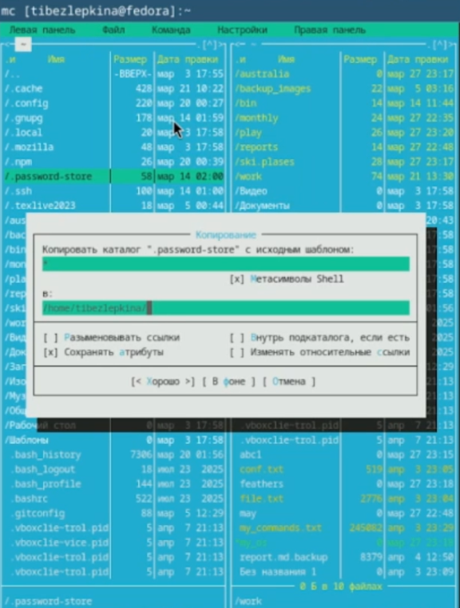
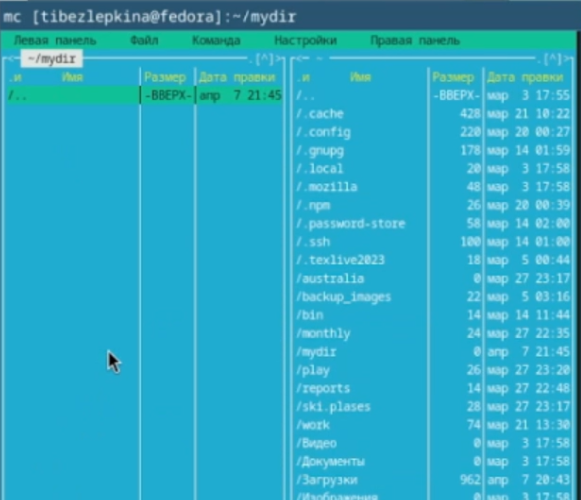
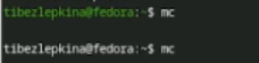
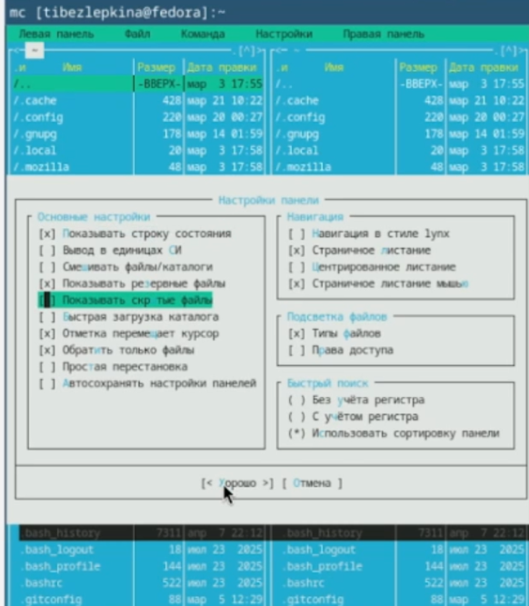

---
## Front matter
lang: ru-RU
title: Лабораторная работа №9
subtitle: Архитектура компьютеров
author:
  - Безлепкина Т.И.
institute:
  - Российский университет дружбы народов, Москва, Россия
date: 10 апреля 2026

## i18n babel
babel-lang: russian
babel-otherlangs: english

## Fonts
mainfont: Liberation Serif
sansfont: Liberation Sans
monofont: Liberation Mono

## Formatting pdf
toc: false
toc-title: Содержание
slide_level: 2
aspectratio: 169
section-titles: true
theme: default
---

# Информация

## Докладчик

:::::::::::::: {.columns align=center}
::: {.column width="70%"}

  * Безлепкина Татьяна Игоревна
  * Студентка НКАбд-01-25
  * Таня
  * Российский университет дружбы народов
  * [1032253539@rudn.ru](mailto1032253539@rudn.ru)

:::
::: {.column width="30%"}

.jpg)

:::
::::::::::::::

# Цель работы

Освоение основных возможностей командной оболочки Midnight Commander. Приоб-
ретение навыков практической работы по просмотру каталогов и файлов; манипуляций
с ними

# Задание

1. изучить интерфейс и меню mc;
2. выполнить операции с файлами (копирование, перемещение, удаление, просмотр, редактирование);
3. создать каталог и файлы;
4. освоить встроенный редактор (вставка, удаление, копирование, отмена, сохранение);
5. настроить внешний вид и режимы панелей.

# Актуальность темы

- Командная оболочка Midnight Commander остаётся востребованным инструментом для работы в UNIX/Linux-системах.
- Позволяет эффективно управлять файлами и каталогами в среде без графического интерфейса.
- Используется системными администраторами и разработчиками для работы на удалённых серверах.
- своение mc упрощает переход к более сложным задачам администрирования и программирования.

# Объект и предмет исследования.

- Объект исследования: процесс взаимодействия пользователя с операционной системой UNIX/Linux через командную оболочку.
- Предмет исследования: функциональные возможности, интерфейс и инструменты командной оболочки Midnight Commander (mc).

# Научная новизна. 

- Работа носит учебно-практический характер, систематизирует знания о работе с mc.
- редложен структурированный подход к освоению псевдографического интерфейса файлового менеджера.
- Выявлены и продемонстрированы эффективные способы навигации, редактирования и настройки mc для повседневных задач.

# Практическая значимость работы. 

Полученные навыки позволяют:
1. Быстро перемещаться по файловой системе;
2. Выполнять операции с файлами (копирование, перемещение, удаление, изменение прав);
3. Редактировать текстовые файлы во встроенном редакторе;
4. Настраивать внешний вид и поведение оболочки под свои задачи.
Результаты могут быть использованы при подготовке к курсам по операционным системам и администрированию.Освоение mc упрощает работу на серверах без графического окружения.

# Теоретическое введение

- Командная оболочка — интерфейс взаимодействия пользователя с ОС и ПО через команды.
- Midnight Commander (mc) — псевдографическая оболочка для UNIX/Linux.
- Запуск: команда mc в терминале.
- Основные элементы интерфейса:
- две панели (по умолчанию — списки файлов двух каталогов);
1. меню (F9);
2. командная строка;
3. управляющие кнопки (F1–F10).
- Режимы панелей: Информация, Дерево, стандартный список.
- Управление панелями: Ctrl+u (переставить), Ctrl+o (отключить), Ctrl+x d (сравнить каталоги).
- Меню mc: Левая панель, Файл, Команда, Настройки, Правая панель.
- Встроенный редактор вызывается клавишей F4.

# Выполнение лабораторной работы

Изучаю информацию о mc (рис. -@fig:001)

{#fig:001 width=70%}

---

Используя управляющие клавиши выполняю: смена активной панели — клавиша Tab,выделение файла - F3 (рис. -@fig:002)

{#fig:002 width=70%}

---

Продолжение работы с управляющими клавишами: копирование -F5, перемещение - F6  (рис. -@fig:003)

{#fig:003 width=70%}

---

Получение информации о размере и правах доступа на файлы. F9 → Левая панель → Режим → Информация (рис. -@fig:004)

{#fig:004 width=70%}

---

Просмотр прав доступа (рис. -@fig:005)

{#fig:005 width=70%}

---

В mc можно создать файл через редактор:
F4 → текст → F2 (сохранить) → имя, например test.txt. Просмотр только для чтения - test.txt → F3. Редактирование без сохранения F4 - на test.txt → изменяю текст → не нажимаю F2 → F10 (рис. -@fig:006)

{#fig:006 width=70%}

---

Создание каталога - на активной панели нажимаю F7 → ввожу имя каталога, например mydir. Копирование файла в созданный каталог - выделяю test.txt → F5 → в поле назначения указываю mydir/  (рис. -@fig:007)

{#fig:007 width=70%}

---

Поиск файлов - F9 → Команда → Поиск файла (рис. -@fig:008)

{#fig:008 width=70%}

---

Выбор и повторение одной из предыдущих команд - Ctrl-x → h выбор любой ранее выполненной команды → Enter (рис. -@fig:009)

{#fig:009 width=70%}

---

Переход в один из быстрых каталогов - Ctrl+\. Анализ файла меню и файла расширений - F9 → Команда → Редактировать файл меню (рис. -@fig:010)

{#fig:010 width=70%}

---

Настройка внешнего вида - F9 → Настройки → Конфигурация (рис. -@fig:011)

{#fig:011 width=70%}

---

Создание файла text.txt. В любом каталоге: F4 → небольшой текст → F2 → имя text.txt. Открыть файл во встроенном редакторе - выделить text.txt → F4. Вставляю фрагмент текста из другого источника. Выполняю манипуляции с текстом: удалить строку - Ctrl+y, выделить фрагмент и скопировать на новую строку - F3 (начало), F3 (конец) → F5 → вставить в нужное место, cохранить файл - F2, отменить последнее действие - Ctrl+u, перейти в конец файла и дописать текст	- End (или Ctrl+End) → напечатать текст, перейти в начало файла и дописать текст - 	Home (или Ctrl+Home) → напечатать текст, cохранить и выйти	F2 → F10 (рис. -@fig:012)

{#fig:012 width=70%}

---

Подсветка синтаксиса (рис. -@fig:013)

{#fig:013 width=70%}

# Выводы

Приобретены практические навыки работы с файлами и каталогами в mc, включая навигацию, редактирование, копирование и настройку интерфейса.

# Список литературы
