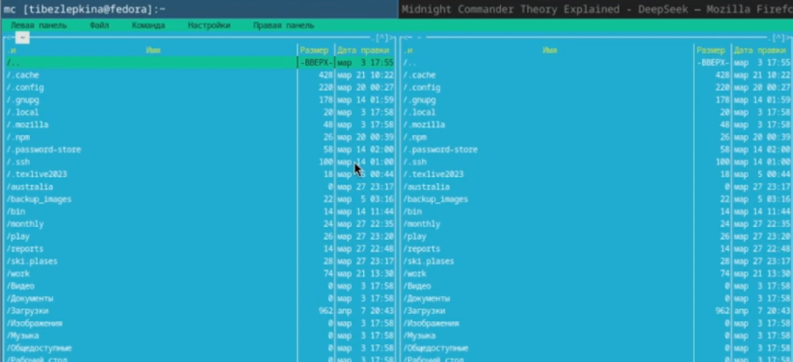
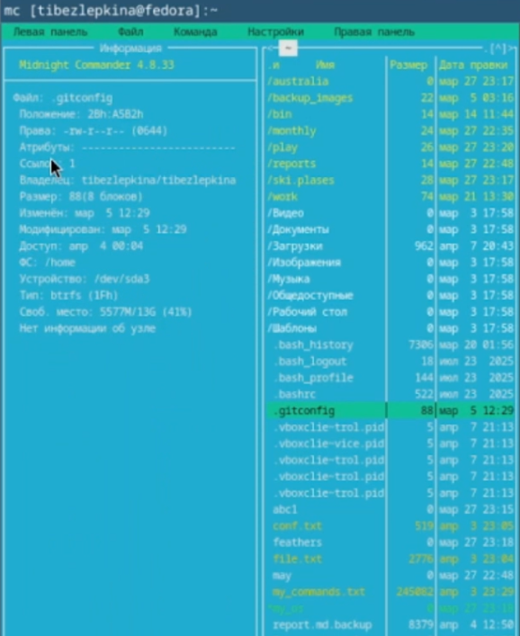
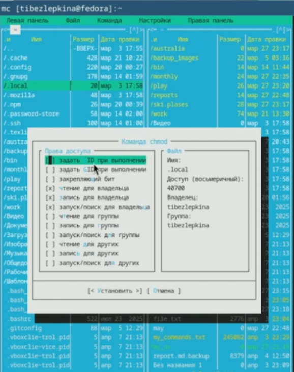
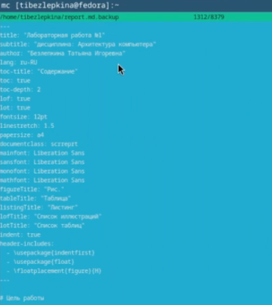
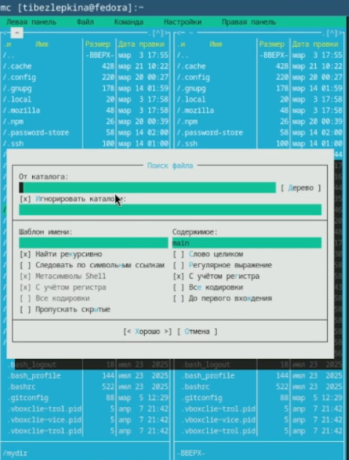
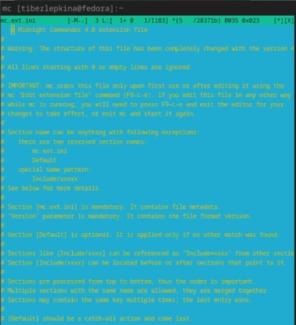
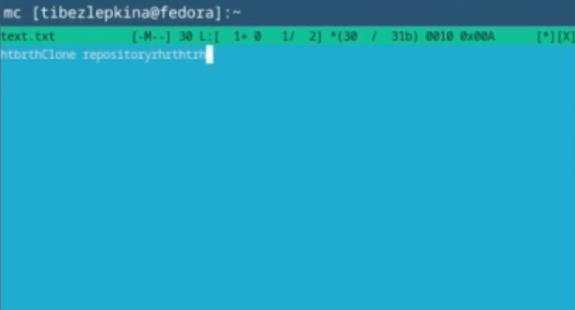
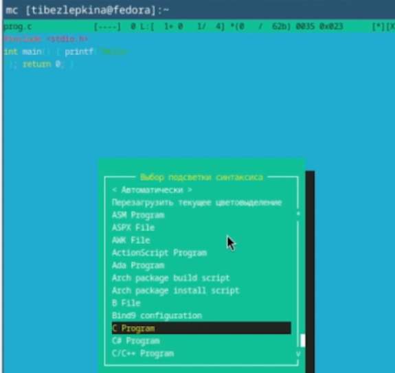

# Цель работы

Освоение основных возможностей командной оболочки Midnight Commander. Приоб-
ретение навыков практической работы по просмотру каталогов и файлов; манипуляций
с ними

# Задание

1. изучить интерфейс и меню mc;
2. выполнить операции с файлами (копирование, перемещение, удаление, просмотр, редактирование);
3. создать каталог и файлы;
4. освоить встроенный редактор (вставка, удаление, копирование, отмена, сохранение);
5. настроить внешний вид и режимы панелей.

# Теоретическое введение

- Командная оболочка — интерфейс взаимодействия пользователя с ОС и ПО через команды.
- Midnight Commander (mc) — псевдографическая оболочка для UNIX/Linux.
- Запуск: команда mc в терминале.
- Основные элементы интерфейса:
- две панели (по умолчанию — списки файлов двух каталогов);
1. меню (F9);
2. командная строка;
3. управляющие кнопки (F1–F10).
- Режимы панелей: Информация, Дерево, стандартный список.
- Управление панелями: Ctrl+u (переставить), Ctrl+o (отключить), Ctrl+x d (сравнить каталоги).
- Меню mc: Левая панель, Файл, Команда, Настройки, Правая панель.
- Встроенный редактор вызывается клавишей F4.

# Выполнение лабораторной работы

Изучаю информацию о mc (рис. -@fig:001)

{#fig:001 width=70%}

Используя управляющие клавиши выполняю: смена активной панели — клавиша Tab,выделение файла - F3 (рис. -@fig:002)

{#fig:002 width=70%}

Продолжение работы с управляющими клавишами: копирование -F5, перемещение - F6  (рис. -@fig:003)

{#fig:003 width=70%}

Получение информации о размере и правах доступа на файлы. F9 → Левая панель → Режим → Информация (рис. -@fig:004)

{#fig:004 width=70%}

Просмотр прав доступа (рис. -@fig:005)

{#fig:005 width=70%}

В mc можно создать файл через редактор:
F4 → текст → F2 (сохранить) → имя, например test.txt. Просмотр только для чтения - test.txt → F3. Редактирование без сохранения F4 - на test.txt → изменяю текст → не нажимаю F2 → F10 (рис. -@fig:006)

{#fig:006 width=70%}

Создание каталога - на активной панели нажимаю F7 → ввожу имя каталога, например mydir. Копирование файла в созданный каталог - выделяю test.txt → F5 → в поле назначения указываю mydir/  (рис. -@fig:007)

{#fig:007 width=70%}

Поиск файлов - F9 → Команда → Поиск файла (рис. -@fig:008)

{#fig:008 width=70%}

Выбор и повторение одной из предыдущих команд - Ctrl-x → h выбор любой ранее выполненной команды → Enter (рис. -@fig:009)

{#fig:009 width=70%}

Переход в один из быстрых каталогов - Ctrl+\. Анализ файла меню и файла расширений - F9 → Команда → Редактировать файл меню (рис. -@fig:010)

{#fig:010 width=70%}

Настройка внешнего вида - F9 → Настройки → Конфигурация (рис. -@fig:011)

{#fig:011 width=70%}

Создание файла text.txt. В любом каталоге: F4 → небольшой текст → F2 → имя text.txt. Открыть файл во встроенном редакторе - выделить text.txt → F4. Вставляю фрагмент текста из другого источника. Выполняю манипуляции с текстом: удалить строку - Ctrl+y, выделить фрагмент и скопировать на новую строку - F3 (начало), F3 (конец) → F5 → вставить в нужное место, cохранить файл - F2, отменить последнее действие - Ctrl+u, перейти в конец файла и дописать текст	- End (или Ctrl+End) → напечатать текст, перейти в начало файла и дописать текст - 	Home (или Ctrl+Home) → напечатать текст, cохранить и выйти	F2 → F10 (рис. -@fig:012)

{#fig:012 width=70%}

Подсветка синтаксиса (рис. -@fig:013)

{#fig:013 width=70%}

# Выводы

Приобретены практические навыки работы с файлами и каталогами в mc, включая навигацию, редактирование, копирование и настройку интерфейса.

# Контрольные вопросы

1. Режимы работы в mc:
   - Стандартный (список файлов) 
   - Информация (сведения о файле и ФС) 
   - Дерево (структура каталогов)

2. Операции с файлами через shell и mc:
   - Копирование: `cp` (shell) или F5 (mc) 
   - Перемещение: `mv` или F6 
   - Удаление: `rm` или F8 
   - Просмотр: `cat`/`less` или F3 
   - Редактирование: `nano`/`vim` или F4

3. Меню левой/правой панели:
   - Список, дерево, информация, формат списка, сортировка, фильтр

4. Меню Файл:
   - Просмотр (F3), правка (F4), копирование (F5), перемещение (F6), создание каталога (F7), удаление (F8), права доступа, ссылка

5. Меню Команда:
   - Поиск файлов, сравнение каталогов, размеры каталогов, история команд, каталоги быстрого доступа, восстановление файлов, редактирование файлов расширений и меню

6. Меню Настройки:
   - Конфигурация, внешний вид, набор символов, подтверждения, распознавание клавиш, виртуальная ФС

7. Встроенные команды mc:
   - F1 – помощь, F2 – пользовательское меню, F3 – просмотр, F4 – правка, F5 – копия, F6 – перемещение, F7 – каталог, F8 – удаление, F9 – меню, F10 – выход

8. Команды встроенного редактора mc:
   - Сохранение (F2), выход (F10), отмена (F4 или Esc), копирование/вставка (F5/F6), поиск (F7), переход в начало/конец (Home/End), удаление строки (Ctrl+Y), подсветка синтаксиса

9. Средства создания пользовательского меню:
   - Редактирование файла меню (через `Команда → Редактировать файл меню`)

10. Средства для действий над текущим файлом:
    - Пользовательское меню (F2), файл расширений (запуск программ по расширению), команды shell

# Список литературы

1. https://wiki.archlinux.org/index.php/Midnight_Commander
2. https://gist.github.com/alexrah/7ded57a512829886b7b2

