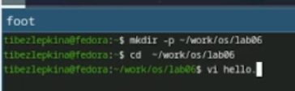
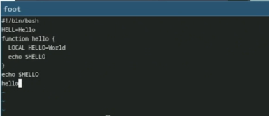
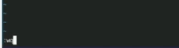
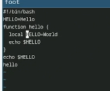
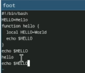

---
## Front matter
lang: ru-RU
title: Лабораторная работа №9
subtitle: Архитектура компьютеров
author:
  - Безлепкина Т.И.
institute:
  - Российский университет дружбы народов, Москва, Россия
date: 10 апреля 2026

## i18n babel
babel-lang: russian
babel-otherlangs: english

## Fonts
mainfont: Liberation Serif
sansfont: Liberation Sans
monofont: Liberation Mono

## Formatting pdf
toc: false
toc-title: Содержание
slide_level: 2
aspectratio: 169
section-titles: true
theme: default
---

# Цель работы

Познакомиться с операционной системой Linux. Получить практические навыки рабо-
ты с редактором vi, установленным по умолчанию практически во всех дистрибутивах

# Задание

1. Изучить теоретические основы работы с экранным редактором vi в ОС Linux.
2. Освоить переключение между тремя режимами работы редактора: командным, режимом вставки и режимом последней строки.
3. Научиться создавать новые файлы с помощью редактора vi.
4. Освоить команды навигации по тексту: перемещение курсора, по словам, по строкам, по файлу.
5. Изучить команды редактирования: вставка, удаление, замена текста, отмена действий.
6. Научиться сохранять изменения в файле и выходить из редактора с сохранением или без сохранения.
7. Получить практические навыки редактирования существующих файлов.
8. Настроить опции редактора для удобной работы (нумерация строк, отображение невидимых символов и др.).
9. Создать исполняемый bash-скрипт и проверить его работу.

# Теоретическое введение

Текстовый редактор vi (Visual display editor) является стандартным интерактивным экранным редактором в большинстве дистрибутивов Linux. Он работает в трёх режимах: командном (навигация и редактирование), режиме вставки (ввод текста) и режиме последней строки (сохранение, выход, настройки). vi различает регистр символов в командах. Умение работать с vi необходимо для администрирования Linux, редактирования конфигурационных файлов и написания скриптов.

# Выполнение лабораторной работы

Создаю каталог с именем ~/work/os/lab06. Перехожу во вновь созданный каталог. Вызываю vi и создаю файл hello.sh (рис. -@fig:001)

{#fig:001 width=70%}

Нажимаю клавишу i и ввожу текст, нажимаю Esc для перехода в командный режим после завершения ввода
текста (рис. -@fig:002)

{#fig:002 width=70%}

Нажимаю : для перехода в режим последней строки и внизу моего экрана появляется приглашение в виде двоеточия. Нажимаю w (записать) и q (выйти), а затем нажимаю клавишу Enter для сохранения текста и завершения работы  (рис. -@fig:003)

{#fig:003 width=70%}

Делаю файл исполняемым (рис. -@fig:004)

{#fig:004 width=70%}

Вызываю vi на редактирование файла с помощью команды vi ~/work/os/lab06/hello.sh. Установливаю курсор в конец слова HELL второй строки(с помощью стрелок или клавиш j и l). Перехожу в режим вставки(a) и заменяю на HELLO(ввожу O). Нажимаю Esc для возврата в командный режим. Установливаю курсор на четвертую строку и стираю слово LOCAL(dw). Перехожу в режим вставки(i) и набираю следующий текст: local, нажимаю Esc для возврата в командный режим (рис. -@fig:005)

{#fig:005 width=70%}

Установливаю курсор на последней строке файла(G). Вставляю после неё строку, содержащую следующий текст: echo $HELLO(o). Нажимаю Esc для перехода в командный режим. Удаляю последнюю строку(dd). Ввожу команду отмены изменений u для отмены последней команды. Ввожу символ : для перехода в режим последней строки. Записываю произведённые изменения и выхожу из vi(wq) (рис. -@fig:006)

{#fig:006 width=70%}

# Выводы

В ходе выполнения лабораторной работы я:
- освоил базовые приёмы работы с редактором vi в Linux;
- научился создавать и редактировать текстовые файлы, переключаться между режимами;
- применил команды навигации, удаления, вставки и отмены изменений;
- создал исполняемый bash-скрипт hello.sh и убедился в его работоспособности.
Таким образом, цель работы достигнута, полученные навыки необходимы для дальнейшей работы в командной строке Linux.

# Контрольные вопросы

- Вопрос 1. Дайте краткую характеристику режимам работы редактора vi.

Редактор vi имеет три режима работы. Командный режим предназначен для навигации по файлу и выполнения команд редактирования, таких как удаление, копирование, вставка и отмена действий. Переход в этот режим осуществляется клавишей Esc. Режим вставки предназначен для непосредственного ввода текста. Переход в него из командного режима осуществляется клавишами i (вставка перед курсором), a (вставка после курсора), o (новая строка снизу) или O (новая строка сверху). Режим последней строки предназначен для выполнения операций с файлом: сохранения, выхода, поиска, замены и настройки опций. Переход в этот режим осуществляется нажатием двоеточия (:) из командного режима.

- Вопрос 2. Как выйти из редактора, не сохраняя произведённые изменения?

Чтобы выйти из редактора без сохранения изменений, необходимо сначала нажать Esc для перехода в командный режим, затем нажать двоеточие (:) для перехода в режим последней строки, ввести команду q! (с восклицательным знаком) и нажать Enter. Команда :q! означает «quit without saving» — выйти без сохранения. Восклицательный знак отменяет предупреждение о несохранённых изменениях.

- Вопрос 3. Назовите и дайте краткую характеристику командам позиционирования.

Команды позиционирования позволяют быстро перемещаться по тексту. Команда 0 (ноль) переводит курсор в начало текущей строки. Команда $ переводит курсор в конец текущей строки. Команда G переводит курсор в конец файла. Команда nG (например, 5G) переводит курсор на строку с указанным номером n. Команда gg переводит курсор в начало файла. Команда H переводит курсор в верхнюю строку текущего экрана. Команда M переводит курсор в среднюю строку текущего экрана. Команда L переводит курсор в нижнюю строку текущего экрана.

- Вопрос 4. Что для редактора vi является словом?

В редакторе vi словом считается последовательность символов, состоящая из букв, цифр и знака подчёркивания, ограниченная пробелами, знаками препинания, символами перевода строки или другими специальными символами, такими как скобки или кавычки. Например, в строке «Hello, world_123!» словами будут Hello (без запятой) и world_123 (подчёркивание считается частью слова).

- Вопрос 5. Каким образом из любого места редактируемого файла перейти в начало (конец) файла?

Чтобы перейти в начало файла из любого места, нужно нажать gg или 1G. Чтобы перейти в конец файла, нужно нажать G. Команда gg является быстрым способом перехода на первую строку и работает в большинстве современных версий vi и vim. Команда 1G — это классический вариант, означающий «перейти на строку номер 1». Команда G без числа всегда переводит курсор на последнюю строку файла.

- Вопрос 6. Назовите и дайте краткую характеристику основным группам команд редактирования.

Основные группы команд редактирования включают в себя следующее. Команды вставки текста предназначены для добавления нового текста. К ним относятся i (вставка перед курсором), a (вставка после курсора), I (вставка в начало строки) и A (вставка в конец строки). Команды вставки строк позволяют добавлять новые пустые строки. Команда o вставляет строку ниже курсора, а команда O — выше курсора. Команды удаления текста служат для удаления символов, слов и строк. Команда x удаляет один символ под курсором, dw удаляет слово, dd удаляет текущую строку, а ndd удаляет n строк. Команды замены текста позволяют заменять символы или слова. Команда r заменяет один символ, а команда R переключает режим замены. Команды копирования и вставки служат для перемещения текста. Команда yy копирует строку, а команда p вставляет скопированный или удалённый текст после курсора. Команды отмены изменений позволяют отменить последние действия. Команда u отменяет последнее изменение, а команда U отменяет все изменения в текущей строке.

- Вопрос 7. Необходимо заполнить строку символами $. Каковы ваши действия?

Для заполнения строки символами $ нужно выполнить следующие действия. Сначала перейти в начало нужной строки, нажав 0 (ноль). Затем перейти в режим замены, нажав заглавную латинскую R. После этого вводить символы $ до конца строки — курсор будет заменять существующие символы по мере ввода. По достижении конца строки нажать Esc для выхода из режима замены. Альтернативный способ: удалить содержимое строки командой dd, затем вставить новую пустую строку командой o, после чего в режиме вставки (i) ввести нужное количество символов $.

- Вопрос 8. Как отменить некорректное действие, связанное с процессом редактирования?

Для отмены некорректного действия используются несколько команд. Строчная команда u отменяет последнее изменение. Повторное нажатие u отменявает предыдущее действие и так далее по цепочке. Заглавная команда U отменяет все изменения в текущей строке, возвращая строку к состоянию на момент перехода в неё. Команда :e! отменяет все изменения с момента последней записи файла и возвращает файл к последней сохранённой версии. В современных версиях vim также доступна комбинация Ctrl + r для повтора отменённого действия (redo).

- Вопрос 9. Назовите и дайте характеристику основным группам команд режима последней строки.

В режиме последней строки выделяют несколько групп команд. Команды операций с файлом предназначены для сохранения, выхода и перезагрузки. К ним относятся :w (записать файл), :wq (записать и выйти), :q! (выйти без сохранения) и :e! (перезагрузить файл, отменив все изменения). Команды поиска и замены служат для нахождения текста и его замены. Например, :/слово выполняет поиск вперёд по файлу, :s/старое/новое/ выполняет замену в текущей строке, а :%s/старое/новое/g выполняет замену во всём файле. Команды настройки опций изменяют среду редактора. Например, :set nu включает нумерацию строк, :set list показывает невидимые символы, а :set ic включает поиск без учёта регистра. Команды работы с несколькими файлами позволяют открывать и переключаться между файлами. Например, :e имя_файла открывает другой файл, а :n переходит к следующему файлу. Команды выполнения внешних команд запускают команды операционной системы без выхода из редактора. Например, :!ls показывает список файлов в текущей директории, а :!pwd показывает текущую рабочую директорию.

- Вопрос 10. Как определить, не перемещая курсора, позицию, в которой заканчивается строка?

Чтобы определить позицию конца строки без перемещения курсора, необходимо включить отображение невидимых символов командой :set list. В этом режиме конец каждой строки будет отображаться символом $. Например, строка «Hello world» будет выглядеть как «Hello world$», где символ $ визуально указывает на позицию окончания строки. Это и есть ответ на вопрос — вы видите конец строки, не перемещая курсора.

- Вопрос 11. Выполните анализ опций редактора vi (сколько их, как узнать их назначение и т.д.).

Количество опций в редакторе vi и vim достаточно велико. В стандартном vi насчитывается более 200 опций. В современных версиях vim количество опций достигает 300–400, в зависимости от версии и параметров компиляции. Чтобы узнать все опции и их назначение, используются следующие команды. Команда :set all выводит полный список всех опций с их текущими значениями. Команда :set option? показывает значение конкретной опции, например :set nu? покажет, включена ли нумерация строк. Команда :help option-list открывает справку по всем опциям (в редакторе vim). Команда :help set открывает общую справку по команде set. Если требуется отказаться от использования опции, в команде set перед именем опции ставится приставка no. Например, :set number включает нумерацию строк, а :set nonumber выключает её. Аналогично :set list включает отображение невидимых символов, а :set nolist выключает его.

- Вопрос 12. Как определить режим работы редактора vi?

Определить текущий режим работы редактора vi можно несколькими способами. Первый способ — визуальный индикатор. В современных версиях редактора (например, в vim) в нижней части экрана отображается текстовый индикатор: -- INSERT -- для режима вставки, -- VISUAL -- для визуального режима. В командном режиме никакого индикатора нет. Второй способ — по поведению клавиш. Если нажатие буквенных клавиш вводит соответствующие символы в текст, значит, редактор находится в режиме вставки. Если буквенные клавиши выполняют команды (например, клавиша j перемещает курсор вниз, а клавиша k — вверх), значит, редактор находится в командном режиме. Третий способ — по наличию двоеточия внизу экрана. Если в нижней части экрана появилось двоеточие (:) и мигающий курсор справа от него, значит, редактор находится в режиме последней строки. Четвёртый способ — использование опции showmode. Команда :set showmode включает постоянное отображение текущего режима в статусной строке редактора. Пятый способ — реакция на клавишу Esc. Если после нажатия Esc исчезает индикатор -- INSERT --, значит, вы находились в режиме вставки. Если ничего не меняется, значит, вы уже находитесь в командном режиме.

- Вопрос 13. Постройте граф взаимосвязи режимов работы редактора vi.

Исходным и основным является командный режим. Из командного режима можно перейти в режим вставки с помощью клавиш i, a, o, O, I, A, R. Из командного режима можно перейти в режим последней строки с помощью нажатия двоеточия (:). Из командного режима можно приостановить редактор с помощью комбинации Ctrl+Z, перейдя в остановленное состояние. Из режима вставки возможен только один переход — обратно в командный режим с помощью клавиши Esc. Из режима последней строки после выполнения команды и нажатия Enter происходит автоматический возврат в командный режим. Также из режима последней строки можно выполнить команду :e!, которая перезагружает файл и возвращает редактор в командный режим, отменяя все несохранённые изменения. Прямого перехода из режима последней строки в режим вставки не существует. Из остановленного состояния (после нажатия Ctrl+Z) можно вернуться обратно в командный режим с помощью команды fg (foreground), введённой в командной оболочке. Важнейшее правило: клавиша Esc всегда возвращает редактор в командный режим из любого другого режима. Это самая важная и часто используемая клавиша в редакторе vi. Схематически граф можно представить в виде цепочки переходов: командный режим → через i, a, o и другие → режим вставки → через Esc → командный режим. Параллельно: командный режим → через двоеточие → режим последней строки → через Enter или :e! → командный режим. И дополнительно: командный режим → через Ctrl+Z → остановленное состояние → через fg → командный режим.

# Список литературы

1. Официальная документация Fedora. Системные утилиты — настройка редакторов по умолчанию. — URL: https://docs.fedoraproject.org/ (дата обращения: 18.04.2026) .

2. Fedora Packages.vim-common — общие файлы редактора VIM. — URL: https://packages.fedoraproject.org/pkgs/vim/vim-common/ (дата обращения: 18.04.2026) .

3. Caen F., Negus C. Fedora Linux Toolbox: 1000+ Commands for Fedora, CentOS, and Red Hat Power Users. — Wiley, 2007. — 307 с. — ISBN 978-0-470-08291-1 .

4. Роббинс А., Ханна Э. Изучаем vi и Vim. Не просто редакторы. — 8-е изд. — СПб. : Питер, 2024. — 525 с. — ISBN 978-5-4461-2019-2 . а что не так
