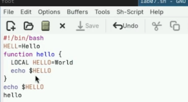
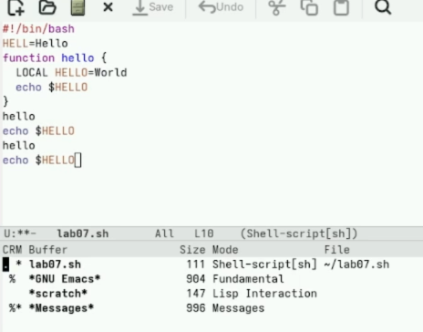
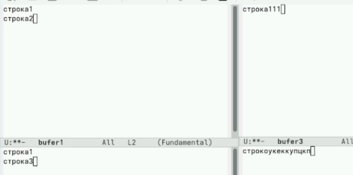

---
## Front matter
lang: ru-RU
title: Лабораторная работа №11
subtitle: Архитектура компьютеров
author:
  - Безлепкина Т.И.
institute:
  - Российский университет дружбы народов, Москва, Россия
date: 25 апреля 2026

## i18n babel
babel-lang: russian
babel-otherlangs: english

## Fonts
mainfont: Liberation Serif
sansfont: Liberation Sans
monofont: Liberation Mono

## Formatting pdf
toc: false
toc-title: Содержание
slide_level: 2
aspectratio: 169
section-titles: true
theme: default
---

# Информация

## Докладчик

:::::::::::::: {.columns align=center}
::: {.column width="70%"}

  * Безлепкина Татьяна Игоревна
  * Студентка НКАбд-01-25
  * Таня
  * Российский университет дружбы народов
  * [1032253539@rudn.ru](mailto1032253539@rudn.ru)

:::
::: {.column width="30%"}

:::
::::::::::::::

# Цель работы

Познакомиться с операционной системой Linux. Получить практические навыки рабо-
ты с редактором Emacs.

# Задание

1. Запустить Emacs.
2. Создать файл lab07.sh.
3. Ввести текст.
4. Сохранить файл.
5. Выполнить редактирование: вырезать строку, вставить, выделить, скопировать, вырезать область, отменить действие.
6. Освоить перемещение курсора (начало/конец строки, буфера).
7. Управлять буферами (список, переключение, закрытие окна).
8. Управлять окнами (разделить на 4 части, открыть буферы).
9. Освоить поиск (C-s), поиск с заменой (M-%), альтернативный поиск (M-s o).

# Актуальность темы

Изучение текстового редактора Emacs актуально, так как он является одним из самых мощных и расширяемых редакторов в среде Linux. Навыки работы с ним необходимы для эффективной разработки программного обеспечения, администрирования систем и работы с текстами в профессиональной IT-среде.

# Объект и предмет исследования.

- Объект исследования — операционная система Linux и её инструментарий для работы с текстами.
- Предмет исследования — текстовый редактор Emacs, его интерфейс, система команд, работа с буферами, окнами и режимами поиска.

# Научная новизна. 

Работа носит учебно-практический характер. Научная новизна отсутствует, так как выполняются стандартные упражнения по освоению базовых функций Emacs в соответствии с учебной программой.

# Практическая значимость работы. 

Практическая значимость заключается в получении навыков:
- создания и редактирования файлов в Emacs;
- навигации по тексту с помощью комбинаций клавиш;
- управления буферами и окнами;
- выполнения поиска и замены текста;
- использования справочной системы.
Полученные компетенции могут применяться при разработке программ, написании скриптов и работе с документацией в среде Linux.

# Теоретическое введение

- Буфер – объект, содержащий текст (файл, подсказки, результаты компиляции).
- Фрейм – обычное окно ОС, содержит область вывода и одно или несколько окон Emacs.
- Окно – прямоугольная область фрейма, отображающая один буфер.
- Область вывода – строка внизу фрейма для сообщений и запросов.
- Минибуфер – часть области вывода для ввода информации.
- Префиксные комбинации:
C-x – команды работы с файлами (открыть, сохранить),
C-c – команды, зависящие от режима.
- Модификаторы: C- (Ctrl), M- (Meta = Alt или Esc).

# Выполнение лабораторной работы

Открываю emacs. Создаю файл lab07.sh с помощью комбинации Ctrl-x Ctrl-f (C-x C-f).Набираю текст. Сохраняю файл с помощью комбинации Ctrl-x Ctrl-s (C-x C-s). Вырезаю одной командой целую строку (С-k). Вставляю эту строку в конец файла (C-y). Выделяю область текста (C-space). Копирую область в буфер обмена (M-w). Вставляю область в конец файла. Вновь выделяю эту область и на этот раз вырезаю её (C-w). Отменяю последнее действие (C-/). Перемещаю курсор в начало строки (C-a). Перемещаю курсор в конец строки (C-e). Перемещаю курсор в начало буфера (M-<). Перемещаю курсор в конец буфера (M->) (рис. -@fig:001)

{#fig:001 width=50%}

--- 

Вывожу список активных буферов на экран (C-x C-b). Перемещаю во вновь открытое окно (C-x) o со списком открытых буферов и переключаюсь на другой буфер. Закрываю это окно (C-x 0). Теперь вновь переключаюсь между буферами, но уже без вывода их списка на экран (C-x b) (рис. -@fig:002)

{#fig:002 width=70%}

---

Поделю фрейм на 4 части: разделяю фрейм на два окна по вертикали (C-x 3), а затем каждое из этих окон на две части по горизонтали (C-x 2). В каждом из четырёх созданных окон открываю новый буфер (файл) и ввожу несколько строк текста (рис. -@fig:003)

{#fig:003 width=70%}

---

Переключаюсь в режим поиска (C-s) и нахожу несколько слов, присутствующих в тексте. Переключаюсь между результатами поиска, нажимая C-s. Выхожу из режима поиска, нажав C-g. Перехожу в режим поиска и замены (M %), ввожу текст, который следует найти и заменить, нажимаю Enter , затем ввожу текст для замены. После того как будут подсвечены результаты поиска, нажимаю ! для подтверждения замены. Пробую другой режим поиска, нажав M-s o. M-s o (occur) отличается от C-s тем, что не просто переходит к совпадениям по одному, а собирает все строки с искомым текстом в отдельный буфер, показывая их в виде списка. Это удобно для общего обзора и быстрой навига (рис. -@fig:004)

{#fig:004 width=50%}

# Выводы

В ходе выполнения лабораторной работы я познакомился с операционной системой Linux и получил практические навыки работы с редактором Emacs.
- Я научился:
- запускать Emacs и создавать файлы;
- выполнять основные операции редактирования текста (вырезание, вставку, копирование, выделение, отмену действий);
- перемещать курсор по строке и буферу;
- управлять буферами (просмотр списка, переключение, закрытие);
- управлять окнами (разделение на части, навигация между окнами);
- использовать режимы поиска (прямой поиск, поиск с заменой).
Таким образом, цель работы — ознакомление с Linux и получение практических навыков работы с Emacs — достигнута.

# Список литературы
