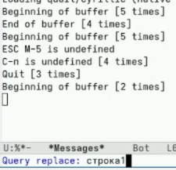

# Цель работы

Познакомиться с операционной системой Linux. Получить практические навыки рабо-
ты с редактором Emacs.

# Задание

1. Запустить Emacs.
2. Создать файл lab07.sh.
3. Ввести текст.
4. Сохранить файл.
5. Выполнить редактирование: вырезать строку, вставить, выделить, скопировать, вырезать область, отменить действие.
6. Освоить перемещение курсора (начало/конец строки, буфера).
7. Управлять буферами (список, переключение, закрытие окна).
8. Управлять окнами (разделить на 4 части, открыть буферы).
9. Освоить поиск (C-s), поиск с заменой (M-%), альтернативный поиск (M-s o).

# Теоретическое введение

- Буфер – объект, содержащий текст (файл, подсказки, результаты компиляции).
- Фрейм – обычное окно ОС, содержит область вывода и одно или несколько окон Emacs.
- Окно – прямоугольная область фрейма, отображающая один буфер.
- Область вывода – строка внизу фрейма для сообщений и запросов.
- Минибуфер – часть области вывода для ввода информации.
- Префиксные комбинации:
C-x – команды работы с файлами (открыть, сохранить),
C-c – команды, зависящие от режима.
- Модификаторы: C- (Ctrl), M- (Meta = Alt или Esc).

# Выполнение лабораторной работы

Открываю emacs. Создаю файл lab07.sh с помощью комбинации Ctrl-x Ctrl-f (C-x C-f).Набираю текст. Сохраняю файл с помощью комбинации Ctrl-x Ctrl-s (C-x C-s). Вырезаю одной командой целую строку (С-k). Вставляю эту строку в конец файла (C-y). Выделяю область текста (C-space). Копирую область в буфер обмена (M-w). Вставляю область в конец файла. Вновь выделяю эту область и на этот раз вырезаю её (C-w). Отменяю последнее действие (C-/). Перемещаю курсор в начало строки (C-a). Перемещаю курсор в конец строки (C-e). Перемещаю курсор в начало буфера (M-<). Перемещаю курсор в конец буфера (M->) (рис. -@fig:001)

{#fig:001 width=50%}

Вывожу список активных буферов на экран (C-x C-b). Перемещаю во вновь открытое окно (C-x) o со списком открытых буферов и переключаюсь на другой буфер. Закрываю это окно (C-x 0). Теперь вновь переключаюсь между буферами, но уже без вывода их списка на экран (C-x b) (рис. -@fig:002)

{#fig:002 width=70%}

Поделю фрейм на 4 части: разделяю фрейм на два окна по вертикали (C-x 3), а затем каждое из этих окон на две части по горизонтали (C-x 2). В каждом из четырёх созданных окон открываю новый буфер (файл) и ввожу несколько строк текста (рис. -@fig:003)

{#fig:003 width=70%}

Переключаюсь в режим поиска (C-s) и нахожу несколько слов, присутствующих в тексте. Переключаюсь между результатами поиска, нажимая C-s. Выхожу из режима поиска, нажав C-g. Перехожу в режим поиска и замены (M %), ввожу текст, который следует найти и заменить, нажимаю Enter , затем ввожу текст для замены. После того как будут подсвечены результаты поиска, нажимаю ! для подтверждения замены. Пробую другой режим поиска, нажав M-s o. M-s o (occur) отличается от C-s тем, что не просто переходит к совпадениям по одному, а собирает все строки с искомым текстом в отдельный буфер, показывая их в виде списка. Это удобно для общего обзора и быстрой навига (рис. -@fig:004)

{#fig:004 width=50%}

# Выводы

В ходе выполнения лабораторной работы я познакомился с операционной системой Linux и получил практические навыки работы с редактором Emacs.
- Я научился:
- запускать Emacs и создавать файлы;
- выполнять основные операции редактирования текста (вырезание, вставку, копирование, выделение, отмену действий);
- перемещать курсор по строке и буферу;
- управлять буферами (просмотр списка, переключение, закрытие);
- управлять окнами (разделение на части, навигация между окнами);
- использовать режимы поиска (прямой поиск, поиск с заменой).
Таким образом, цель работы — ознакомление с Linux и получение практических навыков работы с Emacs — достигнута.

# Контрольные вопросы

1. Кратко охарактеризуйте редактор Emacs.

Emacs — это мощный экранный текстовый редактор, написанный на языке Elisp. Он поддерживает работу с буферами, окнами, имеет множество режимов для разных языков программирования, встроенную справку и возможность расширения.

2. Какие особенности этого редактора могут сделать его сложным для новичка?

Много комбинаций клавиш, непривычная терминология (буфер, фрейм, минибуфер), упор на клавиатуру вместо мыши, отсутствие простой модальности как в vi.

3. Своими словами опишите, что такое буфер и окно в терминологии Emacs.

Буфер — это область памяти, где хранится текст (файл, справка, сообщения). Окно — это видимая область на экране, в которой отображается один буфер.

4. Можно ли открыть более 10 буферов в одном окне?

Да, можно. Количество буферов ограничено только памятью компьютера.

5. Какие буферы создаются по умолчанию при запуске Emacs?

Обычно создаются буферы: scratch (для временных записей), Messages (для сообщений), GNU Emacs (приветствие).

6. Какие клавиши вы нажмёте, чтобы ввести сочетание C-c | и C-c C-|?

Для C-c |: зажать Ctrl, нажать C, отпустить, затем нажать |. Для C-c C-|: зажать Ctrl, нажать C, отпустить, затем снова зажать Ctrl и нажать |.

7. Как разделить текущее окно на две части?

C-x 2 — разделить по горизонтали (верх и низ). C-x 3 — разделить по вертикали (лево и право).

8. В каком файле хранятся настройки редактора Emacs?

В файле .emacs в домашней папке или в файле init.el в папке .emacs.d.

9. Какую функцию выполняет клавиша |? Можно ли её переназначить?

Обычно она вставляет символ вертикальной черты. Да, её можно переназначить через настройки в файле .emacs.

10. Какой редактор вам показался удобнее в работе, чем Emacs? Почему?

Nano показался удобнее для простых правок, потому что все команды видны на экране и их не нужно запоминать. Но Emacs лучше подходит для серьёзной работы с кодом.

# Список литературы

1. GNU Emacs Lisp Reference Manual: Basic Windows -  http://ftp.gnu.org/old-gnu/Manuals/elisp-manual-21-2.8/html_node/elisp_427.html

