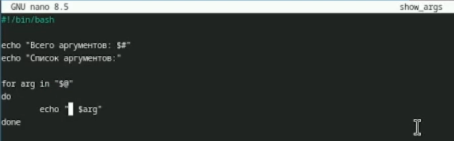
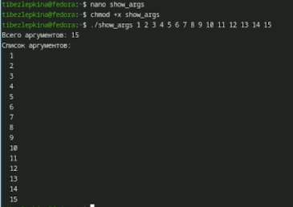
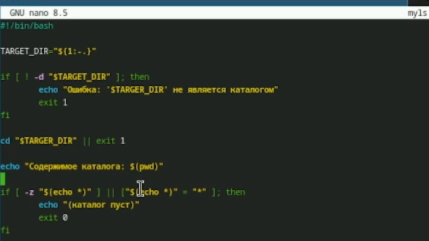
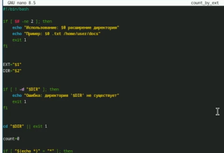
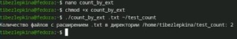

---
## Front matter
lang: ru-RU
title: Лабораторная работа №12
subtitle: Архитектура компьютеров
author:
  - Безлепкина Т.И.
institute:
  - Российский университет дружбы народов, Москва, Россия
date: 2 мая 2026

## i18n babel
babel-lang: russian
babel-otherlangs: english

## Fonts
mainfont: Liberation Serif
sansfont: Liberation Sans
monofont: Liberation Mono

## Formatting pdf
toc: false
toc-title: Содержание
slide_level: 2
aspectratio: 169
section-titles: true
theme: default
---

# Информация

## Докладчик

:::::::::::::: {.columns align=center}
::: {.column width="70%"}

  * Безлепкина Татьяна Игоревна
  * Студентка НКАбд-01-25
  * Таня
  * Российский университет дружбы народов
  * [1032253539@rudn.ru](mailto1032253539@rudn.ru)

:::
::: {.column width="30%"}

.jpg)

:::
::::::::::::::

# Цель работы

Изучить основы программирования в оболочке ОС UNIX/Linux. Научиться писать
небольшие командные файлы.

# Задание

- Задача 1. Создать скрипт, который при запуске делает резервную копию самого себя. Скрипт должен скопировать свой исходный код в директорию backup в домашнем каталоге пользователя и заархивировать его одним из архиваторов (tar, zip или bzip2). Использование архиватора требуется изучить через справочную систему (man).

- Задача 2. Создать скрипт, который обрабатывает произвольное количество аргументов командной строки, в том числе превышающее десять. Скрипт должен правильно работать с любым числом переданных аргументов, например, последовательно распечатывать их значения.

- Задача 3. Создать скрипт, который является аналогом команды ls без использования самой команды ls и команды dir. Скрипт должен выдавать информацию о содержимом указанного каталога (или текущего, если каталог не задан) и выводить информацию о правах доступа к файлам этого каталога (тип файла, возможность чтения, записи, выполнения).

- Задача 4. Создать скрипт, который получает в качестве аргументов командной строки формат файла (например, .txt, .doc, .jpg, .pdf) и путь к директории. Скрипт должен вычислить и вывести количество файлов с указанным расширением в заданной директории.

# Актуальность темы

В современных операционных системах семейства UNIX/Linux командная оболочка bash является одним из основных средств управления системой и автоматизации задач. Умение писать скрипты необходимо системным администраторам и разработчикам для эффективной работы с файлами, процессами и пользователями. Тема актуальна, так как автоматизация рутинных операций с помощью скриптов сокращает время работы и снижает вероятность ошибок.

# Объект и предмет исследования.

- Объект исследования — командная оболочка bash операционной системы Linux.

- Предмет исследования — инструменты и конструкции языка программирования bash: переменные, массивы, арифметические операции, условные операторы, циклы, работа с файлами и правами доступа, архивация, обработка аргументов командной строки.

# Научная новизна. 

Данная лабораторная работа является учебной, поэтому научная новизна отсутствует. В работе применяются стандартные подходы к программированию в командной оболочке bash, широко описанные в учебной и технической литературе.

# Практическая значимость работы. 

Разработанные в ходе работы скрипты могут быть использованы на практике:
- резервное копирование файлов (задание 1);
- обработка большого количества аргументов командной строки (задание 2);
- получение информации о содержимом каталога и правах доступа без использования стандартных команд ls (задание 3);
- поиск и подсчёт файлов по заданному расширению (задание 4).
- Полученные знания позволяют автоматизировать повседневные задачи администратора и пользователя в среде Linux/Unix.

# Теоретическое введение

Kомандная оболочка (shell) — это программа, обеспечивающая взаимодействие пользователя с операционной системой через командную строку. Она интерпретирует команды, запускает программы, поддерживает переменные, управляющие конструкции (условия, циклы) и перенаправление ввода-вывода.

В ОС семейства UNIX/Linux наиболее распространены оболочки sh, bash, csh, ksh.
Стандарт POSIX определяет единый набор интерфейсов для совместимости UNIX-подобных систем.

Bash (Bourne Again Shell) — это расширенная версия Bourne shell с поддержкой массивов, арифметических операций, функций и расширенных управляющих конструкций.

# Выполнение лабораторной работы

Скрипт делает резервную копию самого себя (рис. -@fig:001)

{#fig:001 width=50%}

---

Создаю и запускаю скрипт backup_me (рис. -@fig:002)

{#fig:002 width=70%}

---

Скрипт обрабатывает произвольное количество аргументов (рис. -@fig:003)

{#fig:003 width=70%}

---

Запускаю скрипт show_args, скрипт обрабатывает более 10 аргументов (рис. -@fig:004)

{#fig:004 width=50%}

---

Пишу код скрипта myls для третьего задания (рис. -@fig:005)

{#fig:005 width=50%}

---

Скрипт показывает содержимое каталога и права доступа (рис. -@fig:006)

{#fig:006 width=50%}

---

Пишу код скрипта count_by_ext для четвёртого задания (рис. -@fig:007)

{#fig:007 width=50%}

---

Скрипт правильно подсчитывает количество файлов с заданным расширением. (рис. -@fig:008)

{#fig:008 width=50%}

# Выводы

В ходе лабораторной работы изучены основы программирования в bash: переменные, массивы, арифметика, управляющие конструкции (if, for, while), проверка прав доступа к файлам, обработка аргументов (в том числе более 10) и архивация.

Разработаны и протестированы четыре скрипта:
- backup_me — резервная копия самого себя в ~/backup;
- show_args — вывод любого количества аргументов;
- myls — аналог ls (тип и права доступа файлов);
- count_by_ext — подсчёт файлов по расширению.
Все задания выполнены. Цель работы достигнута.

# Список литературы
