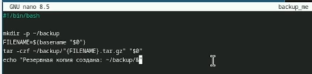
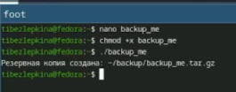
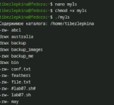

# Цель работы

Изучить основы программирования в оболочке ОС UNIX/Linux. Научиться писать
небольшие командные файлы.

# Задание

- Задача 1. Создать скрипт, который при запуске делает резервную копию самого себя. Скрипт должен скопировать свой исходный код в директорию backup в домашнем каталоге пользователя и заархивировать его одним из архиваторов (tar, zip или bzip2). Использование архиватора требуется изучить через справочную систему (man).

- Задача 2. Создать скрипт, который обрабатывает произвольное количество аргументов командной строки, в том числе превышающее десять. Скрипт должен правильно работать с любым числом переданных аргументов, например, последовательно распечатывать их значения.

- Задача 3. Создать скрипт, который является аналогом команды ls без использования самой команды ls и команды dir. Скрипт должен выдавать информацию о содержимом указанного каталога (или текущего, если каталог не задан) и выводить информацию о правах доступа к файлам этого каталога (тип файла, возможность чтения, записи, выполнения).

- Задача 4. Создать скрипт, который получает в качестве аргументов командной строки формат файла (например, .txt, .doc, .jpg, .pdf) и путь к директории. Скрипт должен вычислить и вывести количество файлов с указанным расширением в заданной директории.

# Теоретическое введение

Kомандная оболочка (shell) — это программа, обеспечивающая взаимодействие пользователя с операционной системой через командную строку. Она интерпретирует команды, запускает программы, поддерживает переменные, управляющие конструкции (условия, циклы) и перенаправление ввода-вывода.

В ОС семейства UNIX/Linux наиболее распространены оболочки sh, bash, csh, ksh.
Стандарт POSIX определяет единый набор интерфейсов для совместимости UNIX-подобных систем.

Bash (Bourne Again Shell) — это расширенная версия Bourne shell с поддержкой массивов, арифметических операций, функций и расширенных управляющих конструкций.

# Выполнение лабораторной работы

Скрипт делает резервную копию самого себя (рис. -@fig:001)

{#fig:001 width=50%}

Создаю и запускаю скрипт backup_me (рис. -@fig:002)

{#fig:002 width=70%}

Скрипт обрабатывает произвольное количество аргументов (рис. -@fig:003)

{#fig:003 width=70%}

Запускаю скрипт show_args, скрипт обрабатывает более 10 аргументов (рис. -@fig:004)

{#fig:004 width=50%}

Пишу код скрипта myls для третьего задания (рис. -@fig:005)

{#fig:005 width=50%}

Скрипт показывает содержимое каталога и права доступа (рис. -@fig:006)

{#fig:006 width=50%}

Пишу код скрипта count_by_ext для четвёртого задания (рис. -@fig:007)

{#fig:007 width=50%}

Скрипт правильно подсчитывает количество файлов с заданным расширением. (рис. -@fig:008)

{#fig:008 width=50%}

# Выводы

В ходе лабораторной работы изучены основы программирования в bash: переменные, массивы, арифметика, управляющие конструкции (if, for, while), проверка прав доступа к файлам, обработка аргументов (в том числе более 10) и архивация.

Разработаны и протестированы четыре скрипта:
- backup_me — резервная копия самого себя в ~/backup;
- show_args — вывод любого количества аргументов;
- myls — аналог ls (тип и права доступа файлов);
- count_by_ext — подсчёт файлов по расширению.
Все задания выполнены. Цель работы достигнута.

# Контрольные вопросы

1. Объясните понятие командной оболочки. Приведите примеры командных оболочек. Чем они отличаются?
Командная оболочка (shell) — это программа, которая принимает команды пользователя, интерпретирует их и передаёт ядру ОС для выполнения. Примеры: sh (Bourne shell) — базовая стандартная оболочка; bash (Bourne Again Shell) — расширенная версия sh с дополнительными возможностями; csh — C-подобная оболочка с историей команд; ksh (Korn shell) — объединяет свойства sh и csh. Отличаются синтаксисом, набором встроенных команд, поддержкой массивов, истории и совместимостью с POSIX.

2. Что такое POSIX?
POSIX (Portable Operating System Interface for Computer Environments) — набор стандартов IEEE, описывающих интерфейсы между операционной системой и прикладными программами. Он обеспечивает совместимость различных UNIX-подобных систем и переносимость программ на уровне исходного кода.

3. Как определяются переменные и массивы в языке программирования bash?
Переменная определяется как имя=значение (например, mark=/usr/andy/bin). Использование переменной — $имя или ${имя}. Массив создаётся командой set -A имя значение1 значение2 ... (например, set -A states Delaware Michigan "New Jersey"). Добавление элемента: states[49]=Alaska. Обращение к элементу: ${states[0]}. Современный синтаксис: states=(Delaware Michigan "New Jersey").

4. Каково назначение операторов let и read?
let используется для арифметических вычислений, например let sum=x+7. Ему не нужен знак $ перед именами переменных. Альтернатива — двойные круглые скобки ((sum=x+7)). read считывает данные со стандартного ввода и присваивает их переменным, например read mon day trash — первые два слова в mon и day, остальное в trash.

5. Какие арифметические операции можно применять в языке программирования bash?
Сложение (+), вычитание (-), умножение (*), целочисленное деление (/), остаток от деления (%), возведение в степень (**), инкремент (++), декремент (--), битовые операции (&, |, ^, <<, >>), логические операции (&&, ||, !), операции сравнения (<, >, ==, !=, <=, >=).

6. Что означает операция (( ))?
(( )) — это встроенная арифметическая конструкция bash для выполнения целочисленных вычислений. Внутри неё можно использовать переменные без знака $. Конструкция возвращает код завершения: 0, если результат не ноль, и 1, если ноль. Используется в условных выражениях и для присваивания, например (( i++ )) или (( sum = a + b )).

7. Какие стандартные имена переменных Вам известны?
PATH — список каталогов для поиска программ; HOME — домашний каталог пользователя; IFS — разделители полей (пробел, табуляция, перевод строки); MAIL — путь к файлу почты; TERM — тип терминала; LOGNAME — имя пользователя; PS1 и PS2 — приглашения командной строки; PWD — текущий каталог; OLDPWD — предыдущий каталог; UID — идентификатор пользователя; SHELL — путь к командной оболочке.

8. Что такое метасимволы?
Метасимволы — это символы, имеющие специальный смысл для командного процессора: * (любая строка), ? (один символ), [ ] (диапазон символов), > (перенаправление вывода), < (перенаправление ввода), | (конвейер), \ (экранирование), & (фон), ; (разделитель команд), ( ) (группировка), $ (подстановка переменной), ' и " (кавычки).

9. Как экранировать метасимволы?
Экранирование — это снятие специального смысла метасимвола. Способы: поставить перед метасимволом обратный слеш \ (например, \* даст обычную звёздочку); заключить метасимволы в одинарные кавычки '...' (например, '*'); заключить в двойные кавычки "..." (экранируются все метасимволы, кроме \$, ', \, ").

10. Как создавать и запускать командные файлы?
Создать текстовый файл с первой строкой #!/bin/bash (shebang). Записать в него команды. Дать файлу право на выполнение командой chmod +x имя_файла. Запустить файл можно как ./имя_файла или bash имя_файла.

11. Как определяются функции в языке программирования bash?
Функция определяется с помощью ключевого слова function или без него: function имя { список_команд; } или имя() { список_команд; }. Например: function clist { cd $1; ls; }. Удалить функцию можно командой unset -f имя.

12. Каким образом можно выяснить, является файл каталогом или обычным файлом?
С помощью команды test или её сокращённой формы [ ]. [ -d "путь" ] возвращает истину, если путь является каталогом. [ -f "путь" ] возвращает истину, если путь является обычным файлом. Также используются [ -r ], [ -w ], [ -x ] для проверки прав доступа.

13. Каково назначение команд set, typeset и unset?
set — отображает текущие переменные и функции окружения; с флагом -A создаёт массив. typeset — задаёт свойства переменных и функций: -f показывает функции, -ft включает трассировку, -fx экспортирует функции, -fu делает функцию автоматически загружаемой. unset — удаляет переменную или функцию (с флагом -f).

14. Как передаются параметры в командные файлы?
Параметры передаются при запуске скрипта через пробел: ./скрипт арг1 арг2 арг3. Внутри скрипта доступны: $1, $2, ... $9 — позиционные параметры; $0 — имя скрипта; $# — количество параметров; $* и $@ — все параметры. Для обработки более девяти параметров используется команда shift (сдвигает параметры влево) или цикл for arg in "$@".

15. Назовите специальные переменные языка bash и их назначение.
$0 — имя скрипта; $1–$9 — аргументы скрипта; $# — количество аргументов; $* и $@ — все аргументы (строка или массив); $? — код возврата последней выполненной команды (0 — успех, не 0 — ошибка); $$ — PID текущего процесса; $! — PID последней фоновой команды; $- — текущие флаги командного процессора; ${#var} — длина строки в переменной; ${var:-word} — значение по умолчанию; ${var:=word} — присвоение по умолчанию; ${var:?word} — вывод ошибки, если переменная не определена; ${var:+word} — подстановка, если переменная определена.

# Список литературы

1. Малахов С.В., Якупов Д.О. Принципы работы операционной системы Linux. Bash-скрипты: учебное пособие. Самара: ПГУТИ, 2024. 134 с

