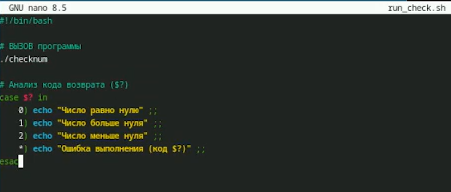
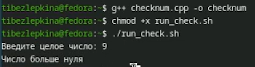
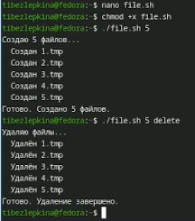
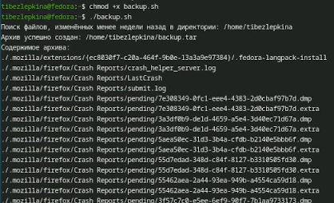

---
## Front matter
lang: ru-RU
title: Лабораторная работа №13
subtitle: Архитектура компьютеров
author:
  - Безлепкина Т.И.
institute:
  - Российский университет дружбы народов, Москва, Россия
date: 8 мая 2026

## i18n babel
babel-lang: russian
babel-otherlangs: english

## Fonts
mainfont: Liberation Serif
sansfont: Liberation Sans
monofont: Liberation Mono

## Formatting pdf
toc: false
toc-title: Содержание
slide_level: 2
aspectratio: 169
section-titles: true
theme: default
---

# Информация

## Докладчик

:::::::::::::: {.columns align=center}
::: {.column width="70%"}

  * Безлепкина Татьяна Игоревна
  * Студентка НКАбд-01-25
  * Таня
  * Российский университет дружбы народов
  * [1032253539@rudn.ru](mailto1032253539@rudn.ru)

:::
::: {.column width="30%"}

:::
::::::::::::::

# Цель работы

Изучить основы программирования в оболочке ОС UNIX. Научится писать более
сложные командные файлы с использованием логических управляющих конструкций
и циклов.

# Задание

В ходе лабораторной работы требуется разработать четыре скрипта (и одну программу на C/C++):
- Командный файл с getopts: Скрипт анализирует ключи: -inputfile (входной файл), -outputfile (выходной файл), -p (шаблон поиска), -C (учёт регистра), -n (номера строк). На основе этих ключей с помощью grep выполняет поиск и выводит результат в файл или на экран.
- Программа на C/C++ и скрипт-анализатор: Программа вводит целое число и завершается с кодом exit(1), exit(2) или exit(0) в зависимости от знака числа (плюс обработка ошибки ввода). Командный файл запускает эту программу, анализирует код возврата через $? и выводит сообщение: «число больше нуля», «меньше нуля» или «равно нулю».
- Создание и удаление нумерованных файлов: Скрипт принимает число N (аргумент командной строки) и создаёт N файлов с именами 1.tmp, 2.tmp, …, N.tmp. При втором аргументе delete эти файлы удаляются (если существуют).
- Архивация изменённых файлов: Скрипт упаковывает в архив tar все файлы из заданной директории. В модифицированном варианте архивируются только файлы, изменённые менее недели назад (используется find -mtime -7).

# Актуальность темы

UNIX-подобные системы широко используются на серверах и в облачных технологиях. Умение писать shell-скрипты с ветвлениями и циклами необходимо для автоматизации повседневных задач администратора и разработчика.

# Объект и предмет исследования.

Объект — командный процессор ОС UNIX (bash). Предмет — управляющие конструкции: ветвления (if, case), циклы (for, while, until), обработка аргументов (getopts) и коды возврата программ.

# Научная новизна. 

Работа имеет учебный характер. Новизна заключается в систематизации приёмов использования ветвлений и циклов при решении типовых задач обработки файлов и текста в ОС UNIX.

# Практическая значимость работы. 

Разработанные скрипты (поиск строк, создание файлов, архивация свежих данных) могут применяться на практике для автоматизации рутинных операций. Полученные навыки являются основой для дальнейшего изучения администрирования UNIX-систем.

# Теоретическое введение

В операционной системе UNIX командный процессор (оболочка, shell) является не только средством для выполнения команд, но и мощным языком программирования. Shell-скрипты позволяют автоматизировать повторяющиеся задачи, управлять файлами и процессами, использовать условные операторы, циклы, функции и обрабатывать аргументы командной строки. В данной лабораторной работе особое внимание уделяется:
Разбору ключей командной строки с помощью встроенной команды getopts, которая позволяет гибко обрабатывать опции и их аргументы.
- Ветвлениям – конструкциям if-then-else, case и проверке кодов возврата программ (переменная $?).
- Циклам – for, while, until, их синтаксису и отличиям.
- Генерации имён файлов с помощью метасимволов (*, ?, []), которые подставляются оболочкой.
- Взаимодействию с программами на языках C/C++ через коды завершения exit().
- Архивации файлов командами tar и find, в том числе с фильтрацией по времени изменения.
- Эти знания необходимы для написания эффективных и надёжных командных файлов в среде UNIX. 

# Выполнение лабораторной работы

На рисунке 1 представлен листинг командного файла search.sh. В нём используются конструкции getopts для разбора ключей -i, -o, -p, -C, -n, а также условный оператор if для проверки существования входного файла и перенаправление вывода grep. Скрипт реализует поиск строк по шаблону с возможностью учёта регистра и вывода номеров строк.

{#fig:001 width=50%}

---

На рисунке 2 показан процесс выполнения скрипта. Командой chmod +x search.sh заданы права на выполнение. Затем скрипт запущен с ключами: -i test.txt -p "Hi" -C -n -o result.txt. В результате в файл result.txt выведены строки, содержащие "Hi" без учёта регистра, с номерами строк.

{#fig:002 width=50%}

---

Рисунок 3 — листинг checknum.cpp. Программа вводит число и завершается с exit(1) если больше 0, exit(2) если меньше 0, exit(0) если равно 0, exit(255) при ошибке ввода.

{#fig:003 width=50%}

---

Рисунок 4 — листинг run_check.sh. Скрипт запускает checknum, анализирует $? через case и выводит сообщение.

{#fig:004 width=50%}

---

Рисунок 5 — выполнение. Компиляция g++ checknum.cpp -o checknum, запуск run_check.sh. При вводе 5 — «больше нуля», -2 — «меньше нуля», 0 — «равно нулю», abc — «ошибка».

{#fig:005 width=50%}

---

Рисунок 6 — листинг files.sh. Скрипт создаёт файлы 1.tmp … N.tmp через цикл for, если второй аргумент delete — удаляет.

{#fig:006 width=50%}

---

Рисунок 7 — выполнение. ./files.sh 5 — созданы пять файлов, ls проверяет. ./files.sh 5 delete — файлы удалены.

{#fig:007 width=50%}

---

Рисунок 8 — листинг backup.sh. Скрипт переходит в каталог, find -mtime -7 ищет файлы новее 7 дней, tar создаёт архив.

{#fig:008 width=50%}

---

Рисунок 9 — процесс выполнения скрипта для 4 задания. Скрипту даны права на выполнение, запуск с указанием директории и имени архива. В архив попали только файлы, изменённые менее 7 дней назад.

{#fig:009 width=50%}

# Выводы

В ходе выполнения лабораторной работы были изучены и практически применены основные конструкции программирования в командном процессоре UNIX: разбор опций с помощью getopts, условные операторы if и case, циклы for и while, работа с кодами возврата ($?), генерация имён файлов с метасимволами, а также утилиты grep, tar, find. Полученные навыки позволяют автоматизировать типовые задачи администрирования и обработки данных в среде UNIX. Использование команды exit(n) в программе на C/C++ продемонстрировало механизм взаимодействия между скомпилированной программой и оболочкой через код завершения.

# Список литературы
