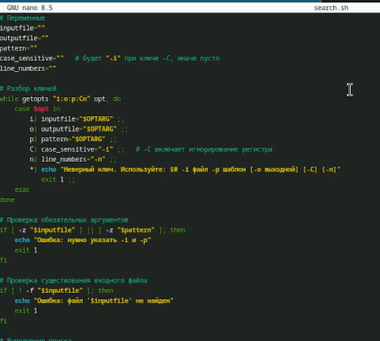
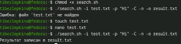
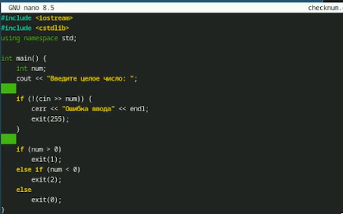
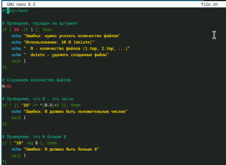
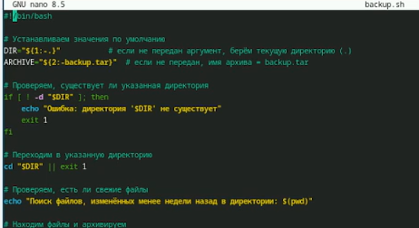

# Цель работы

Изучить основы программирования в оболочке ОС UNIX. Научится писать более
сложные командные файлы с использованием логических управляющих конструкций
и циклов.

# Задание

В ходе лабораторной работы требуется разработать четыре скрипта (и одну программу на C/C++):
- Командный файл с getopts: Скрипт анализирует ключи: -inputfile (входной файл), -outputfile (выходной файл), -p (шаблон поиска), -C (учёт регистра), -n (номера строк). На основе этих ключей с помощью grep выполняет поиск и выводит результат в файл или на экран.
- Программа на C/C++ и скрипт-анализатор: Программа вводит целое число и завершается с кодом exit(1), exit(2) или exit(0) в зависимости от знака числа (плюс обработка ошибки ввода). Командный файл запускает эту программу, анализирует код возврата через $? и выводит сообщение: «число больше нуля», «меньше нуля» или «равно нулю».
- Создание и удаление нумерованных файлов: Скрипт принимает число N (аргумент командной строки) и создаёт N файлов с именами 1.tmp, 2.tmp, …, N.tmp. При втором аргументе delete эти файлы удаляются (если существуют).
- Архивация изменённых файлов: Скрипт упаковывает в архив tar все файлы из заданной директории. В модифицированном варианте архивируются только файлы, изменённые менее недели назад (используется find -mtime -7).

# Теоретическое введение

В операционной системе UNIX командный процессор (оболочка, shell) является не только средством для выполнения команд, но и мощным языком программирования. Shell-скрипты позволяют автоматизировать повторяющиеся задачи, управлять файлами и процессами, использовать условные операторы, циклы, функции и обрабатывать аргументы командной строки. В данной лабораторной работе особое внимание уделяется:
Разбору ключей командной строки с помощью встроенной команды getopts, которая позволяет гибко обрабатывать опции и их аргументы.
- Ветвлениям – конструкциям if-then-else, case и проверке кодов возврата программ (переменная $?).
- Циклам – for, while, until, их синтаксису и отличиям.
- Генерации имён файлов с помощью метасимволов (*, ?, []), которые подставляются оболочкой.
- Взаимодействию с программами на языках C/C++ через коды завершения exit().
- Архивации файлов командами tar и find, в том числе с фильтрацией по времени изменения.
- Эти знания необходимы для написания эффективных и надёжных командных файлов в среде UNIX.

# Выполнение лабораторной работы

На рисунке 1 представлен листинг командного файла search.sh. В нём используются конструкции getopts для разбора ключей -i, -o, -p, -C, -n, а также условный оператор if для проверки существования входного файла и перенаправление вывода grep. Скрипт реализует поиск строк по шаблону с возможностью учёта регистра и вывода номеров строк.

{#fig:001 width=50%}

На рисунке 2 показан процесс выполнения скрипта. Командой chmod +x search.sh заданы права на выполнение. Затем скрипт запущен с ключами: -i test.txt -p "Hi" -C -n -o result.txt. В результате в файл result.txt выведены строки, содержащие "Hi" без учёта регистра, с номерами строк.

{#fig:002 width=50%}

Рисунок 3 — листинг checknum.cpp. Программа вводит число и завершается с exit(1) если больше 0, exit(2) если меньше 0, exit(0) если равно 0, exit(255) при ошибке ввода.

{#fig:003 width=50%}

Рисунок 4 — листинг run_check.sh. Скрипт запускает checknum, анализирует $? через case и выводит сообщение.

{#fig:004 width=50%}

Рисунок 5 — выполнение. Компиляция g++ checknum.cpp -o checknum, запуск run_check.sh. При вводе 5 — «больше нуля», -2 — «меньше нуля», 0 — «равно нулю», abc — «ошибка».

{#fig:005 width=50%}

Рисунок 6 — листинг files.sh. Скрипт создаёт файлы 1.tmp … N.tmp через цикл for, если второй аргумент delete — удаляет.

{#fig:006 width=50%}

Рисунок 7 — выполнение. ./files.sh 5 — созданы пять файлов, ls проверяет. ./files.sh 5 delete — файлы удалены.

{#fig:007 width=50%}

Рисунок 8 — листинг backup.sh. Скрипт переходит в каталог, find -mtime -7 ищет файлы новее 7 дней, tar создаёт архив.

{#fig:008 width=50%}

Рисунок 9 — процесс выполнения скрипта для 4 задания. Скрипту даны права на выполнение, запуск с указанием директории и имени архива. В архив попали только файлы, изменённые менее 7 дней назад.

{#fig:009 width=50%}

# Выводы

В ходе выполнения лабораторной работы были изучены и практически применены основные конструкции программирования в командном процессоре UNIX: разбор опций с помощью getopts, условные операторы if и case, циклы for и while, работа с кодами возврата ($?), генерация имён файлов с метасимволами, а также утилиты grep, tar, find. Полученные навыки позволяют автоматизировать типовые задачи администрирования и обработки данных в среде UNIX. Использование команды exit(n) в программе на C/C++ продемонстрировало механизм взаимодействия между скомпилированной программой и оболочкой через код завершения.

# Контрольные вопросы

1. Каково предназначение команды getopts?
Команда getopts предназначена для разбора коротких ключей опций командной строки в shell-скриптах. Она позволяет последовательно обрабатывать переданные скрипту ключи, определять, требует ли каждый из них аргумента, и помещает этот аргумент в переменную OPTARG. Getopts автоматически учитывает стандартные соглашения UNIX, такие как объединение нескольких флагов в один, и после завершения разбора сдвигает указатель OPTIND на первый свободный аргумент. Это основной инструмент для создания гибких и удобных командных файлов с поддержкой опций.

2. Какое отношение метасимволы имеют к генерации имён файлов?
Метасимволы, такие как звёздочка, вопросительный знак и квадратные скобки, используются оболочкой для так называемого глоббинга, то есть автоматической замены шаблона списком имён файлов, которые этому шаблону соответствуют. Например, шаблон звёздочка точка txt раскроется во все файлы с расширением txt в текущем каталоге, а вопросительный знак заменит ровно один любой символ. Это позволяет не перечислять имена файлов вручную, а задавать их кратко и гибко. Генерация имён файлов происходит до выполнения команды, поэтому сама команда получает уже готовый список имён.

3. Какие операторы управления действиями вы знаете?
К основным операторам управления в командном процессоре UNIX относятся: if для условного выполнения, case для множественного выбора, for, while и until для организации циклов, break и continue для прерывания цикла или перехода к следующей итерации, return для выхода из функции, exit для завершения скрипта с возвратом кода, а также логические операторы амперсанд амперсанд и двойная вертикальная черта, которые выполняют команды условно в зависимости от кода возврата предыдущей команды.

4. Какие операторы используются для организации цикла?
Для организации циклов в shell используются три основных оператора: for для перебора заранее известного списка значений, например перебор всех файлов или чисел из диапазона; while для повторения блока команд, пока условие остаётся истинным, то есть код возврата равен нулю; until для повторения блока команд, пока условие является ложным, то есть код возврата не равен нулю. Также существует конструкция select, которая создаёт меню выбора, но она используется реже.

5. Для чего нужны команды false и true?
Команда true всегда возвращает код завершения ноль, то есть успех, а команда false всегда возвращает ненулевой код, обычно единицу. Они нужны для создания бесконечных циклов, например while true с последующим do и done, для задания заведомо успешного или ошибочного исхода в условных конструкциях, а также для упрощения логики скриптов, когда требуется явно указать истину или ложь в месте, где ожидается выполнение команды.

6. Что означает строка, встреченная в командном файле?
Эта строка проверяет, существует ли обычный файл с именем, которое формируется из значений переменных s и i. Конструкция test -f проверяет, является ли аргумент обычным файлом. Часть mans/ означает подкаталог man, к которому добавляется содержимое переменной s и символ слеш. Далее идёт обратный слеш доллар i — это экранированный знак доллара с последующей буквой i, то есть в имени файла буквально присутствует символ доллар i, а не значение переменной. Затем следует обратный слеш точка — экранированная точка, и в конце снова значение переменной s. Таким образом, полное имя файла выглядит как man значение s слеш доллар i точка значение s, и скрипт проверяет существование такого файла. Экранирование нужно, чтобы оболочка не интерпретировала специальные символы раньше времени.

7. Объясните различие между конструкциями while и until.
Основное различие заключается в условии продолжения цикла. Конструкция while выполняет тело цикла до тех пор, пока условие истинно, то есть пока код возврата последней команды в условии равен нулю. Как только условие становится ложным, то есть код возврата не ноль, цикл прекращается. Конструкция until, напротив, выполняет тело цикла пока условие ложно, то есть пока код возврата не равен нулю. Цикл until продолжается до тех пор, пока условие не станет истинным, то есть код возврата не станет равным нулю. Проще говоря, while повторяет пока условие выполняется, а until повторяет пока условие не выполнится или до тех пор, пока условие не станет истинным. При инвертированном условии оба цикла могут дать одинаковый результат, но семантически они удобны в разных ситуациях: while удобен, когда нужно действовать, пока что-то верно, а until удобен, когда нужно ждать наступления некоторого события.

# Список литературы

1. Mendel Cooper - Ссылка: https://tldp.org/LDP/abs/html/

