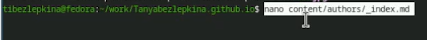
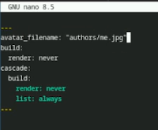
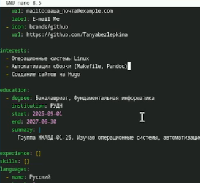
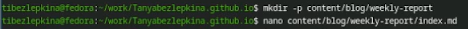
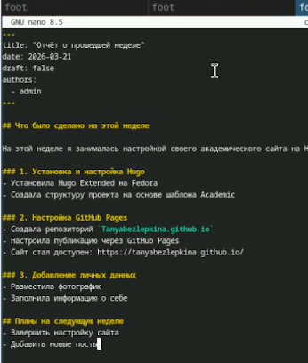
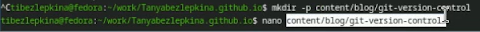
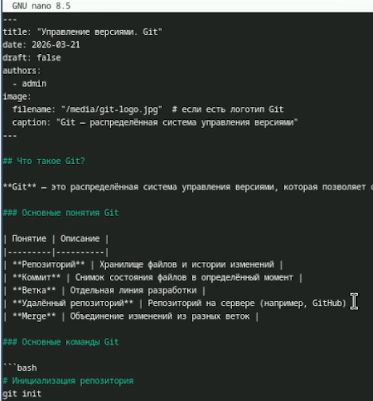

# Цель работы

Целью второго этапа индивидуального проекта является наполнение персонального академического сайта личными данными и создание тематических постов для демонстрации навыков работы с генератором статических сайтов Hugo и системой управления версиями Git.

# Задание

##Добавить к сайту данные о себе.

- Список добавляемых данных.
- Разместить фотографию владельца сайта.
- Разместить краткое описание владельца сайта (Biography).
- Добавить информацию об интересах (Interests).
- Добавить информацию от образовании (Education).
- Сделать пост по прошедшей неделе.
- Добавить пост на тему по выбору:Управление версиями. Git.

# Теоретическое введение

## Теоретическое введение

Генератор статических сайтов **Hugo** позволяет быстро создавать и разворачивать веб-страницы без использования базы данных и сложного серверного кода. В основе сайта лежат текстовые файлы в формате **Markdown**, которые преобразуются в HTML-страницы. Это делает сайт быстрым, безопасным и удобным для поддержки.

Основные технологии, используемые в работе:
- **Hugo** — генератор статических сайтов;
- **Git** — система управления версиями;
- **Markdown** — язык разметки для создания контента;
- **GitHub Pages** — платформа для хостинга статических сайтов.
 
# Выполнение лабораторной работы

Открыла файл для редактирования, чтобы добавить путь к фото автора. (рис. -@fig:001)

{#fig:001 width=70%}

Добавила строку avatar_filename: "authors/me.jpg", указав путь к своей фотографии. Остальные настройки (build, cascade) оставила без изменений. (рис. -@fig:002)

{#fig:002 width=70%}

Открыла файл с данными об авторе, чтобы заменить информацию о Dr. Alex Johnson на свои данные. (рис. -@fig:003)

{#fig:003 width=70%}

Заполнила файл своими данными:Контакты (email, github),Интересы (Linux, Makefile, Pandoc, Hugo),Образование (РУДН, группа НКАБД-01-25),Языки (русский) (рис. -@fig:004)

{#fig:004 width=70%}

Создала папку content/blog/weekly-report и открыла файл index.md для написания поста. (рис. -@fig:005)

{#fig:005 width=70%}

Написала пост, в котором описала:yстановку и настройку Hugo,Настройку GitHub Pages,Добавление личных данных на сайт,Планы на следующую неделю
(рис. -@fig:006)

{#fig:006 width=70%}

Создала папку content/blog/git-version-control и открыла файл index.md для поста об управлении версиями (рис. -@fig:007)

{#fig:007 width=70%}

Содержимое поста об управлении версиями Git (рис. -@fig:008)

{#fig:008 width=70%}

## Вывод

В ходе выполнения второго этапа индивидуального проекта были успешно решены следующие задачи:

1. **Добавлены личные данные владельца сайта**:
   - размещена фотография профиля;
   - добавлена краткая биография (Biography);
   - указаны академические интересы (Interests);
   - внесена информация об образовании (Education).
   Все данные внесены в файл `data/authors/me.yaml` и корректно отображаются на сайте.

2. **Созданы два тематических поста**:
   - **«Отчёт о прошедшей неделе»** — описывает процесс настройки сайта на Hugo, установку инструментов, работу с GitHub Pages и добавление личных данных;
   - **«Управление версиями. Git»** — содержит базовые понятия системы Git, основные команды и примеры их использования в рамках проекта.

3. **Отработаны технические навыки**:
   - работа с файловой структурой Hugo (папки `content/blog/`, `data/authors/`);
   - редактирование конфигурационных файлов и frontmatter постов;
   - локальный запуск и проверка сайта через `hugo server`;
   - подготовка изменений к публикации на GitHub Pages.

# Список литературы

::: {#refs}
:::
