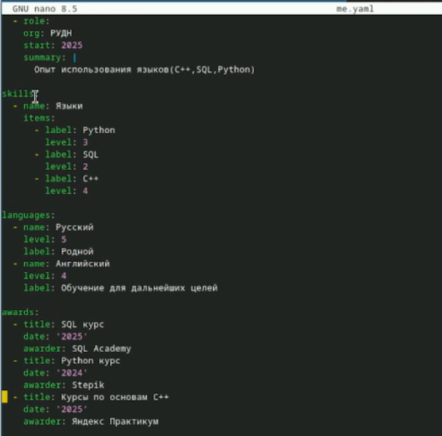
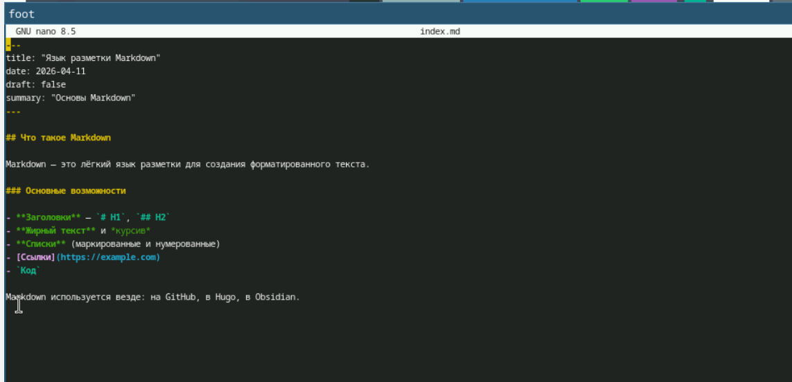

---
## Front matter
lang: ru-RU
title: "Индивидуальный проект.Часть 3."
subtitle: Архитектура компьютеров
author:
  - Безлепкина Т.И.
institute:
  - Российский университет дружбы народов, Москва, Россия
date: 11 апреля 2026

## i18n babel
babel-lang: russian
babel-otherlangs: english

## Fonts
mainfont: Liberation Serif
sansfont: Liberation Sans
monofont: Liberation Mono

## Formatting pdf
toc: false
toc-title: Содержание
slide_level: 2
aspectratio: 169
section-titles: true
theme: default
---

# Информация

## Докладчик

:::::::::::::: {.columns align=center}
::: {.column width="70%"}

  * Безлепкина Татьяна Игоревна
  * Студентка НКАбд-01-25
  * Таня
  * Российский университет дружбы народов
  * [1032253539@rudn.ru](mailto1032253539@rudn.ru)

:::
::: {.column width="30%"}

 (1).jpg)

:::
::::::::::::::

# Цель работы

Научиться добавлять на сайт блоки с достижениями (навыки, опыт, награды), а также создавать и настраивать посты в блоге на тему "Итоги недели" и "Язык разметки Markdown".

# Задание

1. Добавить к сайту достижения.
- Добавить информацию о навыках (Skills).
- Добавить информацию об опыте (Experience).
- Добавить информацию о достижениях (Accomplishments).
2. Сделать пост по прошедшей неделе.
3. Добавить пост на тему по выбору:
- Легковесные языки разметки.
- Языки разметки. LaTeX.
- Язык разметки Markdown.

# Актуальность темы

Современный IT-специалист или исследователь должен иметь цифровое портфолио. Hugo позволяет создавать такие сайты быстро, бесплатно и без программирования на серверной части.

# Объект и предмет исследования.

Объект: генератор статических сайтов Hugo и фреймворк Hugo Blox.

Предмет: настройка блоков достижений и создание постов на сайте.

# Научная новизна. 

Научная новизна заключается в систематизации методов добавления достижений и постов на сайт Hugo Blox, а также в определении эффективной структуры хранения данных в YAML-файлах для последующего отображения через блоки темы.

# Практическая значимость работы. 

Результаты можно использовать для создания личного сайта-портфолио, добавления информации о себе и ведения технического блога.

# Теоретическое введение

Hugo Blox — фреймворк для создания академических сайтов на Hugo. Контент хранится в файлах YAML и Markdown.

# Выполнение лабораторной работы

Я открыла файл data/authors/me.yaml и добавила в него блоки: skills — перечислила навыки (Linux, C++, Python, SQL) с процентами владения,experience — добавила опыт работы (студентка в РУДН, даты, описание), awards — добавила награды и пройденные курсы (SQL, Python, C++), languages — добавила языки (русский, английский) с уровнем владения (рис. -@fig:001)

{#fig:001 width=50%}

--- 

Посты я создавала в папке content/blog/. Каждый пост — это отдельная папка с файлом index.md внутри. Создала папку content/blog/weekly-report_2/ и заполнила содержимым (рис. -@fig:002)

{#fig:002 width=50%}

--- 

Создана папка content/blog/markdown-basics/ с файлом index.md. Пост описывает основы Markdown: заголовки, списки, ссылки, код (рис. -@fig:003)

{#fig:003 width=70%}

# Выводы

Все задачи выполнены. На сайт добавлены навыки, опыт и награды. Созданы два поста. Настроено отображение постов на главной странице.

# Список литературы
это тебе на всякий
