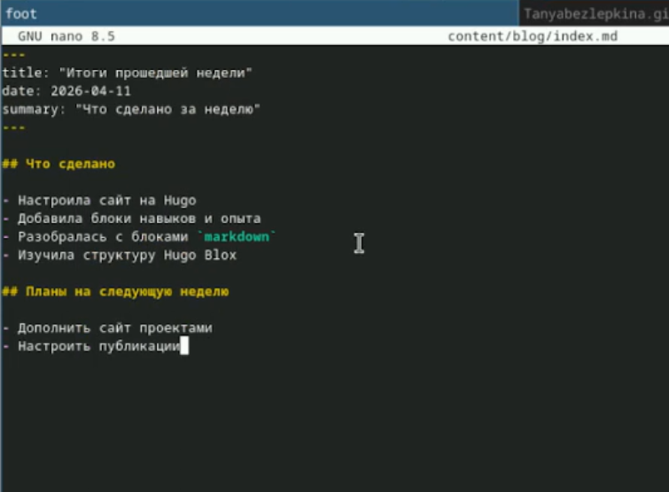

# Цель работы

Научиться добавлять на сайт блоки с достижениями (навыки, опыт, награды), а также создавать и настраивать посты в блоге на тему "Итоги недели" и "Язык разметки Markdown".

# Задание

1. Добавить к сайту достижения.
- Добавить информацию о навыках (Skills).
- Добавить информацию об опыте (Experience).
- Добавить информацию о достижениях (Accomplishments).
2. Сделать пост по прошедшей неделе.
3. Добавить пост на тему по выбору:
- Легковесные языки разметки.
- Языки разметки. LaTeX.
- Язык разметки Markdown.

# Теоретическое введение

Hugo Blox — фреймворк для создания академических сайтов на Hugo. Контент хранится в файлах YAML и Markdown.

# Выполнение лабораторной работы

Я открыла файл data/authors/me.yaml и добавила в него блоки: skills — перечислила навыки (Linux, C++, Python, SQL) с процентами владения,experience — добавила опыт работы (студентка в РУДН, даты, описание), awards — добавила награды и пройденные курсы (SQL, Python, C++), languages — добавила языки (русский, английский) с уровнем владения (рис. -@fig:001)

{#fig:001 width=70%}

Посты я создавала в папке content/blog/. Каждый пост — это отдельная папка с файлом index.md внутри. Создала папку content/blog/weekly-report_2/ и заполнила содержимым (рис. -@fig:002)

{#fig:002 width=70%}

Создана папка content/blog/markdown-basics/ с файлом index.md. Пост описывает основы Markdown: заголовки, списки, ссылки, код (рис. -@fig:003)

{#fig:003 width=70%}

# Вывод

Все задачи выполнены. На сайт добавлены навыки, опыт и награды. Созданы два поста. Настроено отображение постов на главной странице. 

# Список литературы

::: {#refs}
:::
